# GEOVIS iBEST-DB V6.1.0 地理网格模型功能与接口文档（AI-Friendly）

> 本文档针对 AI 检索、RAG 切分和接口问答进行了结构化整理。内容来自用户手册第 354-498 页；未对原文中的接口名称、拼写或示例结果做推断性修正。

## 文档范围

本文档覆盖以下模型和接口族：

- `gridcell`：二维/三维单元地理网格。
- `geomgrids`：由多个 `gridcell` 组成的地理区域。
- `timecell`：单元时间网格。
- `timegrids`：由多个 `timecell` 组成的时间范围。
- 输入输出、属性计算、空间/时间关系、叠置分析、操作符、索引及辅助应用函数。

## AI 使用约定

- 每个接口章节前的 `chunk_type` 注释提供接口类别和来源页，适合切分器保留为元数据。
- `source_page` 注释表示其后内容在原 PDF 中的起始页，可用于回查。
- 参数定义、返回值和示例应联合检索；同名重载应依据完整签名区分。
- 示例中包含 PostgreSQL/psql 输出，代码块语言标签仅用于提升解析效果。

## 顶层目录

- 数据类型（PDF 第 354 页起）
- GridCell输入输出函数（PDF 第 359 页起）
- GridCell属性与计算函数（PDF 第 369 页起）
- GridCell空间关系函数（PDF 第 398 页起）
- GridCell操作符（PDF 第 401 页起）
- GeomGrids输入输出转换函数（PDF 第 407 页起）
- GeomGrids属性函数（PDF 第 419 页起）
- GeomGrids空间关系判断函数（PDF 第 426 页起）
- GeomGrids叠置分析函数（PDF 第 435 页起）
- GeomGrids操作符（PDF 第 441 页起）
- 空间索引（PDF 第 443 页起）
- 北斗位置编码(BGC)（PDF 第 445 页起）
- 实景三维中国-基础地理实体位置码(RSLC)（PDF 第 448 页起）
- 应用函数（PDF 第 451 页起）
- 辅助函数（PDF 第 458 页起）
- Questions and Answers（PDF 第 464 页起）
- 时间网格模型SQL接口说明（PDF 第 466 页起）

## 接口快速索引

下表用于名称检索和 RAG 路由；详细定义以正文对应章节为准。

### GridCell输入输出函数

| 接口/操作符 | 原文标题 | PDF 页 |
| --- | --- | ---: |
| `ST_AsGridcell` | ST_AsGridcell | 359 |
| `ST_AsGridcell3D` | ST_AsGridcell3D | 359 |
| `ST_AsText` | ST_AsText(gridcell,text) | 360 |
| `ST_AsText` | ST_AsText(gridcell[],text) | 362 |
| `ST_GridCellFromText` | ST_GridCellFromText(text,text) | 364 |
| `ST_GridCellsFromTexts` | ST_GridCellsFromTexts | 365 |
| `ST_AsGeometry` | ST_AsGeometry(gridcell) | 366 |
| `ST_AsBox` | ST_AsBox(gridcell) | 367 |
| `ST_AsBox3D` | ST_AsBox3D(gridcell) | 368 |

### GridCell属性与计算函数

| 接口/操作符 | 原文标题 | PDF 页 |
| --- | --- | ---: |
| `ST_Center` | ST_Center(gridcell) | 369 |
| `ST_Level` | ST_Level(gridcell) | 369 |
| `ST_Is3D` | ST_Is3D(gridcell) | 370 |
| `ST_Force2D` | ST_Force2D(gridcell) | 371 |
| `ST_Force3D` | ST_Force3D(gridcell) | 372 |
| `ST_GetSidesLength` | ST_GetSidesLength(gridcell) | 372 |
| `ST_GetArea` | ST_GetArea(gridcell) | 373 |
| `ST_GetVolume` | ST_GetVolume(gridcell) | 374 |
| `ST_DistanceSpheroid` | ST_DistanceSpheroid(gridcell,gridcell,spheroid) | 375 |
| `ST_GetNeibers` | ST_GetNeibers(gridcell, integer default -1) | 376 |
| `ST_GetNeibers3D` | ST_GetNeibers3D(gridcell, integer default -1) | 377 |
| `ST_Angle` | ST_Angle(gridcell,gridcell) | 379 |
| `ST_GetCellFromAngle` | ST_GetCellFromAngle(gridcell, float8) | 380 |
| `ST_Direction` | ST_Direction(gridcell,gridcell) | 382 |
| `ST_VisibilityAnalysis` | ST_VisibilityAnalysis(gridcell, gridcell, text, text) | 384 |
| `ST_GetParent` | ST_GetParent(gridcell) | 385 |
| `ST_GetAncestor` | ST_GetAncestor(gridcell, integer) | 386 |
| `ST_AncestorOf` | ST_AncestorOf(gridcell, gridcell) | 388 |
| `ST_GetDescendant` | ST_GetDescendant(gridcell,integer) | 388 |
| `ST_DescendantOf` | ST_DescendantOf(gridcell, gridcell) | 390 |
| `ST_GetNextBrother` | ST_GetNextBrother(gridcell) | 391 |
| `ST_FamilyOf` | ST_FamilyOf(gridcell, gridcell) | 392 |
| `ST_GetNeiber` | ST_GetNeiber(gridcell, integer) | 392 |
| `ST_GetNeiber3D` | ST_GetNeiber3D(gridcell, integer) | 393 |
| `ST_DrawGrids` | ST_DrawGrids(double,double,double,double,integer) | 395 |
| `ST_DrawGrids` | ST_DrawGrids(integer) | 396 |
| `ST_DrawGrids3D` | ST_DrawGrids3D(double,double,double,double,double,double,integer) | 396 |
| `ST_DrawGrids3D` | ST_DrawGrids3D(double,double,integer) | 397 |

### GridCell空间关系函数

| 接口/操作符 | 原文标题 | PDF 页 |
| --- | --- | ---: |
| `ST_Equals` | ST_Equals(gridcell,gridcell) | 398 |
| `ST_Intersects` | ST_Intersects(gridcell,gridcell) | 399 |
| `ST_WithIn` | ST_WithIn(gridcell,gridcell) | 400 |
| `ST_Contains` | ST_Contains(gridcell,gridcell) | 400 |

### GridCell操作符

| 接口/操作符 | 原文标题 | PDF 页 |
| --- | --- | ---: |
| `=` | = | 401 |
| `&&` | && | 402 |
| `@>` | @> | 403 |
| `<@` | <@ | 403 |
| `<` | < | 404 |
| `<=` | <= | 405 |
| `>=` | >= | 406 |
| `>` | > | 407 |

### GeomGrids输入输出转换函数

| 接口/操作符 | 原文标题 | PDF 页 |
| --- | --- | ---: |
| `ST_AsGrids` | ST_AsGrids(geometry ....) | 407 |
| `ST_AsGrids3D` | ST_AsGrids3D(geometry ....) | 411 |
| `ST_AsGrids` | ST_AsGrids(gridcell[]) | 414 |
| `ST_AsGrids` | ST_AsGrids(gridcell) | 415 |
| `ST_AsText` | ST_AsText(geomgrids,text) | 415 |
| `ST_WithBox` | ST_WithBox(geomgrids,text) | 417 |
| `ST_AsGridCellArray` | ST_AsGridCellArray | 418 |
| `ST_AsGeometry` | ST_AsGeometry(geomgrids) | 419 |

### GeomGrids属性函数

| 接口/操作符 | 原文标题 | PDF 页 |
| --- | --- | ---: |
| `ST_Is3D` | ST_Is3D(geomgrids) | 419 |
| `ST_DetailLevel` | ST_DetailLevel(geomgrids) | 420 |
| `ST_nCells` | ST_nCells(geomgrids) | 421 |
| `ST_GetArea` | ST_GetArea(geomgrids) | 421 |
| `ST_Centroid` | ST_Centroid(geomgrids) | 422 |
| `ST_DistanceSpheroid` | ST_DistanceSpheroid(geomgrids, geomgrids, spheroid) | 423 |
| `ST_Angle` | ST_Angle(geomgrids, geomgrids) | 424 |
| `ST_Direction` | ST_Direction(geomgrids,geomgrids) | 425 |

### GeomGrids空间关系判断函数

| 接口/操作符 | 原文标题 | PDF 页 |
| --- | --- | ---: |
| `ST_Intersects` | ST_Intersects(geomgrids,geomgrids) | 426 |
| `ST_Intersects` | ST_Intersects（gridcell ,geomgrids） | 427 |
| `ST_Intersects` | ST_Intersects（geomgrids,gridcell） | 427 |
| `ST_Equals` | ST_Equals（geomgrids,geomgrids） | 428 |
| `ST_WithIn` | ST_WithIn（geomgrids ,geomgrids） | 429 |
| `ST_WithIn` | ST_WithIn（gridcell ,geomgrids） | 430 |
| `ST_Contains` | ST_Contains（geomgrids,geomgrids） | 431 |
| `ST_Contains` | ST_Contains（geomgrids,gridcell） | 432 |
| `ST_Adjacent` | ST_Adjacent(geomgrids,geomgrids) | 433 |

### GeomGrids叠置分析函数

| 接口/操作符 | 原文标题 | PDF 页 |
| --- | --- | ---: |
| `ST_Intersection` | ST_Intersection(geomgrids,geomgrids) | 435 |
| `ST_Union` | ST_Union(geomgrids,geomgrids) | 439 |

### GeomGrids操作符

| 接口/操作符 | 原文标题 | PDF 页 |
| --- | --- | ---: |
| `=` | = | 441 |
| `&&` | && | 441 |
| `@>` | @> | 442 |
| `<@` | <@ | 442 |

### 北斗位置编码(BGC)

| 接口/操作符 | 原文标题 | PDF 页 |
| --- | --- | ---: |
| `ST_asBGC` | ST_asBGC | 445 |
| `ST_asBGC3D` | ST_asBGC3D | 446 |
| `ST_BGC2Box` | ST_BGC2Box | 447 |
| `ST_BGC3D2Box` | ST_BGC3D2Box | 447 |

### 实景三维中国-基础地理实体位置码(RSLC)

| 接口/操作符 | 原文标题 | PDF 页 |
| --- | --- | ---: |
| `ST_asRSLC` | ST_asRSLC | 448 |
| `ST_asRSLC3D` | ST_asRSLC3D | 449 |
| `ST_RSLC2Box` | ST_RSLC2Box | 449 |
| `ST_RSLC3D2Box` | ST_RSLC3D2Box | 450 |

### 应用函数

| 接口/操作符 | 原文标题 | PDF 页 |
| --- | --- | ---: |
| `ST_FindGridsPath` | ST_FindGridsPath(gridcell, gridcell, text, text, bool) | 451 |
| `ST_RouteFromGridsPath` | ST_RouteFromGridsPath(gridcell[]) | 453 |
| `ST_RouteFromGridsPath` | ST_RouteFromGridsPath(geometry,geometry,gridcell[]) | 455 |
| `ST_FindAllGridsPath` | ST_FindAllGridsPath(gridcell, gridcell, text, text, bool) | 456 |
| `ST_SmoothRouteFromGridsPath` | ST_SmoothRouteFromGridsPath(gridcell[], text, text) | 457 |

### 辅助函数

| 接口/操作符 | 原文标题 | PDF 页 |
| --- | --- | ---: |
| `ST_ExturdeGeometry` | ST_ExturdeGeometry(geometry, float, float) | 458 |
| `ST_Grids23dtiles` | ST_Grids23dtiles | 459 |
| `ST_CreateTableFromGeom` | ST_CreateTableFromGeom | 461 |
| `ST_Geom2Shpfile` | ST_Geom2Shpfile | 462 |

### 时间网格 / 二、TimeCell输入输出函数

| 接口/操作符 | 原文标题 | PDF 页 |
| --- | --- | ---: |
| `ST_timecellFromISO` | 3.1 ST_timecellFromISO | 468 |
| `st_asText` | 3.2 st_asText(timeCell,text) | 468 |
| `st_asText` | 3.3 st_asText(timeCell[],text) | 469 |

### 时间网格 / 三、TimeCell属性与计算函数

| 接口/操作符 | 原文标题 | PDF 页 |
| --- | --- | ---: |
| `ST_Level` | 4.1 ST_Level(timecell) | 470 |
| `ST_GetParent` | 4.2 ST_GetParent(timecell) | 471 |
| `ST_GetAncestor` | 4.3 ST_GetAncestor(timecell, integer) | 471 |
| `ST_AncestorOf` | 4.4 ST_AncestorOf(timecell, timecell) | 472 |
| `ST_GetDescendant` | 4.5 ST_GetDescendant(timecell,integer) | 473 |
| `ST_DescendantOf` | 4.6 ST_DescendantOf(timecell, timecell) | 474 |
| `ST_GetNextBrother` | 4.7 ST_GetNextBrother(timecell) | 474 |
| `ST_GetpreBrother` | 4.8 ST_GetpreBrother(timecell) | 475 |
| `ST_FamilyOf` | 4.9 ST_FamilyOf(timecell, timecell) | 475 |

### 时间网格 / 四、TimeCell时间关系函数

| 接口/操作符 | 原文标题 | PDF 页 |
| --- | --- | ---: |
| `ST_Equals` | 5.1 ST_Equals(timecell,timecell) | 476 |
| `ST_Intersects` | 5.2 ST_Intersects(timecell,timecell) | 477 |
| `ST_WithIn` | 5.3 ST_WithIn(timecell,timecell) | 477 |
| `ST_Contains` | 5.4 ST_Contains(timecell,timecell) | 478 |

### 时间网格 / 五、TimeCell操作符

| 接口/操作符 | 原文标题 | PDF 页 |
| --- | --- | ---: |
| `=` | 6.1 = | 479 |
| `&&` | 6.2 && | 479 |
| `@>` | 6.3 @> | 480 |
| `<@` | 6.4 <@ | 480 |
| `<` | 6.5 < | 481 |
| `<=` | 6.6 <= | 481 |
| `>` | 6.7 > | 482 |
| `>=` | 6.8 >= | 482 |

### 时间网格 / 六、timeGrids输入输出转换函数

| 接口/操作符 | 原文标题 | PDF 页 |
| --- | --- | ---: |
| `ST_AsTimeGrids` | 7.1 ST_AsTimeGrids(timecell) | 483 |
| `ST_AsTimeGrids` | 7.2 ST_AsTimeGrids(timecell[]) | 484 |
| `ST_AsTimeCellArray` | 7.3 ST_AsTimeCellArray | 484 |
| `ST_AsText` | 7.4 ST_AsText(TimeGrids,text) | 485 |
| `ST_AsTimeGrids` | 7.5 ST_AsTimeGrids(startTimeISO text,endTimeISO text,detailLevel integer default-1,isagg boolean default true) | 486 |

### 时间网格 / 七、timeGrids属性函数

| 接口/操作符 | 原文标题 | PDF 页 |
| --- | --- | ---: |
| `ST_DetailLevel` | 8.1 ST_DetailLevel(timegrids) | 487 |
| `ST_nCells` | 8.2 ST_nCells(timegrids) | 487 |

### 时间网格 / 八、timeGrids时间关系判断函数

| 接口/操作符 | 原文标题 | PDF 页 |
| --- | --- | ---: |
| `ST_Intersects` | 9.1 ST_Intersects(timeGrids,timeGrids) | 488 |
| `ST_Intersects` | 9.2 ST_Intersects（timecell ,timeGrids） ST_Intersects（timeGrids,timecell） | 489 |
| `ST_Equals` | 9.3 ST_Equals（timeGrids,timeGrids） | 489 |
| `ST_WithIn` | 9.4 ST_WithIn（timeGrids ,timeGrids） | 490 |
| `ST_WithIn` | 9.5 ST_WithIn（timecell ,timeGrids） | 491 |
| `ST_Contains` | 9.6 ST_Contains（timeGrids,timeGrids） | 492 |
| `ST_Contains` | 9.7 ST_Contains（timeGrids,timecell） | 492 |

### 时间网格 / 九、timeGrids叠置分析函数

| 接口/操作符 | 原文标题 | PDF 页 |
| --- | --- | ---: |
| `ST_Intersection` | 10.1 ST_Intersection(timeGrids,timeGrids) | 493 |
| `ST_Union` | 10.2 ST_Union(timeGrids,timeGrids) | 494 |

### 时间网格 / 十、timeGrids操作符

| 接口/操作符 | 原文标题 | PDF 页 |
| --- | --- | ---: |
| `=` | 11.1 = | 495 |
| `&&` | 11.2 && | 495 |
| `@>` | 11.3 @> | 496 |
| `<@` | 11.4 <@ | 497 |

## 接口参考正文

<!-- source_page: 354 -->

## 数据类型

### gridcell（2D/3D）

是北斗网格码模块扩展的一个数据模型，用于表示GeoSOT-2D/GeoSOT-3D中的一个单元网格。 GeoSOT-2D网格用code(二维编码，unsigned long)+level(网格层级，unsigned char)存储。 GeoSOT-3D网格用code(二维编码，unsigned long)+zcode(高度维编码，unsigned int)+level(网格层级，unsigned char)存储。

#### 空间意义

一个2D gridCell代表一个矩形的空间范围. 一个3D gridCell代表一个近似立方体的空间范围。

2D示例 ：

下图中为一个15级的网格

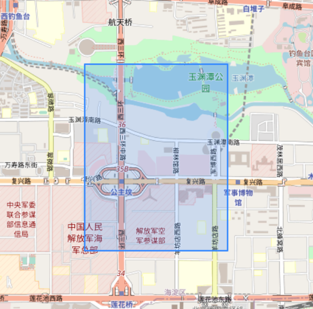

原始格式输出：

**526548078363148288:15 (code:level)**

<!-- source_page: 355 -->

GGER格式输出：

**G001310322230230**

BGC格式输出：

**N50J47534**

RSLC格式输出：

**NE104J2525034**

3D示例 ：

下图为上图二维网格对应的三维网格。因大地高度近似于0，故高程编码为0.

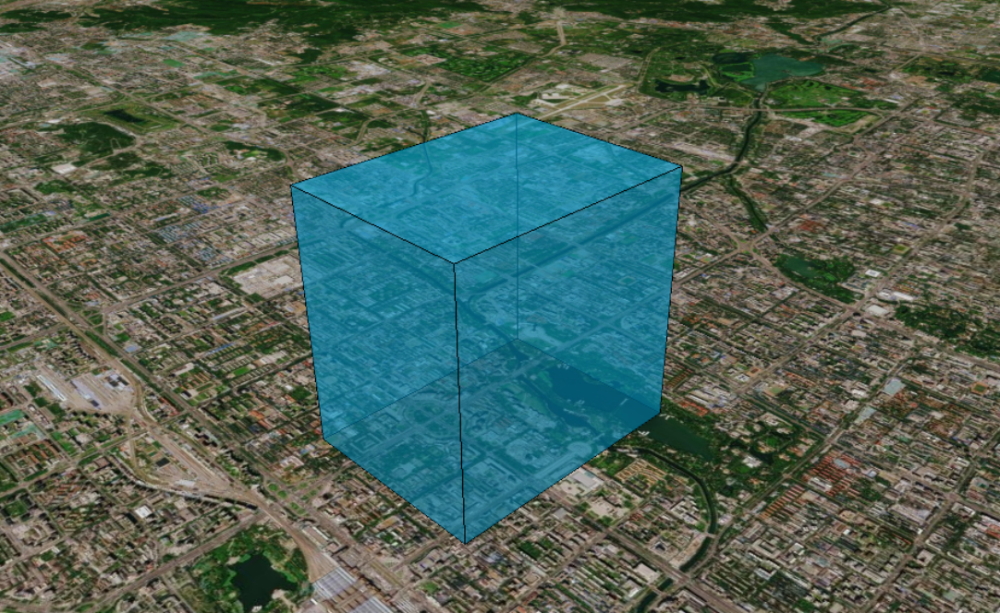

原始格式输出：

**526548078363148288,0:15 (code,zcode:level)**

GGER格式输出：

<!-- source_page: 356 -->

**GZ002242242026624**

BGC格式输出：

**N049E0034020030**

RSLC格式输出：

**NE01004J002050205000340**

#### BEST-DB支持以下数据类型到gridcell的转换：

- text(GGER)
- 坐标点(lng,lat,level)
- geomgrids

#### BEST-DB支持从gridcell到以下数据类型的转换：

- text(GGER)
- text(code:level)
- geometry
- box
- geomgrids

### geomgrids（2D/3D）

由层级相同或不同的gridcell集合组成，表示地球表面空间特定的区域范围。可粗略表达任意类型Geometry代表的地理范围。

#### 地理空间意义

一个geomgrids对象代表多个gridcell对象区域的合集。

#### 2D示例

<!-- source_page: 357 -->

下图中为一个geomgrids(2D)对象代表的北京六环空间范围。

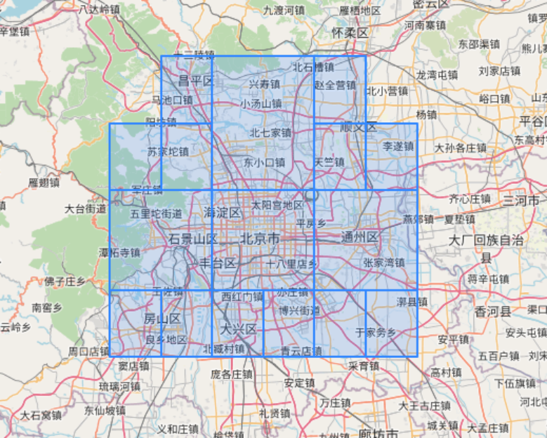

原始格式输出：

````json
{"cells":["526536327332626432:12","526537426844254208:12","526540725379137536:12","5
````

GGER格式输出：

````json
{"cells":["G001310322202","G001310322203","G001310322212","G001310322213","G00131032
````

#### 3D示例

<!-- source_page: 358 -->

下图中为一个geomgrids(3D)对象代表的某建筑范围。

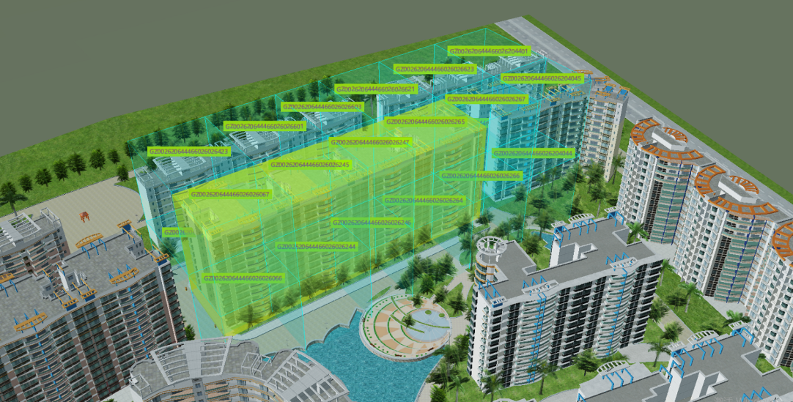

原始格式输出：

````json
{"cells":["526550743235166208,0:21","526550743235166208,2048:21","526550743344218112
````

GGER格式输出：

````json
{"cells":["GZ002620644466026026620","GZ002620644466026026621","GZ0026206444660260262
````

json字段含义：

| 参数名称 | 描述 |
| --- | --- |
| cells | gridcell |
| detailLevel | 最大层级 |
| nCell | gridcell数量 |

#### BEST-DB支持以下数据类型到Geomgrids的转换：

- text
- geomtry
- gridcell[]

<!-- source_page: 359 -->

#### BEST-DB支持从Geomgrids到以下数据类型的转换：

- text
- geometry
- gridcell[]
- box

## GridCell输入输出函数

<!-- chunk_type: interface; category: GridCell输入输出函数; source_page: 359 -->

### ST_AsGridcell

#### 描述

通过给定位置信息（经度和纬度）、层级构建2D GridCell对象

#### 语法

````sql
gridcell ST_AsGridcell(double lng,double lat,integer level)
````

#### 参数

| 参数名称 | 描述 |
| --- | --- |
| lng | 位置经度，取值范围[-180.0,180.0] |
| lat | 位置纬度，取值范围[-88.0,88.0] |
| level | 网格层级，取值范围[1,32]，默认12 |

#### 示例

````sql
select ST_AsGridcell(113.22,40.1,12);
st_asgridcell
-----------------------
531496224285523968:12
(1 row)
````

<!-- chunk_type: interface; category: GridCell输入输出函数; source_page: 359 -->

### ST_AsGridcell3D

<!-- source_page: 360 -->

#### 描述

通过给定位置信息（经度、纬度、高程）、层级构建3D gridCell对象

#### 语法

````sql
gridcell ST_AsGridcell3D(double lng,double lat,double height,integer level)
````

#### 参数

| 参数名称 | 描述 |
| --- | --- |
| lng | 位置点经度，取值范围[-180.0,180.0] |
| lat | 位置点纬度，取值范围[-88.0,88.0] |
| height | 位置点大地高(单位m)，取值范围[-6302106.7222,528680167.3367] |
| level | 网格层级，取值范围[1,32]，默认12 |

#### 示例

````sql
select ST_AsGridcell3D(113.22,40.1,100,12);
st_asgridcell3d
-------------------------
531496224285523968,0:12
````

<!-- chunk_type: interface; category: GridCell输入输出函数; source_page: 360 -->

### ST_AsText(gridcell,text)

#### 描述

将一个网格对象转换为指定规范的文本编码。支持2D/3D.

#### 语法

````sql
text ST_AsText(gridcell cell,text default 'GGER')
````

#### 参数

<!-- source_page: 361 -->

| 参数名称 | 描述 |
| --- | --- |
| cell | 需要输出的单元网格对象。 |
| standard | 网格标准，支持GGER、BGC、RSLC、RAW(原始格式)，默认GGER。由于BGC和RSLC网格与<br>GeoSOT层级不是一一对应，BGC格式支持gridcell(2D/3D)的15、19、20、23、26、29、32层级<br>输出为BGC,其他层级输出空字符串。RSLC格式支持gridcell(2D/3D)的9、15、19、20、21、<br>23、26、29、32层级输出为RSLC,其他层级输出空字符串。 |

#### 示例

````sql
-- GGER方式输出
test=# select st_asText(ST_AsGridcell(116.31522216796875,39.910277777777778,15));
st_astext
------------------
G00131
````

````sql
-- BGC 2D方式输出（合法层级）
select st_asText(ST_AsGridcell(116.31522216796875,39.910277777777778,15),'BGC');
st_astext
-----------
N50J47534
````

````sql
-- BGC 2D方式输出（非法层级）
select st_asText(ST_AsGridcell(116.31522216796875,39.910277777777778,14),'BGC');
st_astext
-----------
````

````sql
-- BGC 3D方式输出（合法层级）
select st_asText(ST_AsGridcell3D(116.31522216796875,39.910277777777778,45333,20),'BG
st_astext
----------------------
N050J0047051348D9810
````

````sql
-- RSLC 2D方式输出（合法层级）
select st_asText(ST_AsGridcell(116.31522216796875,39.910277777777778,15),'RSLC');
st_astext
---------------
NE104J2525034
````

````sql
-- RSLC 3D方式输出 (合法层级)
select st_asText(ST_AsGridcell3D(116.31522216796875,39.910277777777778,45333,20),'RS
st_astext
--------------------------------
````

<!-- source_page: 362 -->

````text
NE01004J0020502052003444321210
````

````sql
-- RAW原始方式输出
select st_asText(ST_AsGridcell(116.31522216796875,39.910277777777778,15),-1,'RAW');
st_astext
-----------------------
526548078363148288:15
````

````sql
-- 不传level
select st_asText(ST_AsGridcell(116.31522216796875,39.910277777777778,15));
st_astext
------------------
G001310322230230
````

````sql
--3D RAW原始方式
select st_asText(ST_AsGridcell3D(116.31522216796875,39.910277777777778,10000,20),-1,
st_astext
------------------------------
526548092539895808,704512:20
````

````sql
--3D GGER
select st_asText(ST_AsGridcell3D(116.31522216796875,39.910277777777778,10,15));
st_astext
-------------------
GZ002620644460460
````

<!-- chunk_type: interface; category: GridCell输入输出函数; source_page: 362 -->

### ST_AsText(gridcell[],text)

#### 描述

将单元网格数组转换为指定规范的文本编码Text数组。支持2D/3D.

#### 语法

````sql
text[] ST_AsText(gridcell[] cells,text default 'GGER')
````

#### 参数

<!-- source_page: 363 -->

cells需要输出的单元网格数组对象。

网格标准，支持GGER、BGC、RSLC、RAW(原始方式)，默认GGER。由于BGC和RSLC网格与GeoSOT层级不是一一对应，BGC格式支持gridcell(2D/3D)的15、19、20、23、26、29、32层级输出为BGC,其他层级输出空字符串。RSLC格式支持gridcell(2D/3D)的9、15、19、20、21、23、26、29、32层级输出为RSLC,其他层级输出空字符串standard

#### 示例

````sql
sql
-- 2D GGER
st_asText ST_AsGridCellArray ST_AsGrids ST_GeomFromText
select
(
(
(
('POLYGON((116.168188
st_astext
--------------------------------------------------
{G001310322202 G001310322203 G001310322212 G001310322213 G00131032222 G00131032223
,
,
,
,
,
,
````

````sql
-- 2D BGC
st_asText ST_AsGridCellArray ST_AsGrids ST_GeomFromText
select
(
(
(
('LINESTRING (114 35,
st_astext
-------------------------------------------------------------
{N50I06055 N50I06065 N50I06001 N50I06044 N50I06056 N50I06012 N49IB61E0 N50I06022 N4
,
,
,
,
,
,
,
,
````

````sql
-- 2D RSLC
st_asText ST_AsGridCellArray ST_AsGrids ST_GeomFromText
select
(
(
(
('LINESTRING (114 35,
st_astext
------------------------------------------------------------------------------------
{NE104I2300400 NE104I2300410 NE104I2300001 NE104I2300044 NE104I2300401 NE104I230001
,
,
,
,
,
````

````sql
-- 3D GGER
st_asText ST_AsGridCellArray ST_AsGrids3D st_geomfromtext
select
(
(
(
('LINESTRING (114 35
st_astext
------------------------------------------------------------------------------------
{GZ0026200644 GZ0026204224 GZ1037315263 GZ0026200646 GZ0026204226 GZ0026200462 GZ002
,
,
,
,
,
,
````

````sql
-- 3D BGC
st_asText ST_AsGridCellArray ST_AsGrids3D st_geomfromtext
select
(
(
(
('LINESTRING (114.2
st_astext
------------------------------------------------------------------------------------
{N150I3206151098 N050I0006020D30 N050I0006040E50 N050I3206120D5E N050I3206140E20 N05
,
,
,
,
,
````

````sql
-- 3D RSLC
st_asText ST_AsGridCellArray ST_AsGrids3D st_geomfromtext
select
(
(
(
('LINESTRING (114.2
st_astext
````

<!-- source_page: 364 -->

````text
--------------------------------------------------
{NE01004I002030000050100 NE01004I002030000050110 NE01004I002030000050200 NE01004I002
,
,
,
````

<!-- chunk_type: interface; category: GridCell输入输出函数; source_page: 364 -->

### ST_GridCellFromText(text,text)

#### 描述

通过指定规范的文本编码，构造单元网格。支持2D/3D.

#### 语法

````sql
gridcell ST_GridCellFromText(text code,text standard)
````

#### 参数

| 参数名<br>称 | 描述 |
| --- | --- |
| code | 文本编码。 |
| standard | 网格标准，支持GGER、BGC-2D、BGC-3D、RSLC-2D、RSLC-3D、RAW(原始方式)，默认<br>GGER。GGER 2D网格以ʻGʼ开头，后缀为4进制数字字符序列，数字字符长度范围[1,32]；GGER<br>3D网格以ʻGZʼ开头，后缀为8进制数字字符序列，数字字符长度范围[1,32]。由于BGC 2D/3D和<br>RSLC 2D/3D无法从编码本身区分，需要指定BGC-2D/BGC-3D或者RSLC-2D/RSLC-3D |

BGC编码格式见BGC

RSLC编码格式见RSLC

#### 示例

````sql
sql
--GGER 2D
ST_GridCellFromText
select
('G001312100003','GGER');
st_gridcellfromtext
-----------------------
:
532553954471444480 12
--GGER 3D
ST_GridCellFromText
select
('GZ0026204220');
st_gridcellfromtext
-------------------------
````

<!-- source_page: 365 -->

````text
:
525021200309551104,0 10
````

````sql
-- BGC 2D
ST_GridCellFromText
select
('N50I06033','BGC-2D');
st_gridcellfromtext
-----------------------
:
523402976891502592 15
````

````sql
-- BGC 3D
ST_GridCellFromText
select
('N050J004755039E','BGC-3D');
st_gridcellfromtext
--------------------------------
:
526549761990328320,22806528 15
````

````sql
-- RSLC 2D
ST_GridCellFromText
SELECT
('NE104J2525334328','RSLC-2D');
st_gridcellfromtext
-----------------------
:
526549775210774528 19
````

````sql
--RSLC 3D
ST_GridCellFromText
SELECT
('NE02002G00104020503034332280','RSLC-3D');
st_gridcellfromtext
------------------------------
:
596918519388438528,442368 19
````

<!-- chunk_type: interface; category: GridCell输入输出函数; source_page: 365 -->

### ST_GridCellsFromTexts

将指定规范的文本编码Text数组转为单元网格数组转换为GridCell数组。支持2D/3D.

#### 语法

````sql
gridcell[] ST_GridCellsFromTexts(text[] codes,text standard)
````

#### 参数

| 参数名称 | 描述 |
| --- | --- |
| codes | 指定规范的文本编码Text数组 |
| standard | 网格标准，支持GGER、BGC-2D、BGC-3D、RSLC-2D、RSLC-3D |

<!-- source_page: 366 -->

#### 示例

````sql
--GGER 2D
select ST_GridCellsFromTexts(ARRAY['G00131032220212','G00131032220213','G00131032220
st_gridcellsfromtexts
--------------------------------------------------------------
{526536739649486848:14,526536808368963584:14,526537151966347264:13,5265375642832076
````

````sql
--GGER 3D
select ST_GridCellsFromTexts(ARRAY['GZ0026204220','GZ0026206004','GZ0026200640','GZ0
st_gridcellsfromtexts
----------------------------------------------------
{"525021200309551104,0:10","525830440867594240,0:10","523402719193464832,0:10","525
````

````sql
--BGC 2D
select ST_GridCellsFromTexts(ARRAY['N50I06033','N50I06023','N50I06034','N50I06066','
st_gridcellsfromtexts
------------------------------------------------------------------------------------
{523402976891502592:15,523402959711633408:15,523403354848624640:15,5234037499856158
````

````sql
--BGC 3D
select ST_GridCellsFromTexts(ARRAY['N150I3206151098','N050I0006020D30','N050I000604
st_gridcellsfromtexts
------------------------------------------------------------------------------------
{"523415758714175488,3228565504:15","523406893901676544,0:15","523415191778492416,0
````

````sql
-- RSLC 2D
select ST_GridCellsFromTexts(ARRAY['NE104I2300400','NE104I2300410','NE104I2300001',
st_gridcellsfromtexts
------------------------------------------------------------------------------------
{523403595366793216:15,523403646906400768:15,523402753553203200:15,5234035438271856
````

````sql
-- RSLC 3D
select st_gridcellsfromtexts(ARRAY['NE01004I002030000050100','NE01004I0020300000501
st_gridcellsfromtexts
------------------------------------------------------------------------------------
{"523404488719990784,0:15","523404591799205888,0:15","523404677698551808,0:15","523
````

<!-- chunk_type: interface; category: GridCell输入输出函数; source_page: 366 -->

### ST_AsGeometry(gridcell)

<!-- source_page: 367 -->

返回gridcell对象空间范围对应的Geometry对象。若gridcell为2D网格，返回Geometry类型为Polygon；若gridcell为3D网格，返回Geometry类型为POLYHEDRALSURFACE Z

#### 语法

````sql
geometry ST_AsGeometry(gridcell cell);
````

#### 参数

| 参数名称 | 描述 |
| --- | --- |
| cell | gridcell对象 |

#### 示例

````sql
-- GGER 2D
select st_asText(st_asGeometry(ST_GridCellFromText('G00131210000')));
st_astext
-----------------------------------------------------------------
POLYGON((116 40,116.266666666667 40,116.266666666667 40.266666666667,116 40.2666666
````

````sql
-- GGER 3D
select st_asText(st_asGeometry(ST_GridCellFromText('GZ002624003')));
````

````text
st_astext
----------------------------------------------------------------
POLYHEDRALSURFACE Z (((113 40 111319.49066607188,113 41 111319.49066607188,114 41 11
````

<!-- chunk_type: interface; category: GridCell输入输出函数; source_page: 367 -->

### ST_AsBox(gridcell)

#### 描述

从单元网格对象返回以box表示的网格二维范围，如果gridcell是3D网格，会强制转换为2D网格。支持2D/3D

#### 语法

````sql
box ST_AsBox(gridcell cell)
````

<!-- source_page: 368 -->

#### 参数

| 参数名称 | 描述 |
| --- | --- |
| cell | 输入的单元网格 |

#### 示例

````sql
select ST_AsBox(ST_AsGridCell(113.22,42.1,12));
st_asbox
----------------------------------------
(113.266667,42.133333),(113.133333,42)
````

<!-- chunk_type: interface; category: GridCell输入输出函数; source_page: 368 -->

### ST_AsBox3D(gridcell)

#### 描述

网格的3D box,如果输入为2D网格，则强制转换为3D网格。支持2D/3D

#### 语法

````sql
box ST_AsBox3D(gridcell cell)
````

#### 参数

| 参数名称 | 描述 |
| --- | --- |
| cell | 输入的单元网格 |

#### 示例

````sql
select ST_AsBox3D(ST_AsGridCell(113.22,42.1,12));
st_asbox3d
----------------------------------------------
BOX3D(113.133333333333 42 0,113.266666666667 42.133333333333 14731.5468)
````

<!-- source_page: 369 -->

## GridCell属性与计算函数

<!-- chunk_type: interface; category: GridCell属性与计算函数; source_page: 369 -->

### ST_Center(gridcell)

#### 描述

获取单元网格的二维几何中心点(经纬度)。支持2D/3D。3D网格会忽略高程。

#### 语法

````sql
Point ST_Center(gridcell cell)
````

#### 参数

| 参数名称 | 描述 |
| --- | --- |
| cell | 输入的单元网格 |

#### 示例

````sql
select ST_Center(ST_AsGridCell(113.22,42.1,12));
st_center
---------------------------------
(113.2,42.0666666666665)
````

<!-- chunk_type: interface; category: GridCell属性与计算函数; source_page: 369 -->

### ST_Level(gridcell)

#### 描述

获取给定单元网格的层级，支持2D/3D.

#### 语法

````sql
integer ST_Level(gridcell cell)
````

#### 参数

<!-- source_page: 370 -->

cell给定的单元网格

#### 返回值

返回单元网格的层级

#### 示例

````sql
select ST_Level(ST_AsGridCell(113.22,42.1,12));
st_level
----------
````

````sql
select ST_Level(ST_GridCellFromText('G0013121000031'));
st_level
----------
````

<!-- chunk_type: interface; category: GridCell属性与计算函数; source_page: 370 -->

### ST_Is3D(gridcell)

#### 描述

获取单元网格是否是3D,支持2D/3D

#### 语法

integer ST_Is3D(gridcell cell)

#### 参数

| 参数名称 | 描述 |
| --- | --- |
| cell | 给定的的单元网格 |

#### 返回值

若为2D网格，返回false，若为3D网格，返回true.

#### 示例

<!-- source_page: 371 -->

````sql
select ST_Is3D(ST_AsGridCell(113.22,42.1,12));
st_is3d
----------
f
select ST_Is3D(ST_AsGridCell3D(113.22,42.1,10,12));
st_is3d
----------
t
````

<!-- chunk_type: interface; category: GridCell属性与计算函数; source_page: 371 -->

### ST_Force2D(gridcell)

#### 描述

将输入的gridcell强制转换为2D gridcell。

#### 语法

````sql
gridcell ST_Force2D(gridcell cell)
````

#### 参数

| 参数名<br>称 | 描述 |
| --- | --- |
| cell | 输入的单元网格。如果为2D网格，直接原样返回；如果是3D网格，返回去掉zcode后对应的<br>2D网格 |

#### 示例

````sql
--3D->2D
select st_asText(st_Force2D(ST_GridCellFromText('GZ002624003')));
st_astext
------------
G001312001
(1 row)
````

````sql
--2D->2D
select st_asText(st_Force2D(ST_GridCellFromText('G001312100')));
st_astext
````

<!-- source_page: 372 -->

````text
------------
G001312100
````

<!-- chunk_type: interface; category: GridCell属性与计算函数; source_page: 372 -->

### ST_Force3D(gridcell)

#### 描述

将输入的gridcell强制转换为3D gridcell。

#### 语法

````sql
gridcell ST_Force3D(gridcell cell)
````

#### 参数

| 参数名称 | 描述 |
| --- | --- |
| cell | 输入的单元网格。如果为3D网格，直接原样返回；如果是2D网格，zcode设置为0，然后返回 |

#### 示例

````sql
--2D->3D
select st_asText(st_Force3D(ST_GridCellFromText('G001312100')));
st_astext
-------------
GZ002624200
````

````sql
--3D->3D
select st_asText(st_Force3D(ST_GridCellFromText('GZ002624003')));
st_astext
-------------
GZ002624003
````

<!-- chunk_type: interface; category: GridCell属性与计算函数; source_page: 372 -->

### ST_GetSidesLength(gridcell)

#### 描述

获取给定单元网格的边长，支持2D/3D.

<!-- source_page: 373 -->

#### 语法

````sql
float8[] ST_GetSidesLength(gridcell cell, text flag default 'M')
````

#### 参数

| 参数名称 | 描述 |
| --- | --- |
| cell | 给定的单元网格 |
| flag | 标识按照米或度来计算，'M'表示米,'D'表示度，默认为'M' |

#### 返回值

返回单元网格的边长数组，按东西向边长、南北向边长、高度边长顺序排列。如果是2D网格，高度边长为0.

#### 示例

````sql
select ST_GetSidesLength(st_asGridcell(122.11,60.0,15));
st_getsideslength
------------------------------------------
{930.0000237670961,1856.8738178639928,0}
````

````sql
select ST_GetSidesLength(st_asGridcell(122.11,60.0,15),'D');
st_getsideslength
-----------------------------------------------
{-0.01666666666700678,0.016666666666999674,0}
````

````sql
select ST_GetSidesLength(st_asGridcell3D(122.11,60.0,15,15));
st_getsideslength
-----------------------------------------------------------
{930.0000237670961,1856.8738178639928,1839.5852729342878}
````

````sql
select ST_GetSidesLength(st_asGridcell3D(122.11,60.0,15,15),'D');
st_getsideslength
-----------------------------------------------
{-0.01666666666700678,0.016666666666999674,0}
````

<!-- chunk_type: interface; category: GridCell属性与计算函数; source_page: 373 -->

### ST_GetArea(gridcell)

<!-- source_page: 374 -->

#### 描述

获取给定单元网格的面积，支持2D/3D.

注: 输入的网格单元的层级>=6,如果层级<6,则会报错。

#### 语法

````sql
float8 ST_GetArea(gridcell cell)
````

#### 参数

| 参数名称 | 描述 |
| --- | --- |
| cell | 给定的单元网格 |

#### 返回值

返回单元网格的面积，如果是3D网格，按底面面积算。单位：平方米

#### 示例

````sql
SELECT ST_GetArea(st_asGridcell(122.11,60.0,16));
st_getarea
--------------------
428308.88052979554
````

<!-- chunk_type: interface; category: GridCell属性与计算函数; source_page: 374 -->

### ST_GetVolume(gridcell)

#### 描述

获取给定单元网格的体积，支持2D/3D.

注: 输入的网格单元的层级>=6,如果层级<6,则会报错。

#### 语法

````sql
float8 ST_GetVolume(gridcell cell)
````

<!-- source_page: 375 -->

#### 参数

| 参数名称 | 描述 |
| --- | --- |
| cell | 给定的单元网格 |

#### 返回值

返回单元网格的体积，如果是2D网格，返回0。单位：立方米

#### 示例

````sql
SELECT ST_GetVolume(st_asGridcell3D(122.11,60.0,15,15));
st_getvolume
--------------------
3166253459.8684144
````

<!-- chunk_type: interface; category: GridCell属性与计算函数; source_page: 375 -->

### ST_DistanceSpheroid(gridcell,gridcell,spheroid)

#### 描述

返回网格间的球面距离,仅支持2D,若为3D网格，则将3D转换为2D进行计算。

#### 语法

````sql
double ST_DistanceSpheroid(gridcell cell1, gridcell cell2, spheroid a_spheroid default
'SPHEROID["WGS 84",6378137,298.257223563]')
````

#### 参数

| 参数名称 | 描述 |
| --- | --- |
| cell1 | 给定的单元网格之一 |
| cell2 | 给定的单元网格之一 |
| a spheroid<br>_ | 指定地球椭球参考面，默认为WGS 84 |

#### 返回值

返回两个网格间的球面距离，double类型，单位：米。

<!-- source_page: 376 -->

#### 示例

````sql
sql
ST_DistanceSpheroid ST_AsGridCell
ST_AsGridCell
SELECT
(
(122.11,65.15),
(122.11,75.15)
st_distancespheroid
---------------------
1115623.520230457
````

<!-- chunk_type: interface; category: GridCell属性与计算函数; source_page: 376 -->

### ST_GetNeibers(gridcell, integer default -1)

#### 描述

返回网格的4邻域或者8邻域，其中网格为2D网格。

4邻域为东、南、西、北。

8邻域为东、南、西、北、东南、东北、西南、西北。

如下图所示：

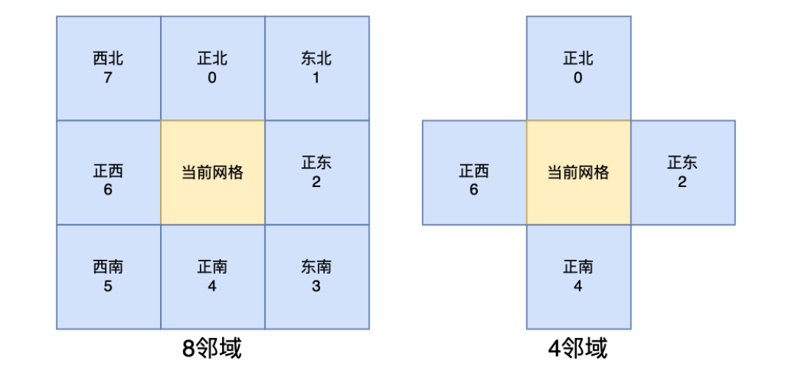

#### 语法

````sql
gridcell[] ST_Get_Neibers(gridcell cell, integer count default -1)
````

#### 参数

<!-- source_page: 377 -->

| 参数名称 | 描述 |
| --- | --- |
| cell | 给定的2D单元网格 |
| count | 返回网格的邻域个数，-1表示8邻域，4表示为4邻域，默认为-1 |

#### 返回值

返回邻域的网格数组。

#### 示例

````sql
sql
ST_GetNeibers ST_AsGridCell
SELECT
(
(122.11,65.15,15));
st_getneibers
------------------------------------------------------------------------------------
{
:
:
:
959691613154574336 15,959691630334443520 15,959691527255228416 15,9596914928954900
````

````sql
ST_GetNeibers ST_AsGridCell
SELECT
(
(122.11,65.15,15),4);
st_getneibers
-----------------------------------------------------------------------------------
{
:
:
:
959691613154574336 15,959691527255228416 15,959691475715620864 15,9596914585357516
````

````sql
ST_GetNeibers ST_AsGridCell
SELECT
(
(122.11,65.15),6);
ERROR: Number
neighborhood D grids must be
of
2
-1 or 4,default is -1.
````

<!-- chunk_type: interface; category: GridCell属性与计算函数; source_page: 377 -->

### ST_GetNeibers3D(gridcell, integer default -1)

#### 描述

返回网格的6邻域、18邻域或者26邻域，其中网格为3D网格。

6邻域为东、南、西、北、上、下。

18邻域为正北、东北、正东、东南、正南、西南、正西、西北、正上方、正北上、正东上、正南上、正西上、

正下方、正北下、正东下、正南下、正西下。

26邻域为正北、东北、正东、东南、正南、西南、正西、西北、正上方、正北上、东北上、正东上、东南上、

正南上、西南上、正西上、西北上、正下方、正北下、东北下、正东下、东南下、正南下、西南下、正西下、

西北下。

如下图所示：

<!-- source_page: 378 -->

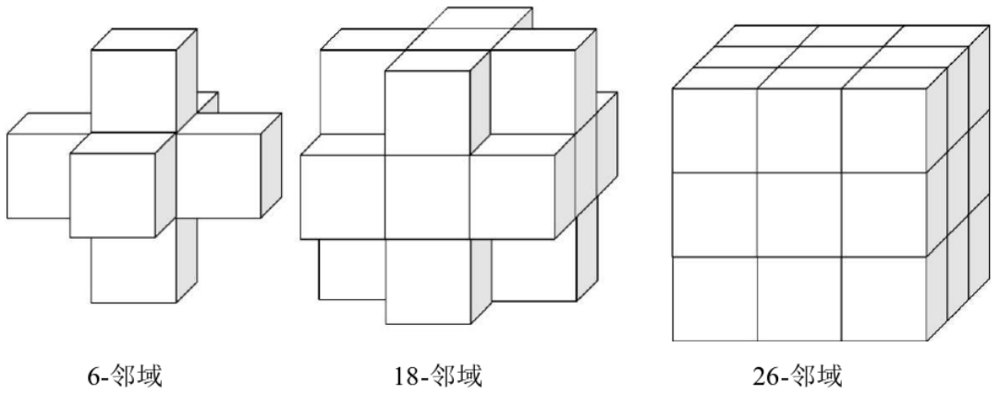

#### 语法

````sql
gridcell[] ST_Get_Neibers3D(gridcell cell, integer count default -1)
````

#### 参数

| 参数名称 | 描述 |
| --- | --- |
| cell | 给定的3D单元网格 |
| count | 返回网格的邻域个数，-1表示26邻域，6表示为6邻域，18表示为18邻域,默认为-1 |

#### 返回值

返回邻域的网格数组。

#### 示例

````sql
sql
ST_GetNeibers3D ST_AsGridCell3D
SELECT
(
(122.11,65.15,1000));
st_getneibers3d
------------------------------------------------------------------------------
{
"959697729188003840,0:12","959698828699631616,0:12","959692231629864960,0:12","959
,0:12","959691132118237184,1048576:12","959697729188003840,1048576:12","959698828699
500916606631936,1048576:12","959503115629887488,1048576:12","959509712699654144,1048
2231629864960,2147483648:12","959690032606609408,2147483648:12","959688933094981632,
}
````

````sql
ST_GetNeibers3D ST_AsGridCell3D
SELECT
(
(122.11,65.15,1000),6);
````

<!-- source_page: 379 -->

````text
st_getneibers3d
------------------------------------------------------------------------------
{
"959697729188003840,0:12","959692231629864960,0:12","959688933094981632,0:12","959
````

````sql
ST_GetNeibers3D ST_AsGridCell3D
SELECT
(
(122.11,65.15,1000),18);
st_getneibers3d
-------------------------------------------------------------------------------
{
"959697729188003840,0:12","959698828699631616,0:12","959692231629864960,0:12","959
,0:12","959691132118237184,1048576:12","959697729188003840,1048576:12","959692231629
959697729188003840,2147483648:12","959692231629864960,2147483648:12","95968893309498
````

````sql
ST_GetNeibers3D ST_AsGridCell3D
SELECT
(
(122.11,65.15,1000),8);
ERROR: Number
neighborhood D grids must be
of
3
-1 or 6 or 18,default is -1.
````

<!-- chunk_type: interface; category: GridCell属性与计算函数; source_page: 379 -->

### ST_Angle(gridcell,gridcell)

#### 描述

获取网格间定量方向，即为两个网格的之间的方位角。仅支持2D,若为3D网格，则将3D转换为2D进行计算。

#### 语法

````sql
float8 ST_Angle(gridcell cell1, gridcell cell2)
````

#### 参数

| 参数名称 | 描述 |
| --- | --- |
| cell1 | 给定的单元网格之一 |
| cell2 | 给定的单元网格之一 |

计算网格cell2相对于网格cell1的方位角，示意图如下所示：

<!-- source_page: 380 -->

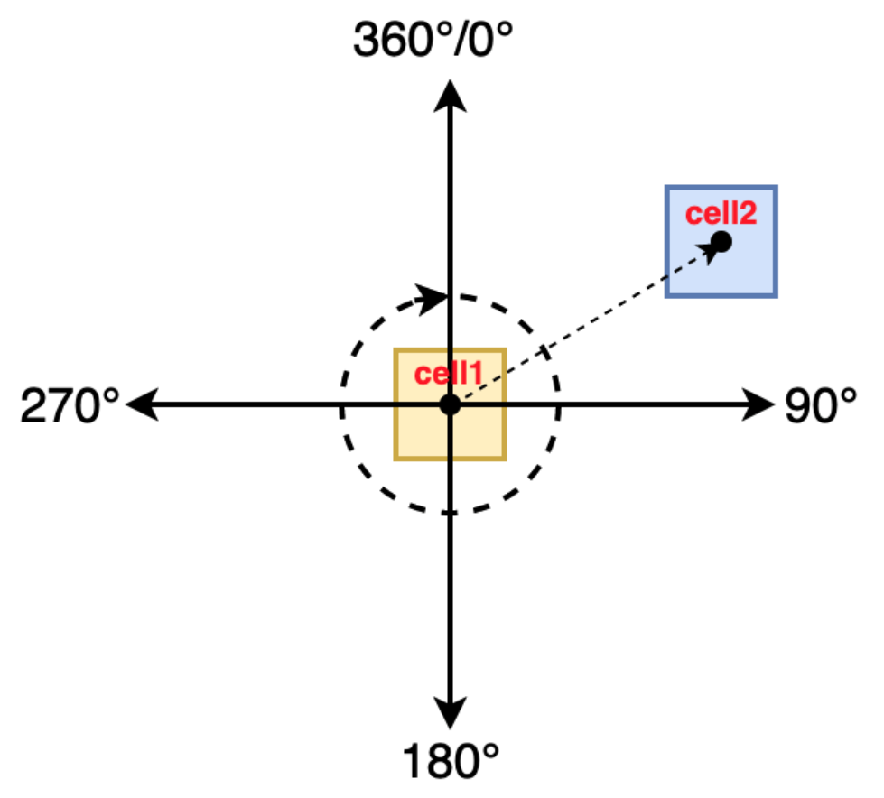

#### 返回值

返回两个网格之间的方位角,保留两位小数。

#### 示例

````sql
sql
ST_Angle ST_AsGridCell
ST_AsGridCell
SELECT
(
(102.11,53.15,18),
(132.11,75.15,18));
st_angle
----------
53.74
````

<!-- chunk_type: interface; category: GridCell属性与计算函数; source_page: 380 -->

### ST_GetCellFromAngle(gridcell, float8)

#### 描述

<!-- source_page: 381 -->

计算指定方位角的邻域网格。仅支持2D,若为3D网格，则将3D转换为2D进行计算。

#### 语法

````sql
gridcell ST_GetCellFromAngle(gridcell cell, float8 angle)
````

#### 参数

| 参数名称 | 描述 |
| --- | --- |
| cell | 给定的单元网格 |
| angle | 精确的方位角,范围为[0,360] |

#### 返回值

返回邻域网格。

#### 示例

````sql
sql
ST_GetCellFromAngle ST_AsGridCell
SELECT
(
(102.11,53.15,15),30);
st_getcellfromangle
-----------------------
:
544234461630300160 15
````

````sql
ST_GetCellFromAngle ST_AsGridCell
SELECT
(
(102.11,53.15,15),120);
st_getcellfromangle
-----------------------
:
544232949801811968 15
````

示意如下：

<!-- source_page: 382 -->

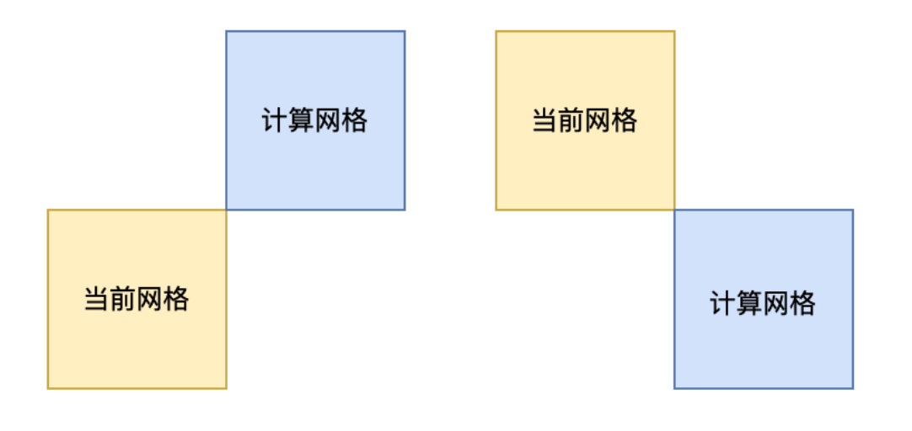

左图方位角为30，右图方位角为120.

<!-- chunk_type: interface; category: GridCell属性与计算函数; source_page: 382 -->

### ST_Direction(gridcell,gridcell)

#### 描述

获取网格间定性方向。仅支持2D,若为3D网格，则将3D转换为2D进行计算。

#### 语法

````sql
DIRECTION ST_Direction(gridcell cell1, gridcell cell2)
````

#### 参数

| 参数名称 | 描述 |
| --- | --- |
| cell1 | 给定的单元网格之一 |
| cell2 | 给定的单元网格之一 |

计算网格cell2相对于网格cell1的定性方向。

#### 返回值

返回两个网格的定性方向。

<!-- source_page: 383 -->

DIRECTION为枚举类型，分别

````text
为'NORTH','SOUTH','EAST','WEST','EAST_NORTH','EAST_SOUTH','WEST_NORTH','WEST_SOUTH','UNKNOW
````

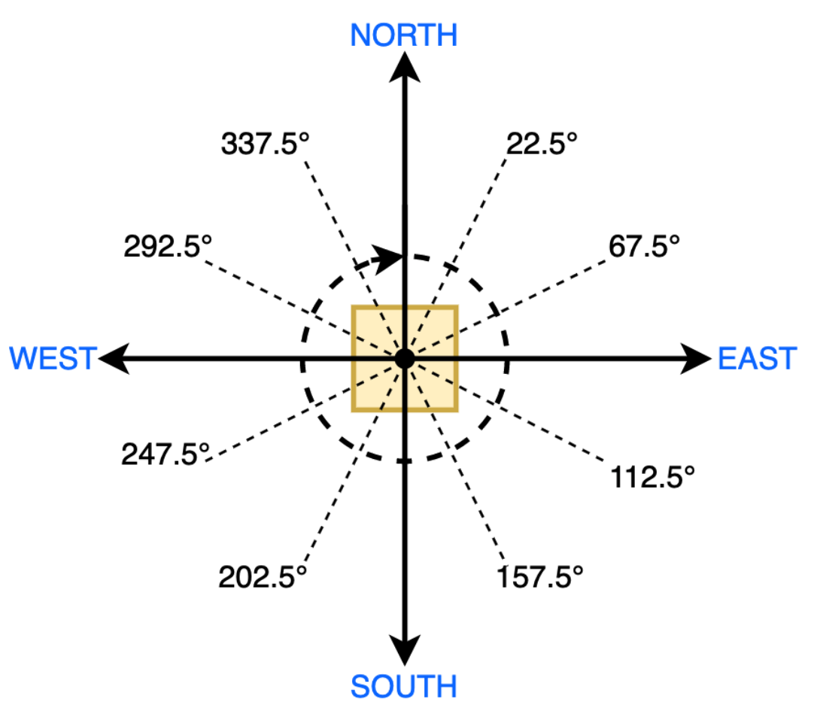

如上图所示,两个网格的定性方向与方位角之间的对应关系如下:

定性方向方位角区间(度)

NORTH (0,22.5] && (337.5,360]

EAST_NORTH (22.5,67.5]

EAST (67.5,112.5]

EAST_SOUTH (112.5,157.5]

SOUTH (157.5,202.5]

WEST_SOUTH (202.5,247.5]

WEST (247.5,292.5]

<!-- source_page: 384 -->

WEST_NORTH (292.5,337.5]

#### 示例

````sql
sql
ST_Direction ST_AsGridCell
ST_GetCellFromAngle ST_AsGridCell
SELECT
(
(102.11,53.15,15),
(
st_direction
--------------
WEST_NORTH
````

````sql
ST_Direction ST_AsGridCell
ST_GetCellFromAngle ST_AsGridCell
SELECT
(
(102.11,53.15,15),
(
st_direction
--------------
WEST_SOUTH
````

<!-- chunk_type: interface; category: GridCell属性与计算函数; source_page: 384 -->

### ST_VisibilityAnalysis(gridcell, gridcell, text, text)

#### 描述

已知空间区域环境网格集合，求其中两个网格的是否可视,即两个网格之间的连线没有其他网格遮挡。

#### 语法

````sql
boolean ST_VisibilityAnalysis(gridcell cell1, gridcell cell2, text tableName, text
field)
````

#### 参数

| 参数名称 | 描述 |
| --- | --- |
| cell1 | 单元网格起始点 |
| cell2 | 单元网格终止点 |
| tableName | 空间区域网格集合存储表 |
| field | 空间区域网格集合存储表中的网格集合字段,类型为geomgrids |

#### 返回值

返回两个网格是否可视。

<!-- source_page: 385 -->

#### 示例

````sql
sql
test
ST_AsGrids ST_AsGridcell
grids
CREATE TABLE
AS SELECT
(
(50,50)) As
;
````

````sql
ST_VisibilityAnalysis ST_AsGridcell
ST_AsGridcell
SELECT
(
(50,49),
(110,80),'test','grid
st_visibilityanalysis
-----------------------
f
````

````sql
ST_VisibilityAnalysis ST_AsGridcell
ST_AsGridcell
SELECT
(
(30,49),
(110,80),'test','grid
st_visibilityanalysis
-----------------------
t
````

<!-- chunk_type: interface; category: GridCell属性与计算函数; source_page: 385 -->

### ST_GetParent(gridcell)

#### 描述

获取给定单元网格的父网格,支持2D/3D

#### 语法

````sql
gridcell ST_GetParent(gridcell cell)
````

#### 参数

| 参数名称 | 描述 |
| --- | --- |
| cell | 给定的的单元网格 |

#### 返回值

返回父网格对象，若输入cell的level为0，则返回空。

#### 示例

````text
-- 2D
-- G00131032223023为中华世纪坛所在的14级网格，获取其父网格（13级）
````

<!-- source_page: 386 -->

````sql
select st_asText(st_GetParent(st_GridCellFromText('G00131032223023')));
st_astext
----------------
G0013103222302
````

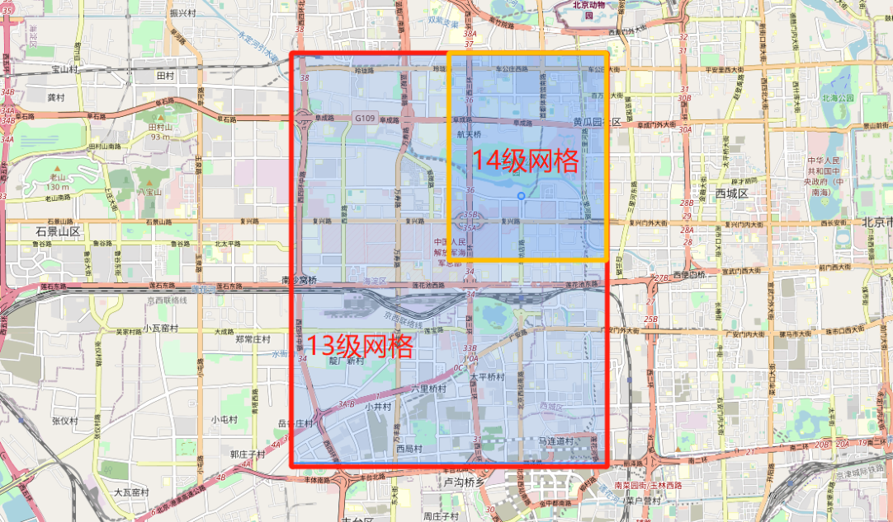

````sql
-- 3D
select st_asText(st_GetParent(st_GridCellFromText('GZ0026204220')));
st_astext
-------------
GZ002620422
````

<!-- chunk_type: interface; category: GridCell属性与计算函数; source_page: 386 -->

### ST_GetAncestor(gridcell, integer)

#### 描述

获取给定单元网格的特定层级的祖先网格,支持2D/3D

#### 语法

````sql
gridcell ST_GetAncestor(gridcell cell,integer level)
````

<!-- source_page: 387 -->

#### 参数

| 参数名称 | 描述 |
| --- | --- |
| cell | 给定的的单元网格 |
| level | 祖先网格的层级，要求不能大于cell的level |

#### 返回值

返回祖先网格对象，若输入的level大于cell的level，则返回空。

#### 示例

````sql
-- 2D 获取14级网格G00131032223023的11级祖先网格
select st_asText(ST_GetAncestor(st_GridCellFromText('G00131032223023'),11));
st_astext
--------------
G00131032223
````

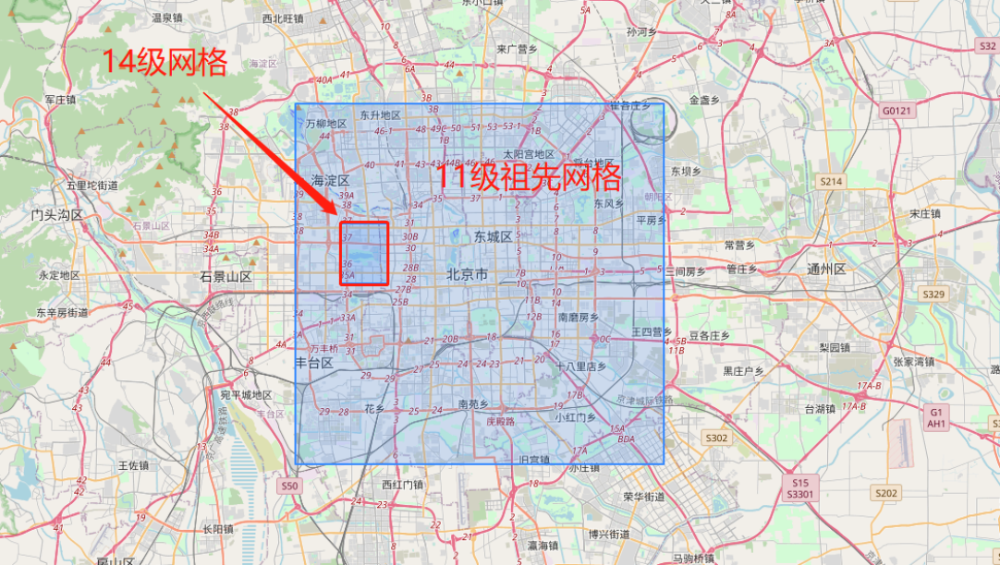

````sql
-- 3D 获取10级三维网格GZ0026204220的8级祖先网格
select st_asText(ST_GetAncestor(st_GridCellFromText('GZ0026204220'),8));
````

<!-- source_page: 388 -->

````text
st_astext
------------
GZ00262042
````

<!-- chunk_type: interface; category: GridCell属性与计算函数; source_page: 388 -->

### ST_AncestorOf(gridcell, gridcell)

#### 描述

判断一个gridcell是否是另一个gridcell的祖先,支持2D/3D

#### 语法

````sql
bool ST_AncestorOf(gridcell left,gridcell right)
````

#### 参数

| 参数名称 | 描述 |
| --- | --- |
| ley | 假设为祖先的gridcell对象 |
| right | 假设为后代的gridcell对象 |

#### 示例

````sql
-- 2D
select ST_AncestorOf(ST_GridCellFromText('G0013121000'),ST_GridCellFromText('G001312
st_ancestorof
---------------
t
-- 3D
select ST_AncestorOf(ST_GridCellFromText('GZ002620422'),ST_GridCellFromText('GZ00262
st_ancestorof
---------------
t
````

<!-- chunk_type: interface; category: GridCell属性与计算函数; source_page: 388 -->

### ST_GetDescendant(gridcell,integer)

#### 描述

<!-- source_page: 389 -->

获取给定单元网格的后代网格,支持2D/3D

#### 语法

````sql
gridcell[] ST_GetDescendant(gridcell cell,integer level))
````

#### 参数

| 参<br>数<br>名<br>称 | 描述 |
| --- | --- |
| cell | 给定的的单元网格 |
| level | 后代网格层级,为了避免数据量过大，2D支持5代以内、3D支持3代以内的后代网格计算。2D合法<br>区间：[cell.level+1,min(31,cell.level+5)]，3D合法区间：[cell.level+1,min(31,cell.level+3)]，超过合法<br>区间会返回NULL |

#### 返回值

返回后代网格数组对象。

#### 示例

````sql
--2D G00131032223023是一个层级为14的网格，获取其16级的后代网格
select st_asText(st_asGrids(ST_GetDescendant(st_GridCellFromText('G00131032223023'),
````

````text
--------------------------------------------------------
{"cells":["G0013103222302322","G0013103222302300","G0013103222302323","G00131032223
````

<!-- source_page: 390 -->

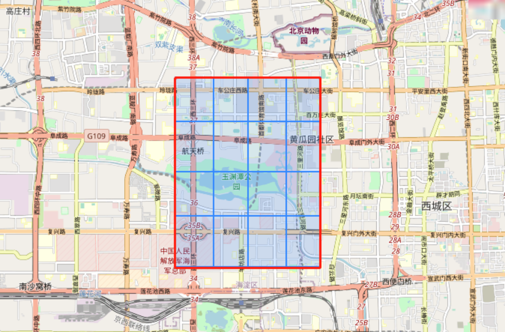

````sql
--3D GZ0026204220是一个层级为10的3D网格，获取其11级子网格。
select st_asText(ST_GetDescendant(st_GridCellFromText('GZ0026204220'),11));
st_astext
----------------------------------------------------------------
{GZ00262042207,GZ00262042206,GZ00262042205,GZ00262042204,GZ00262042203,GZ0026204220
````

<!-- chunk_type: interface; category: GridCell属性与计算函数; source_page: 390 -->

### ST_DescendantOf(gridcell, gridcell)

#### 描述

判断一个gridcell是否是另一个gridcell的后代,支持2D/3D

#### 语法

````sql
bool ST_DescendantOf(gridcell left,gridcell right)
````

#### 参数

ley假设为后代的gridcell对象

<!-- source_page: 391 -->

right假设为祖先的gridcell对象

#### 示例

````sql
-- 2D
select ST_DescendantOf(ST_GridCellFromText('G001312100003'),ST_GridCellFromText('G00
st_descendantof
-----------------
t
-- 3D
select ST_DescendantOf(ST_GridCellFromText('GZ002620422075'),ST_GridCellFromText('G
st_descendantof
-----------------
t
````

<!-- chunk_type: interface; category: GridCell属性与计算函数; source_page: 391 -->

### ST_GetNextBrother(gridcell)

#### 描述

获取给定gridcell同层级的下一个网格（按Code排序），用于在Btree索引下查询子网格。主要用于点数据基于网格聚合的场景。

#### 原理

gridcell在Btree索引下按code（2D网格码）排序，cellC是CellA的NextBrother，如果cellB是cellA的子网格，则cellB肯定位于(cellA,cellC)区间。由于Btree索引支持range查询，所以可通过Btree索引查询子网格。

#### 语法

````sql
gridcell ST_GetNextBrother(gridcell cell)
````

#### 示例

````sql
select ST_GETNEXTBROTHER('394383914082238464:18'::gridcell);
st_getnextbrother
-----------------------
394383914350673920:18
````

<!-- source_page: 392 -->

<!-- chunk_type: interface; category: GridCell属性与计算函数; source_page: 392 -->

### ST_FamilyOf(gridcell, gridcell)

#### 描述

判断一个gridcell是否是另一个gridcell是否存在亲属关系,支持2D/3D

#### 语法

````sql
bool ST_FamilyOf(gridcell left,gridcell right)
````

#### 原理

如果ley与right相等，或ley是right的祖先网格，或ley是right的后代网格，则返回true.

#### 示例

````sql
--2D
select ST_FamilyOf(ST_GridCellFromText('G001312100003'),ST_GridCellFromText('G001312
st_familyof
-------------
t
````

````sql
--3D
select ST_FamilyOf(ST_GridCellFromText('GZ002620422075'),ST_GridCellFromText('GZ002
st_familyof
-------------
t
````

<!-- chunk_type: interface; category: GridCell属性与计算函数; source_page: 392 -->

### ST_GetNeiber(gridcell, integer)

#### 描述

获取一个2D网格的相邻网格。如果传入的网格是3D网格，则不考虑高程剖分。 支持2D

#### 原理

一个2D网格相邻的8个网格示例图如下：

<!-- source_page: 393 -->

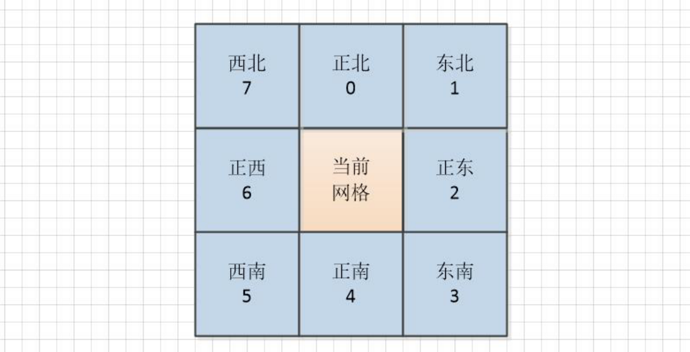

#### 语法

````sql
bool ST_GetNeiber(gridcell cell,integer neiberType)
````

#### 参数

| 参数名称 | 描述 |
| --- | --- |
| cell | 当前单元网格 |
| neiberType | 临接网格8中类型。0：正北，1：东北，2：正东，3：东南，4：正南，5：西南，6：正<br>西，7：西北 |

#### 示例

````sql
select st_getNeiber(st_asGridcell(28.01,39.5,15),3);
st_getneiber
-----------------------
170726169786712064:15
````

<!-- chunk_type: interface; category: GridCell属性与计算函数; source_page: 393 -->

### ST_GetNeiber3D(gridcell, integer)

#### 描述

<!-- source_page: 394 -->

获取一个3D网格的相邻网格。 仅支持3D

#### 原理

一个3D网格相邻的26个网格示例图如下：

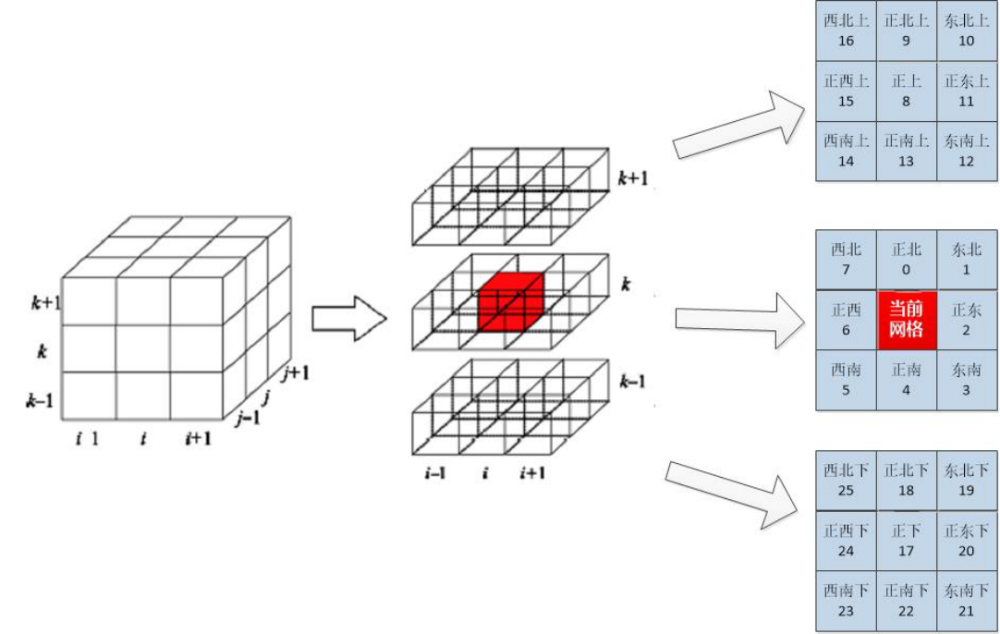

#### 语法

````sql
bool ST_GetNeiber(gridcell cell,integer neiberType)
````

#### 参数

| 参数名称 | 描述 |
| --- | --- |
| cell | 当前单元网格,要求必须为3D网格 |
| neiberType | 临接网格8中类型。0：正北，1：东北，2：正东，3：东南，4：正南，5：西南，6：正<br>西，7：西北，8：正上，9：正北上，10：东北上，11：正东上，12：东南上，13：正南<br>上，14：西南上，15：正西上，16：西北上，17：正下，18：正北下，19：东北下，20：正<br>东下，21：东南下，22：正南下，23：西南下，24：正西下，25：西北下 |

#### 示例

<!-- source_page: 395 -->

````sql
select st_getNeiber3D(st_asGridcell3D(28.01,39.5,1005,15),8);
st_getneiber3d
------------------------------
170726255686057984,131072:15
````

<!-- chunk_type: interface; category: GridCell属性与计算函数; source_page: 395 -->

### ST_DrawGrids(double,double,double,double,integer)

#### 描述

二维网格绘制函数，根据传入的空间范围和层级，返回网格线信息。

#### 语法

````sql
text ST_DrawGrids(double west,double south,double east,double north,integer level)
````

#### 参数

| 参数名称 | 描述 |
| --- | --- |
| west | 屏幕范围 经度最小值,范围[-180,180] |
| south | 屏幕范围 纬度最小值,范围[-80,80] |
| east | 屏幕范围 经度最大值,范围[-180,180] |
| north | 屏幕范围 纬度最大值,范围[-80,80] |
| level | 需要绘制的网格层级,限定范围为[3,12] |

#### 示例

````sql
select st_drawgrids(120.0,38.0,122.0,40.0,10);
st_drawgrids
----------------------------------------------
{"lats":[38.0,38.533332999999999,39.0,39.533332999999999,40.0,40.533332999999999],"
````

#### 返回值

返回网格绘制信息，json字符串格式。

<!-- source_page: 396 -->

| 参数名称 | 描述 |
| --- | --- |
| lats | 屏幕绘制 纵线数组 |
| lngs | 屏幕范围 横线数组 |

<!-- chunk_type: interface; category: GridCell属性与计算函数; source_page: 396 -->

### ST_DrawGrids(integer)

#### 描述

全球二维网格绘制函数，根据传入的层级，返回全球网格线信息。

#### 语法

````sql
text ST_DrawGrids(integer level)
````

#### 参数

| 参数名称 | 描述 |
| --- | --- |
| level | 需要绘制的网格层级,限定范围为[3,15] |

#### 示例

````sql
select ST_DrawGrids(6);
st_drawgrids
-----------------------------------------------------------------------------------
{"lats":[-90.0,-88.0,-80.0,-72.0,-64.0,-56.0,-48.0,-40.0,-32.0,-24.0,-16.0,-8.0,0.0,
````

#### 返回值

返回网格绘制信息，json字符串格式。

| 参数名称 | 描述 |
| --- | --- |
| lats | 屏幕绘制 纵线数组 |
| lngs | 屏幕范围 横线数组 |

<!-- chunk_type: interface; category: GridCell属性与计算函数; source_page: 396 -->

### ST_DrawGrids3D(double,double,double,double,double,double,integer)

#### 描述

<!-- source_page: 397 -->

三维网格绘制函数，根据传入的空间范围和层级，返回网格面信息。

#### 语法

````sql
text ST_DrawGrids3D(double west,double south,double bottom,double east,double
north,double top,integer level)
````

#### 参数

| 参数名称 | 描述 |
| --- | --- |
| west | 经度最小值 |
| south | 纬度最小值,范围[-88,88] |
| bottom | 高度最小值(单位m)。有效范围[-6302106.7222,528680167.3367] |
| east | 经度最大值 |
| north | 纬度最大值,范围[-88,88] |
| top | 高度最大值(单位m).有效范围[-6302106.7222,528680167.3367] |
| level | 需要绘制的网格层级,限定范围为[3,20] |

#### 示例

````sql
select ST_DrawGrids3D(120.0,38.0,0,122.0,40.0,150000,10);
st_drawgrids3d
-----------------------------------------------------------------
{"heights":[0.0,59130.654071920551,118809.49866577052],"lats":[38.0,38.533333333332
````

#### 返回值

返回网格绘制信息，json字符串格式。

| 参数名称 | 描述 |
| --- | --- |
| lats | 纵面数组 |
| lngs | 横面数组 |
| heights | 高度面数组 |

<!-- chunk_type: interface; category: GridCell属性与计算函数; source_page: 397 -->

### ST_DrawGrids3D(double,double,integer)

<!-- source_page: 398 -->

#### 描述

全球三维网格绘制函数，根据传入的高度范围和层级，返回全球网格面信息。

#### 语法

````sql
text ST_DrawGrids3D(double bottom,double top,integer level)
````

#### 参数

| 参数名称 | 描述 |
| --- | --- |
| bottom | 高度最小值(单位m)。有效范围[-6302106.7222,528680167.3367] |
| top | 高度最大值(单位m).有效范围[-6302106.7222,528680167.3367] |
| level | 需要绘制的网格层级,限定范围为[3,20] |

#### 示例

````sql
select ST_DrawGrids3D(0,15000,7);
st_drawgrids3d
------------------------------------------------------------------------
{"heights":[0.0,457071.54371596314],"lats":[-88.0,-84.0,-80.0,-76.0,-72.0,-68.0,-64
````

#### 返回值

返回网格绘制信息，json字符串格式。

| 参数名称 | 描述 |
| --- | --- |
| lats | 纵面数组 |
| lngs | 横面数组 |
| heights | 高度面数组 |

## GridCell空间关系函数

<!-- chunk_type: interface; category: GridCell空间关系函数; source_page: 398 -->

### ST_Equals(gridcell,gridcell)

<!-- source_page: 399 -->

比较两个gridcell对象是否相等. 函数仅支持2D，对于3D对象，高度编码不参与计算。

#### 语法

````sql
bool ST_Equals(geomgrids leftcell, geomgrids rightcell)
````

#### 参数

| 参数名称 | 描述 |
| --- | --- |
| leycell | 第一个gridCell对象 |
| rightcell | 第二个gridCell对象 |

#### 示例

````sql
select st_equals(st_gridcellfromText('G00131032220212'),st_gridcellfromText('G001310
st_equals
-----------
t
````

<!-- chunk_type: interface; category: GridCell空间关系函数; source_page: 399 -->

### ST_Intersects(gridcell,gridcell)

判断一个gridCell的空间范围是与另一个gridCell的空间范围是否有交集。 函数仅支持2D，若gridCell是3D网格，高度码zcode不参与计算。

#### 语法

````sql
bool ST_Intersects(geomgrids leftcell, geomgrids rightcell)
````

#### 参数

| 参数名称 | 描述 |
| --- | --- |
| leycell | 第一个gridCell对象 |
| rightcell | 第二个gridCell对象 |

#### 原理

如果两个网格是亲属关系，则他们肯定相交。

<!-- source_page: 400 -->

#### 示例

````sql
select ST_Intersects(ST_GridCellFromText('G0013121000031'),ST_GridCellFromText('G001
st_intersects
---------------
t
````

<!-- chunk_type: interface; category: GridCell空间关系函数; source_page: 400 -->

### ST_WithIn(gridcell,gridcell)

判断一个gridCell的空间范围是否被完全被另一个gridCell的空间范围覆盖。 算子仅支持2D，若gridCell是3D网格，高度码zcode不参与计算。

#### 语法

````sql
bool ST_WithIn(geomgrids leftcell, geomgrids rightcell)
````

#### 参数

| 参数名称 | 描述 |
| --- | --- |
| leycell | 第一个gridCell对象 |
| rightcell | 第二个gridCell对象 |

#### 原理

如果leycell与rightcell相等，或leycell是rightcell的后代网格，则返回true.

#### 示例

````sql
select ST_WithIn(ST_GridCellFromText('G00131210000312'),ST_GridCellFromText('G001312
st_within
-----------
t
````

<!-- chunk_type: interface; category: GridCell空间关系函数; source_page: 400 -->

### ST_Contains(gridcell,gridcell)

<!-- source_page: 401 -->

判断一个gridCell的空间范围是否完全覆盖一个gridCell的空间范围。 算子仅支持2D，若gridCell是3D网格，高度码zcode不参与计算。

#### 语法

````sql
bool ST_Contains(geomgrids leftcell, geomgrids rightcell)
````

#### 参数

| 参数名称 | 描述 |
| --- | --- |
| leycell | 第一个gridCell对象 |
| rightcell | 第二个gridCell对象 |

#### 原理

如果leycell与rightcell相等，或leycell是rightcell的祖先网格，则返回true.

#### 示例

````sql
select ST_Contains(ST_GridCellFromText('G00131210000'),ST_GridCellFromText('G0013121
st_contains
-------------
t
````

## GridCell操作符

<!-- chunk_type: interface; category: GridCell操作符; source_page: 401 -->

### =

两个gridCell是否相等。

仅支持2D(若gridCell是3D网格，高度码zcode不参与计算)

支持Btree索引

#### 语法

````text
boolean =(gridcell cell1, gridcell cell2);
````

<!-- source_page: 402 -->

#### 原理

若两个gridcell的code和level都相等，则返回true。

#### 示例

````sql
select '394383914082238464:18'::gridcell='394383914082238464:18'::gridcell;
?column?
----------
t
````

<!-- chunk_type: interface; category: GridCell操作符; source_page: 402 -->

### &&

判断一个gridCell的空间范围是否与另一个gridCell的空间范围是否有交集。

支持2D/3D

不支持索引

#### 语法

````text
boolean &&(gridcell cell1, gridcell cell2);
````

#### 原理

同ST_Intersects(gridcell,gridcell)

#### 示例

````sql
--2D
select ST_GridCellFromText('G0013121000031')&&ST_GridCellFromText('G001312100003122'
?column?
----------
t
````

<!-- source_page: 403 -->

````sql
--3D
select st_gridcellfromText('GZ00262042')&&st_gridcellfromText('GZ00262042207');
?column?
----------
t
````

<!-- chunk_type: interface; category: GridCell操作符; source_page: 403 -->

### @>

判断一个gridCell的空间范围是否完全覆盖一个gridCell的空间范围。

支持2D/3D

不支持索引

#### 语法

````text
boolean @>(gridcell cell1, gridcell cell2);
````

#### 原理

同ST_Contains(gridcell,gridcell)

#### 示例

````sql
--2D
select ST_GridCellFromText('G00131210000')@>ST_GridCellFromText('G001312100003');
st_contains
-------------
t
````

````sql
--3D
select st_gridcellfromText('GZ00262042')@>st_gridcellfromText('GZ00262042207');
st_contains
-------------
t
````

<!-- chunk_type: interface; category: GridCell操作符; source_page: 403 -->

### <@

<!-- source_page: 404 -->

判断一个gridCell的空间范围是否被完全另一个gridCell的空间范围覆盖。

支持2D/3D

不支持索引

#### 语法

````text
boolean <@(gridcell cell1, gridcell cell2);
````

#### 原理

同ST_WithIn(gridcell,gridcell)

#### 示例

````sql
--2D
select ST_GridCellFromText('G00131210000312')<@ST_GridCellFromText('G0013121000031')
?column?
----------
t
````

````sql
--3D
select st_gridcellfromText('GZ00262042207')<@st_gridcellfromText('GZ00262042');
?column?
----------
t
````

<!-- chunk_type: interface; category: GridCell操作符; source_page: 404 -->

### <

判断一个gridCell是否小于另一个gridcell。

仅支持2D

支持BTree索引

#### 语法

<!-- source_page: 405 -->

````text
boolean <(gridcell cell1, gridcell cell2);
````

#### 原理

如果"cell1.code<cell2.code" 或 "cell1.code==cell2.code && cell1.level<cell2.level",返回true。

#### 示例

````sql
select '394383914082238464:16'::gridcell<'394383914082238464:18'::gridcell;
?column?
----------
t
````

````sql
select '394383321402238464:18'::gridcell<'394383914082238464:18'::gridcell;
?column?
----------
t
````

<!-- chunk_type: interface; category: GridCell操作符; source_page: 405 -->

### <=

判断一个gridCell是否小于等于另一个gridcell。

仅支持2D

支持BTree索引

#### 语法

````text
boolean <=(gridcell cell1, gridcell cell2);
````

#### 原理

如果"cell1.code<=cell2.code" 或 "cell1.code==cell2.code && cell1.level<=cell2.level",返回true。

#### 示例

<!-- source_page: 406 -->

````sql
select '394383914082238464:16'::gridcell<='394383914082238464:18'::gridcell;
?column?
----------
t
````

````sql
select '394383321402238464:18'::gridcell<='394383914082238464:18'::gridcell;
?column?
----------
t
````

<!-- chunk_type: interface; category: GridCell操作符; source_page: 406 -->

### >=

判断一个gridCell是否大于等于另一个gridcell。

仅支持2D

支持BTree索引

#### 语法

````text
boolean >=(gridcell cell1, gridcell cell2);
````

#### 原理

如果"cell1.code>cell2.code" 或 "cell1.code==cell2.code && cell1.level>=cell2.level",返回true。

#### 示例

````sql
select '394383914082238464:16'::gridcell>='394383914082238464:18'::gridcell;
?column?
----------
f
````

````sql
select '394383914082238464:18'::gridcell>='394383321402238464:18'::gridcell;
?column?
````

<!-- source_page: 407 -->

````text
----------
t
````

<!-- chunk_type: interface; category: GridCell操作符; source_page: 407 -->

### >

判断一个gridCell是否大于另一个gridcell。

仅支持2D

支持BTree索引

#### 语法

````text
boolean >(gridcell cell1, gridcell cell2);
````

#### 原理

如果"cell1.code>=cell2.code" 或 "cell1.code==cell2.code && cell1.level>cell2.level",返回true。

#### 示例

````sql
select '394383914082238464:16'::gridcell>'394383914082238464:18'::gridcell;
?column?
----------
f
````

````sql
select '394383914082238464:18'::gridcell>'394383321402238464:18'::gridcell;
?column?
----------
t
````

## GeomGrids输入输出转换函数

<!-- chunk_type: interface; category: GeomGrids输入输出转换函数; source_page: 407 -->

### ST_AsGrids(geometry ....)

<!-- source_page: 408 -->

打码函数。通过Geomtry构建GeomGrids对象（计算几何对象相交的所有网格对象） 几何对象的空间参考必须是CGC2000（SRID=4490）（为了开发方便，暂时支持4490和4326两种）

#### 语法

````sql
geomgrids ST_AsGrids(geometry geom, integer detailLevel,bool isAgg); geomgrids
ST_AsGrids(geometry geom, integer detailLevel); geomgrids ST_AsGrids(geometry geom);
````

#### 参数

| 参数名称 | 描述 |
| --- | --- |
| geom | 需要计算的几何对象。 |
| isAgg | 是否开启网格聚合，默认开启。true:聚合模式，false：非聚合模式。聚合模式会产生不同<br>层级的网格单元，在BGC应用场景下，避免使用聚合模式 |
| detailLevel | 打码最精细层级，取值范围[6,32]。如果不指定，则根据geometry自动计算detailLevel。对<br>于Point、MultiPoint，默认detailLevel为12,对于其他类型，自动计算出的detailLevel范围为<br>[6,32] |

#### 原理

本函数实现对任意Geometry的打码。根据点、线或面等Geometry对象生成与之相交的GeomGrids对象。点、线、面打码效果如下图所示：

<!-- source_page: 409 -->

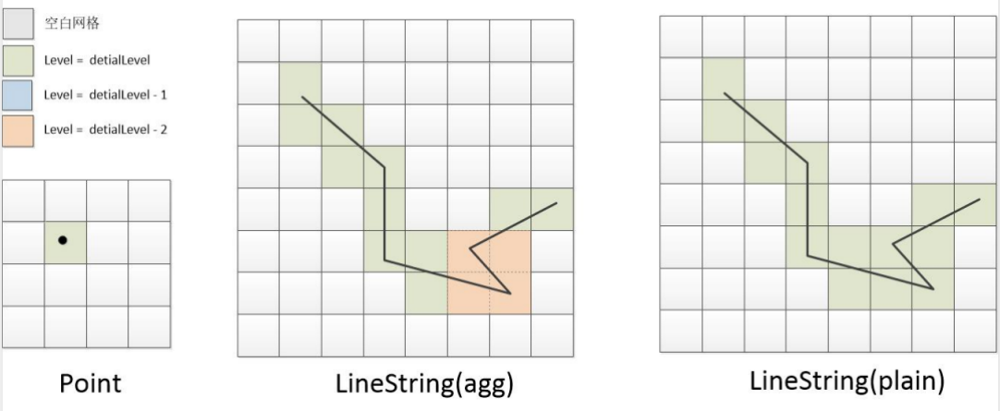

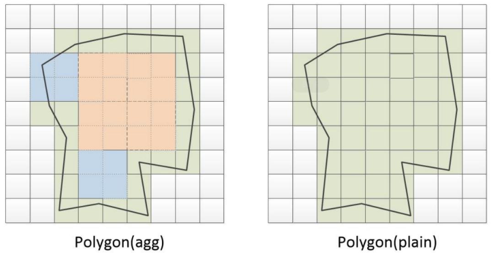

#### 网格模式

提供Aggregate和Plain两种网格模式。 plain模式 ：Geometry转换输出的GeomGrids中所有的gridCell对象均为detailLevel。这种模式下所有单元网格层级相同，但数据量较大。 agg(Aggregate)模式 ：为了降低GeomGrids存储空间，对GeomGrids进行了网格聚合。在一个Grids对象中，从detailLevel到第6级，如果四个网格为兄弟网格（拥有相同的父网格），从Grids中删除这四个网格，添加其父网格。

上图左侧为一个Polygon agg模式的打码示例。

绿色网格（level = detailLevel）位于多边形边缘，不能再合并；蓝色网格（level = detailLevel-1）是四个绿色网格的父网格，由于其四个子网格均在Grids中，故用蓝色网格代替四个绿色网格；

<!-- source_page: 410 -->

粉色网格（level = detailLevel-2）是四个蓝色网格的父网格，由于其四个子网格均在Grids中，故用粉色网格代替四个蓝色网格；

#### detailLevel的选择

detailLevel越大，网格cell代表的区域范围越小，Grids中cell数量越多，表达的Geometry区域更加精确；detailLevel越小，网格cell代表的区域范围越小，中cell数量越少，Grids对Geometry的表达更加粗略，但数据量会很大

#### 举例说明detailLevel与isAgg 对打码精度和数据量的影响

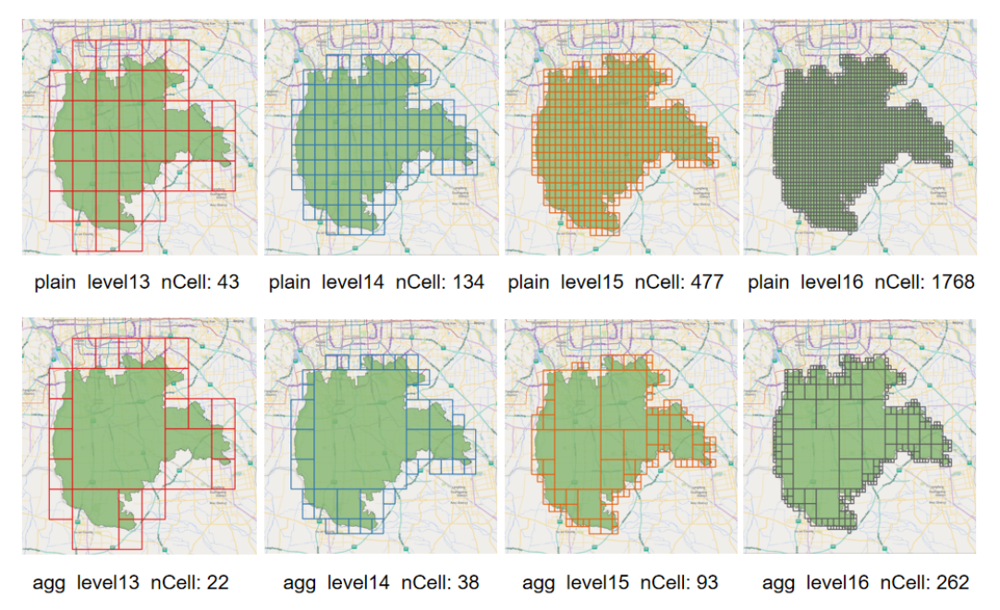

上图为不同detailLevel和isAgg下对北京市大兴区Polygon的打码结果。 从图中可以得出以下结论： 横向对比，网格模式相同时，detailLevel越大，Cell数量越多，但网格的几何形状与Geometry更加贴近。detailLevel每增加1，Cell数量是原来的3~4倍。 纵向对比，detailLevel相同时，agg模式与plain模式外轮廓一致（与Geometry贴合程度一致），但agg模式的cell数量为plain模式的1/3。tailLeve越大时，agg较plain模式的数据压缩率越高。

结论：agg模式可以占用更少存储，且不损耗外轮廓精度，推荐使用agg模式。

#### detailLevel自动计算原理

如果参数不传入detailLevel，BEST-DB会根据传入的Geometry类型和范围自动计算最合适的数值。 对于Point、MultiPoint，默认detailLevel为12。对于其他Geometry类型，获取geometry bbox 最大的边长 length。width(l)为层级为l的单元网格边长,若 width(l)*12<=length 且 width(l+1)*12 >length，l即为结果。这种算法保证每

<!-- source_page: 411 -->

个geometry获得的grids对象单元网格数量不超过144. 上文中的大兴区多边形，如果不指定层级，自动计算出来的detailLevel为14.

#### 示例

````sql
--用Point构建一个(不设置层级，默认12),
select ST_AsGrids(ST_geomfromtext('POINT(116.31522216796875 39.910277777777778)',449
st_asgrids
----------------------------------------------------------------
{"cells":["526547322448904192:12"],"detailLevel":12,"nCell":1}
````

````sql
-- 用Polygon构建一个11级网格，并输出。
select st_asText(ST_AsGrids(ST_GeomFromText('POLYGON((116.168188 40.158828,116.62141
st_astext
---------------------------------------------
{"cells":["G0013103222","G00131032232","G00131032230","G00131210000","G00131210001"
````

````sql
-- 自动计算level
select ST_AsGrids(ST_GeomFromText('POLYGON((116.168188 40.158828,116.621415 40.137
````

````text
st_asgrids
---------------------------------------------
{"cells":["526555568786112512:13","526562715611693056:12","526560516588437504:12","5
````

````sql
--如果需要在pgAdmin或QGIS等工具中可视化浏览GeomGrids的效果，可将其转换为Geometry
select st_asGeometry(ST_AsGrids(ST_GeomFromText('POLYGON((116.168188 40.158828,116.6
st_asgeometry
------------------------------------------------
0106000020E610000006000000010300000001000000050000000000000000005D401544444444C4434
03333333333335D401544444444C443403333333333335D406666666666E643400B22222222225D40666
00000000044400B22222222225D406666666666E64340010300000001000000050000000000000000005
D4000000000000044400B22222222225D4000000000000044400B22222222225D4051222222222244402
B22222222225D4051222222222244400B22222222225D400000000000004440
````

<!-- chunk_type: interface; category: GeomGrids输入输出转换函数; source_page: 411 -->

### ST_AsGrids3D(geometry ....)

三维Geometry打码函数。通过3D Geomtry构建3D GeomGrids对象（计算几何对象相交的所有网格对象）. 几何对象的空间参考必须是CGC2000（SRID=4490） （为了开发方便，暂时支持4490和4326两种）

<!-- source_page: 412 -->

另外,可以通过ST_ExturdeGeometry函数将2D geometry拉伸成为3D geometry再进行打码。

#### 语法

````sql
geomgrids ST_AsGrids3D(geometry geom, integer detailLevel,bool isAgg); geomgrids
ST_AsGrids3D(geometry geom, integer detailLevel); geomgrids ST_AsGrids3D(geometry
geom);
````

#### 参数

| 参数名称 | 描述 |
| --- | --- |
| geom | 需要计算的几何对象,要求geometry必须含有Z维度信息，否则报错。目前支持：Point Z、<br>LingString Z、MultiPoint Z、MultiLingString Z、POLYHEDRALSURFACE Z |
| isAgg | 是否开启网格聚合，默认开启。支持两种网格模式，aggregate和Plain。 |
| detailLevel | 打码最精细层级，取值范围[6,32]。如果不指定，则根据geometry自动计算detailLevel。对<br>于Point、MultiPoint，默认detailLevel为12,对于其他类型，自动计算出的detailLevel范围为<br>[6,32] |

#### 原理

本函数实现对任意Geometry Z的打码。根据Geometry生成与之相交的GeomGrids对象。三维点、三维面、三维

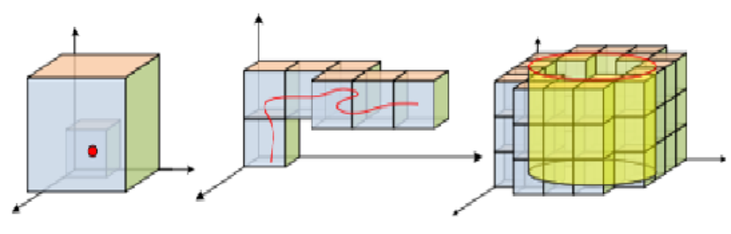

体打码效果如下图所示：

#### detailLevel自动计算原理

原理同ST_AsGrids(),高度域不参与计算。

#### 示例

````sql
-- Point 打码，提示需要Z。
select ST_AsGrids3D(ST_GeomFromText('POINT(116.168188 40.158828)',4326),9);
ERROR: Input Geometry must has z！
````

<!-- source_page: 413 -->

````sql
-- Point Z 打码
select ST_AsGrids3D(ST_GeomFromText('POINT(116.168188 40.158828 10)',4326),9);
st_asgrids3d
----------------------------------------------------------------------------
{"cells":["532550655936561152,0:9"],"detailLevel":9,"is3d":true,"nCell":1}
````

````sql
--LineString Z 打码
select ST_AsGrids3D(st_geomfromtext('LINESTRING (114 35 100, 115 36 1200, 116 37 0)'
````

````text
st_asgrids3d
---------------------------------------------------------------------
{"cells":["523455495751598080,0:10","525073976867684352,0:10","523209205146976256,0:
````

````sql
-- 用Box3D构建一个POLYHEDRALSURFACE Z对象，然后打码构建一个9级网格集合。
select ST_AsGrids3D(st_setSrid(geometry(ST_3DMakeBox(ST_MakePoint(120.1, 40.1, 0.1),
````

````text
st_asgrids3d
------------------------------------------------------------------------------------
{"cells":["536280199377977344,0:9","536209830633799680,8388608:9","5362801993779773
561674354688000,0:9","536983886819753984,8388608:9","536209830633799680,0:9","536139
08:9","536069093145444352,0:9","535998724401266688,8388608:9","536843149331398656,0:
3328,0:9","536632043098865664,8388608:9","536632043098865664,0:9","53656167435468800
````

将二维Polygon拉伸成POLYHEDRALSURFACE Z，然后打码

````sql
-- 构建POLYHEDRALSURFACE Z 并打码。注意，ST_Extrude中单位为度，实际使用中需要将高程米换算成度。
SELECT st_asGrids3d(ST_Extrude(ST_GeomFromText('POLYGON ((30 10, 10 20, 20 40, 40 40
st_asgrids3d
------------------------------------------------------------------------------------
{"cells":["50665495807918080,0:7","52917295621603328,0:7","162129586585337856,0:7","
````

将二维geometry拉伸成为三维体数据再进行打码

````sql
select st_asgrids3d(ST_ExturdeGeometry(ST_GeomFromText('POLYGON((116.168188 40.15882
````

````text
st_asgrids3d
---------------------------------------------------------------------------
````

<!-- source_page: 414 -->

````json
{"cells":["526550620983787520,0:13","526553919518670848,0:13","526554194396577792,0
351424,0:13","526555568786112512,0:13","532550930814468096,0:13","532551480570281984
38886144,0:13","532568523000512512,0:13","526542649524486144,0:13","5265613412221583
2756326400,0:13","526543199280300032,0:13","532556428372606976,0:13","53256934763423
222937276416,0:13","526545398303555584,0:13","526548421960531968,0:13","526542099768
37426844254208,0:13","526544023914020864,0:13","526537701722161152,0:13","5265407253
6541000257044480,0:13","526538251477975040,0:13","532558627395862528,0:13","52654759
532555328860979200,0:13","526560791466344448,0:13","526541550012858368,0:13","526548
,"532552580081909760,0:13","532568248122605568,0:13","526542374646579200,0:13","5325
3","526544573669834752,0:13","532570447145861120,0:13","532557527884234752,0:13","52
````

<!-- chunk_type: interface; category: GeomGrids输入输出转换函数; source_page: 414 -->

### ST_AsGrids(gridcell[])

通过gridcell数组构建GeomGrids对象。支持2D/3D

#### 语法

````sql
geomgrids ST_AsGrids(gridcell[] cells)
````

#### 参数

| 参数名称 | 描述 |
| --- | --- |
| cells | gridcell数组,数组中不能同时存在2D和3D网格 |

#### 示例

````sql
-- 2D
select ST_AsGrids(ST_GridCellsFromTexts(ARRAY['G00131032220212','G00131032220213','G
st_asgrids
-------------------------------------------------------------
{"cells":["526537839161114624:14","526537633002684416:14","526537151966347264:13","
````

````sql
-- 3D
select ST_AsGrids(ST_GridCellsFromTexts(ARRAY['GZ002626044','GZ002626045','GZ002626
````

````text
---------------------------------------------------
````

<!-- source_page: 415 -->

````json
{"cells":["536772780587220992,0:9","536772780587220992,8388608:9","5368431493313986
````

````sql
-- 2D-3D混合
select ST_AsGrids(ST_GridCellsFromTexts(ARRAY['G00131032220212','G00131032220213','G
ERROR: Input array can not contains both 2d gridcell and 3d gridcell!
````

<!-- chunk_type: interface; category: GeomGrids输入输出转换函数; source_page: 415 -->

### ST_AsGrids(gridcell)

通过单个gridcell对象构建GeomGrids对象。支持2D/3D

#### 语法

````sql
geomgrids ST_AsGrids(gridcell cell)
````

#### 参数

| 参数名称 | 描述 |
| --- | --- |
| cell | gridcell对象 |

#### 示例

````sql
-- 2D
select ST_AsGrids(st_gridcellfromtext('G00131032220212'));
st_asgrids
-----------------------------------------------------------------------------
{"cells":["526536739649486848:14"],"detailLevel":14,"is3d":false,"nCell":1}
````

````sql
-- 3D
select ST_AsGrids(st_gridcellfromtext('GZ002626044'));
st_asgrids
----------------------------------------------------------------------------
{"cells":["536632043098865664,0:9"],"detailLevel":9,"is3d":true,"nCell":1}
````

<!-- chunk_type: interface; category: GeomGrids输入输出转换函数; source_page: 415 -->

### ST_AsText(geomgrids,text)

<!-- source_page: 416 -->

将一个Grids对象转换为指定规范的文本编码。支持2D/3D

#### 语法

````sql
text ST_AsText(geomgrids grids,text standard)
````

#### 参数

| 参数名<br>称 | 描述 |
| --- | --- |
| grids | 需要输出的网格集合对象。 |
| standard | 支持GGER、BGC、RSLC、RAW。网格集合中的网格对象如果无法找到与BGC/RSLC层级相匹<br>配的网格，将不会被输出。 |

#### 描述

按照规范标准，将一个网格对象输出。

#### 示例

````sql
-- 用Point构建一个15级网格，并输出GGER标准网格,
select st_asText(ST_AsGrids(ST_geomfromtext('POINT(116.31522216796875 39.91027777777
st_astext
-----------------------------------------------
{"cells":["G001310322230230"],"detailLevel":15,"is3d":false,"nCell":1}
````

````sql
-- 用Point构建一个15级网格，并输出原始格式
select st_asText(ST_AsGrids(ST_geomfromtext('POINT(116.31522216796875 39.91027777777
st_astext
----------------------------------------------------------------
{"cells":["526548078363148288:15"],"detailLevel":15,"nCell":1}+
````

````sql
-- 3D
select st_asText(ST_AsGrids3D(st_geomfromtext('LINESTRING (114 35 100, 115 36 1200,
st_astext
----------------------------------------------------------------------
{"cells":["GZ0026200644","GZ0026204224","GZ0026204262","GZ0026200646","GZ0026204226
````

<!-- source_page: 417 -->

<!-- chunk_type: interface; category: GeomGrids输入输出转换函数; source_page: 417 -->

### ST_WithBox(geomgrids,text)

#### 描述

输出网格码的同时包括网格Bbox信息。支持2D/3D。 Bbox格式(minLng minLat minHeight,maxLng maxLat maxHeight)。如果grids是2D的，minHeight、maxHeight均设置为0

#### 语法

````sql
text ST_WithBox(geomgrids grids,text standard)
````

#### 参数

| 参数名<br>称 | 描述 |
| --- | --- |
| grids | 需要输出的网格集合对象。 |
| standard | 规范标准：GGER。自然资源部地球空间网格编码规则（GeoSpatial Grid Encoding Rule）。默<br>认使用GGER。如果指定其他，则单元网格按原始方式（无符号长整型+层级的方式输出） |

#### 返回值

| 参数名称 | 描述 |
| --- | --- |
| cells | gridcell |
| detailLevel | 最大层级 |
| bbox | gridcell的包围盒信息。格式(minLon,minLat,minHeight,maxLon,maxLat,maxHeight)，当网格<br>为2D时minHeight、maxHeight为0.0 |

#### 示例

````sql
--3D Grids对象输出BBox
select st_WithBox(ST_AsGrids3D(st_setSrid(geometry(ST_3DMakeBox(ST_MakePoint(120.1,
st_withbox
--------------------------------------------------------------
{"cells":[{"bbox":"(123.0000 40.0000 0.0000,124.0000 41.0000 111319.4907)","code":"
````

<!-- source_page: 418 -->

````sql
----2D Grids对象输出BBox
select ST_WithBox(ST_AsGrids(ST_geomfromtext('POINT(116.31522216796875 39.9102777777
st_withbox
--------------------------------------------------------------------------
{"cells":[{"bbox":"(116.2667 39.8000 0.0000,116.4000 39.9333 0.0000)","code":"G0013
````

<!-- chunk_type: interface; category: GeomGrids输入输出转换函数; source_page: 418 -->

### ST_AsGridCellArray

GeomGrids对象转换为GridCell数组。支持2D/3D

#### 语法

````sql
gridcell[] ST_AsGridCellArray(geomgrids grids);
````

#### 参数

| 参数名称 | 描述 |
| --- | --- |
| grids | 需要转换的Grids对象。 |

#### 示例

````sql
-- 2D
select ST_AsGridCellArray(ST_AsGrids(ST_GeomFromText('POLYGON((116.168188 40.158828,
st_asgridcellarray
-----------------------------------------------------
{526536327332626432:12,526537426844254208:12,526540725379137536:12,5265418248907653
````

````sql
-- 3D
select ST_AsGridCellArray(ST_AsGrids3D(st_geomfromtext('LINESTRING (114 35 100, 115
````

````text
st_asgridcellarray
-------------------------------------------------
{"525021200309551104,0:10","525830440867594240,0:10","523402719193464832,0:10","525
166077198336,1166676224:10","525038792495595520,3228565504:10","523420311379509248,3
384681639936,3228565504:10","523209205146976256,3228565504:10"}
````

<!-- source_page: 419 -->

<!-- chunk_type: interface; category: GeomGrids输入输出转换函数; source_page: 419 -->

### ST_AsGeometry(geomgrids)

返回GeomGrids对象空间范围几何对象,如果是2D,返回MultiPolygon，如果是3D,返回GEOMETRYCOLLECTION Z (POLYHEDRALSURFACE Z)。

#### 语法

````sql
geometry ST_AsGeometry(geomgrids grids);
````

#### 参数

| 参数名称 | 描述 |
| --- | --- |
| grids | geomGrids对象 |

#### 示例

````sql
-- 2D
select st_asText(st_asGeometry(ST_AsGrids(ST_GeomFromText('POLYGON((116.168188 40.15
st_astext
---------------------------------------------------
MULTIPOLYGON(((116 39.666667,116.133333 39.666667,116.133333 39.8,116 39.8,116 39.6
````

````sql
-- 3D
select st_asText(ST_AsGeometry(ST_AsGrids3D(st_geomfromtext('LINESTRING (114 35 100,
st_astext
-----------------------------------------------------
GEOMETRYCOLLECTION Z (POLYHEDRALSURFACE Z (((112 32 0,112 40 0,120 40 0,120 32 0,11
````

## GeomGrids属性函数

<!-- chunk_type: interface; category: GeomGrids属性函数; source_page: 419 -->

### ST_Is3D(geomgrids)

判断一个geomgrids是否是3D网格集合，支持2D/3D

<!-- source_page: 420 -->

#### 语法

````sql
boolean ST_Is3D(geomgrids grids);
````

#### 参数

| 参数名称 | 描述 |
| --- | --- |
| grids | grids对象 |

#### 返回值

true:3D网格集合，false：2D网格集合

#### 示例

````sql
select st_is3d(ST_AsGrids(ST_GeomFromText('POLYGON((116.168188 40.158828,116.621415
st_is3d
---------
f
````

<!-- chunk_type: interface; category: GeomGrids属性函数; source_page: 420 -->

### ST_DetailLevel(geomgrids)

获取一个geomgrids对象的最大层级，支持2D/3D

#### 语法

````sql
integer ST_DetailLevel(geomgrids grids);
````

#### 参数

| 参数名称 | 描述 |
| --- | --- |
| grids | grids对象 |

<!-- source_page: 421 -->

#### 示例

````sql
select st_DetailLevel(ST_AsGrids(ST_GeomFromText('POLYGON((116.168188 40.158828,116.
st_detaillevel
----------------
````

<!-- chunk_type: interface; category: GeomGrids属性函数; source_page: 421 -->

### ST_nCells(geomgrids)

获取一个geomgrids对象中单元网格数量，支持2D/3D

#### 语法

````sql
integer ST_nCells(geomgrids grids);
````

#### 参数

| 参数名称 | 描述 |
| --- | --- |
| grids | grids对象 |

#### 示例

````sql
select st_nCells(ST_AsGrids(ST_GeomFromText('POLYGON((116.168188 40.158828,116.62141
st_ncells
-----------
````

<!-- chunk_type: interface; category: GeomGrids属性函数; source_page: 421 -->

### ST_GetArea(geomgrids)

获取网格集的面积,即求网格集中的所有网格的面积和。

注: 支持网格层级>=6的网格计算,如果网格集合中出现层级小于6的网格，按照报错处理。

<!-- source_page: 422 -->

#### 语法

````sql
float8 ST_GetArea(geomgrids grids)
````

#### 参数

| 参数名称 | 描述 |
| --- | --- |
| grids | grids对象 |

#### 返回值

返回网格集的面积，单位：平方米

#### 示例

````sql
sql
ST_GetArea ST_AsGrids ST_GeomFromText
SELECT
(
(
('POLYGON((116.168188 40.158828,116.621
st_getarea
-------------------
3252211561.781908
````

<!-- chunk_type: interface; category: GeomGrids属性函数; source_page: 422 -->

### ST_Centroid(geomgrids)

返回网格集的重心，仅支持2D,若为3D网格，则将3D转换为2D进行计算。

#### 语法

````sql
point ST_Centroid(geomgrids grids)
````

#### 参数

| 参数名称 | 描述 |
| --- | --- |
| grids | grids对象 |

#### 返回值

返回网格集的重心，为point类型。

<!-- source_page: 423 -->

#### 示例

````sql
SELECT ST_Centroid(ST_AsGrids(ST_GeomFromText('POLYGON((116.168188 40.158828,116.62
st_centroid
---------------------------------------
(116.39117647058819,39.9588235294117)
````

效果如下图所示：

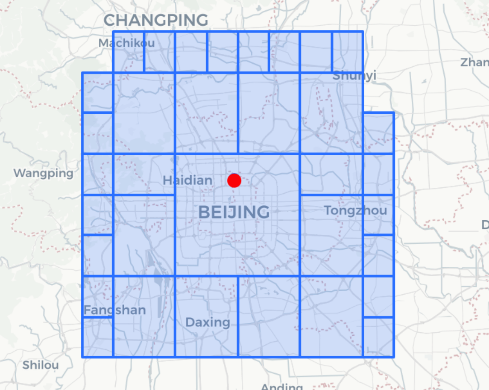

<!-- chunk_type: interface; category: GeomGrids属性函数; source_page: 423 -->

### ST_DistanceSpheroid(geomgrids, geomgrids, spheroid)

计算网格集的球面距离,仅支持2D,若为3D网格，则将3D转换为2D进行计算。

#### 原理

<!-- source_page: 424 -->

计算两个网格集的球面距离，即为计算两个网格集重心点的球面距离。

#### 语法

````sql
double ST_DistanceSpheroid(geomgrids grids1, geomgrids grids2, spheroid a_spheroid d
````

#### 参数

| 参数名称 | 描述 |
| --- | --- |
| grids1 | 给定的网格集合之一 |
| grids2 | 给定的网格集合之一 |
| a spheroid<br>_ | 指定地球椭球参考面，默认为WGS 84 |

#### 返回值

返回两个网格集间的球面距离,double类型，单位：米。

#### 示例

````sql
sql
ST_DistanceSpheroid ST_AsGrids ST_GeomFromText
SELECT
(
(
('POLYGON((116.168188 40.15882
st_distancespheroid
---------------------
58901.81834631373
````

<!-- chunk_type: interface; category: GeomGrids属性函数; source_page: 424 -->

### ST_Angle(geomgrids, geomgrids)

#### 描述

网格集间方位角定量方向，仅支持2D,若为3D网格，则将3D转换为2D进行计算。

#### 原理

计算两个网格集间定量方向，即为计算两个网格集重心点的方位角。

#### 语法

<!-- source_page: 425 -->

````sql
float8 ST_Angle(geomgrids grids1, geomgrids grids2)
````

#### 参数

| 参数名称 | 描述 |
| --- | --- |
| grids1 | 给定的网格集合之一 |
| grids2 | 给定的网格集合之一 |

计算网格集grids2相对于网格集grids1的方位角度。

#### 返回值

返回网格集间的定量方向。

````text
具体说明可以参照函数ST_Angle(gridcell,gridcell)
````

#### 示例

````sql
sql
ST_Angle ST_AsGrids ST_AsGridCell
ST_AsGrids ST_AsGridCell
SELECT
(
(
(102.11,53.15,18)),
(
(
st_angle
----------
53.74
````

<!-- chunk_type: interface; category: GeomGrids属性函数; source_page: 425 -->

### ST_Direction(geomgrids,geomgrids)

#### 描述

网格间的定性方向，仅支持2D,若为3D网格，则将3D转换为2D进行计算。

#### 原理

计算两个网格集间定性方向，即为计算两个网格集重心点的方位角，然后根据方位角来获取定性方向。

#### 语法

````sql
DIRECTION ST_Direction(geomgrids grids1, geomgrids grids2)
````

#### 参数

<!-- source_page: 426 -->

| 参数名称 | 描述 |
| --- | --- |
| grids1 | 给定的网格集合之一 |
| grids2 | 给定的网格集合之一 |

计算网格集grids2相对于网格集grids1的定性方向。

#### 返回值

返回两个网格的定性方向，DIRECTION为枚举类型，分别

````text
为'NORTH','SOUTH','EAST','WEST','EAST_NORTH','EAST_SOUTH','WEST_NORTH','WEST_SOUTH','UNKNOW
````

````text
具体说明可以参照函数ST_Direction(gridcell,gridcell)
````

#### 示例

````sql
sql
ST_Direction ST_AsGrids ST_AsGridCell
ST_AsGrids ST_GetCell
SELECT
(
(
(102.11,53.15,18)),
(
st_direction
--------------
WEST_NORTH
````

## GeomGrids空间关系判断函数

<!-- chunk_type: interface; category: GeomGrids空间关系判断函数; source_page: 426 -->

### ST_Intersects(geomgrids,geomgrids)

查询两个Grids对象是否相交。支持2D/3D,支持GIN空间索引。

#### 语法

````sql
boolean ST_Intersects(geomgrids left, geomgrids right);
````

#### 参数

ley一个grids对象

<!-- source_page: 427 -->

right另一个grids对象

#### 描述

几何对象空间参考必须是CGC2000（SRID=4490或SRID=4326）。

#### 原理

ley和right为待判断的两个Grids对象。cellL、cellR 分别为ley和right中的网格单元。如果存在cellL与cellR 相等或cellL与cellR 互为亲属关系，则判断ley与right相交。 在图形学上，若ley与right相交，则说明两个grids包含相交的空间范围。

#### 示例

````sql
-- 2D 北京六环Polygon构造的grids对象，与六环内一个小区的Polygon构造的grids对象判断相交。
select ST_Intersects(ST_AsGrids(ST_GeomFromText('POLYGON((116.168188 40.158828,116.6
st_intersects
---------------
t
````

````sql
-- 3D
select ST_Intersects(ST_AsGrids3D(st_geomfromtext('Point (114 35 100)',4490)),ST_As
st_intersects
---------------
t
````

<!-- chunk_type: interface; category: GeomGrids空间关系判断函数; source_page: 427 -->

### ST_Intersects（gridcell ,geomgrids）

<!-- chunk_type: interface; category: GeomGrids空间关系判断函数; source_page: 427 -->

### ST_Intersects（geomgrids,gridcell）

gridcell与geomgrids对象间的相交判断,支持2D/3D

#### 语法

````sql
boolean ST_Intersects(gridcell cell, geomgrids grids);
boolean ST_Intersects(geomgrids grids, gridcell cell);
````

<!-- source_page: 428 -->

#### 参数

| 参数名称 | 描述 |
| --- | --- |
| cell | gridcell对象 |
| grids | geomgrids对象 |

#### 示例

````sql
-- 2D
select st_Intersects(ST_AsGridcell(116.31522216796875,39.910277777777778,15),ST_AsGr
st_intersects
---------------
t
````

````sql
-- 3D
select ST_Intersects(ST_AsGridcell3D(114,35,100,12),ST_AsGrids3D(st_geomfromtext('LI
st_intersects
---------------
t
````

<!-- chunk_type: interface; category: GeomGrids空间关系判断函数; source_page: 428 -->

### ST_Equals（geomgrids,geomgrids）

查询两个Geomgrids 对象是否相等。支持2D/3D,支持GIN空间索引。

#### 语法

````sql
boolean ST_Equals(geomgrids left, geomgrids right);
````

#### 参数

| 参数名称 | 描述 |
| --- | --- |
| ley | 一个grids对象 |
| right | 另一个grids对象 |

#### 原理

<!-- source_page: 429 -->

ley和right为待判断的两个Grids对象。nCellL、nCellR分别为其单元格数量。如果nCellL==nCellR且对于ley中的任意cell均在right中存在，则判断ley与right相等。 在图形学上，若ley与right相等，则说明两个grids覆盖的空间范围完全相等。

#### 示例

````sql
--北京六环Polygon构造的grids对象，与六环内一个小区的Polygon构造的grids对象相等判断。
select ST_Equals(ST_AsGrids(ST_GeomFromText('POLYGON((116.168188 40.158828,116.62141
,15));
st_equals
-----------
f
(1 row)
-- 3D
select ST_Equals(ST_AsGrids3D(st_geomfromtext('LINESTRING (114 35 100, 115 36 1200,
st_equals
-----------
t
````

````sql
-- 3D
select ST_Equals(ST_AsGrids3D(st_geomfromtext('LINESTRING (114 35 100, 115 36 1200,
st_equals
-----------
f
````

<!-- chunk_type: interface; category: GeomGrids空间关系判断函数; source_page: 429 -->

### ST_WithIn（geomgrids ,geomgrids）

查询一个geomgrids被另一个geomgrids对象包含。支持2D/3D

#### 语法

````sql
boolean ST_WithIn(geomgrids left, geomgrids right);
````

#### 参数

ley

<!-- source_page: 430 -->

被包含grids对象

right另一个grids对象

#### 原理

ley和right为待判断的两个Grids对象。ley的detailLevel为dLevelL,right的detailLevel为dLevelR;cellL为ley中的任意cell,cellR为right中的任意cell。如果任意一个cellL在区间[0,dLevelR]的祖先网格在right中存在，则称cellL被包含在right中；如果ley的所有cellL均包含在right中，则判断ST_WithIn（ley,right）为真。 在图形学上，ST_WithIn（ley,right）为真，ley覆盖的空间范围完全被right包含。

#### 示例

````sql
--2D 北京六环内一个小区的Polygon构造的grids对象被六环Polygon构造的grids对象包含
select st_WithIn(ST_AsGrids(ST_GeomFromText('POLYGON((116.68464839458467 39.93658010
st_within
-----------
t
````

````text
-- 3D
````

````sql
select ST_WithIn(ST_AsGrids3D(st_geomfromtext('Point (114 35 100)',4490),12),ST_AsGr
st_within
-----------
t
````

````sql
-- 3D
select ST_WithIn(ST_AsGrids3D(st_geomfromtext('Point (114 35 100)',4490),12),ST_AsGr
st_within
-----------
f
````

<!-- chunk_type: interface; category: GeomGrids空间关系判断函数; source_page: 430 -->

### ST_WithIn（gridcell ,geomgrids）

查询一个gridcell对象是否被一个geomgrids对象包含。

#### 语法

<!-- source_page: 431 -->

````sql
boolean ST_WithIn(gridcell cell, geomgrids grids);
````

#### 参数

| 参数名称 | 描述 |
| --- | --- |
| cell | gridcell对象 |
| grids | grids对象 |

#### 示例

````sql
-- 2D
select st_within(ST_AsGridcell(116.31522216796875,39.910277777777778,15),ST_AsGrids(
st_within
-----------
t
````

````sql
-- 3D
select st_within(ST_AsGridcell3D(114,35,100,12),ST_AsGrids3D(st_geomfromtext('LINEST
st_within
-----------
t
````

<!-- chunk_type: interface; category: GeomGrids空间关系判断函数; source_page: 431 -->

### ST_Contains（geomgrids,geomgrids）

查询一个geomgrids对象是否完全包含另一个geomgrids对象。支持2D/3D,支持GIN空间索引。

#### 语法

````sql
boolean ST_Contains(geomgrids left, geomgrids right);
````

#### 参数

<!-- source_page: 432 -->

ley grids对象

right被包含grids对象

#### 原理

见ST_WithIn

#### 示例

````sql
--北京六环Polygon构造的grids对象包含与六环内一个小区的Polygon构造的grids对象。
test=# select ST_Contains(ST_AsGrids(ST_GeomFromText('POLYGON((116.168188 40.158828,
st_contains
-------------
t
````

````sql
-- 3D
select ST_Contains(ST_AsGrids3D(st_geomfromtext('LINESTRING (114 35 100, 115 36 1200
st_contains
-------------
t
````

<!-- chunk_type: interface; category: GeomGrids空间关系判断函数; source_page: 432 -->

### ST_Contains（geomgrids,gridcell）

判断一个geomgrids对象是否包含gridCell对象。支持2D/3D

````sql
boolean ST_Contains(geomgrids grids, gridcell cell);
````

#### 参数

| 参数名称 | 描述 |
| --- | --- |
| grids | geomgrids对象 |
| cell | gridcell对象 |

<!-- source_page: 433 -->

#### 示例

````sql
-- 2D
select st_contains(ST_AsGrids(ST_GeomFromText('POLYGON((116.168188 40.158828,116.621
st_contains
-------------
t
````

````sql
-- 3D
select st_contains(ST_AsGrids3D(st_geomfromtext('LINESTRING (114 35 100, 115 36 1200
st_contains
-------------
t
````

<!-- chunk_type: interface; category: GeomGrids空间关系判断函数; source_page: 433 -->

### ST_Adjacent(geomgrids,geomgrids)

#### 描述

判断两个网格集是否相邻，支持2D/3D，不支持GIN索引

#### 语法

````sql
boolean ST_Adjacent(geomgrids grids1,geomgrids grids2)
````

#### 参数

| 参数名称 | 描述 |
| --- | --- |
| grids1 | geomgrids对象 |
| grids2 | geomgrids对象 |

#### 返回值

返回两个网格集之间是否相交，相邻则为true,不相邻则为false。

#### 原理

首先判断两个网格集之间不相交，相交的网格集肯定不相邻。然后再按照最小网格的层级对grids1向外进行扩展1个相邻的网格，生成tmpGrids1。 再判断tmpGrid1与grid2是否相交。两个条件全部为true，则表示是两个网

<!-- source_page: 434 -->

格集是相邻的。

#### 示例

````sql
sql
ST_Adjacent ST_Asgrids ST_GeomFromText
SELECT
(
(
('POLYGON((116.168188 40.158828,116.621
ST_Asgrids ST_SetSrid ST_MakePoint
(
(
(116.33333333333351,39.599999999
st_adjacent
-------------
t
````

针对上述示例情况，展示示意图如下：

<!-- source_page: 435 -->

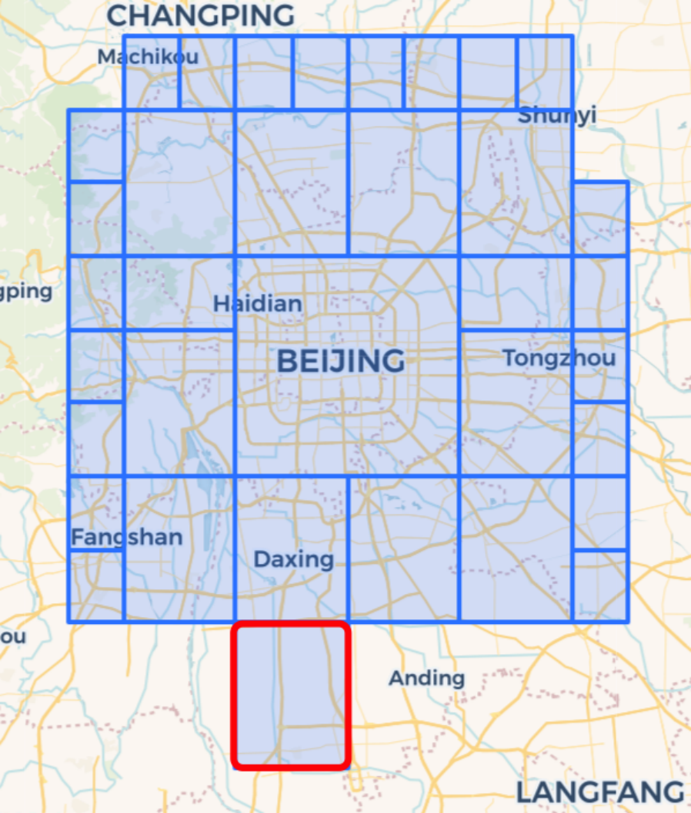

## GeomGrids叠置分析函数

<!-- chunk_type: interface; category: GeomGrids叠置分析函数; source_page: 435 -->

### ST_Intersection(geomgrids,geomgrids)

获取两个geomgrids对象的交集。 支持2D/3D 不支持索引

#### 语法

````sql
geomgrids ST_Intersection(geomgrids left, geomgrids right);
````

<!-- source_page: 436 -->

#### 参数

| 参数名称 | 描述 |
| --- | --- |
| ley | 一个grids对象 |
| right | 另一个grids对象 |

ley和right必须同为2D或同为3D网格，不支持2D 3D网格混合。

#### 返回值

如果ley和right有一个为空，返回NULL；

如果ley和right不为空，但没有相交网格，返回空的Geomgrids对象。

#### 示例一

从库里查出大兴区的14级Geomgrids对象。

````sql
select ST_AsGrids(geom,14) geom from beijing_admin where name like '%大兴%';
geom
---------------------------------------------------------------------------
{"cells":["526547597326811136:14","526560516588437504:14","526512069357338624:14","
:13","526515574050652160:14","526548765557915648:14","526552545129136128:13","526554
526514543258501120:14","526514818136408064:14","526515986367512576:13","526515161733
398684372992:14","526548696838438912:14","526552957445996544:14","526554469274484736
````

大兴Geomgrid空间范围如下：

<!-- source_page: 437 -->

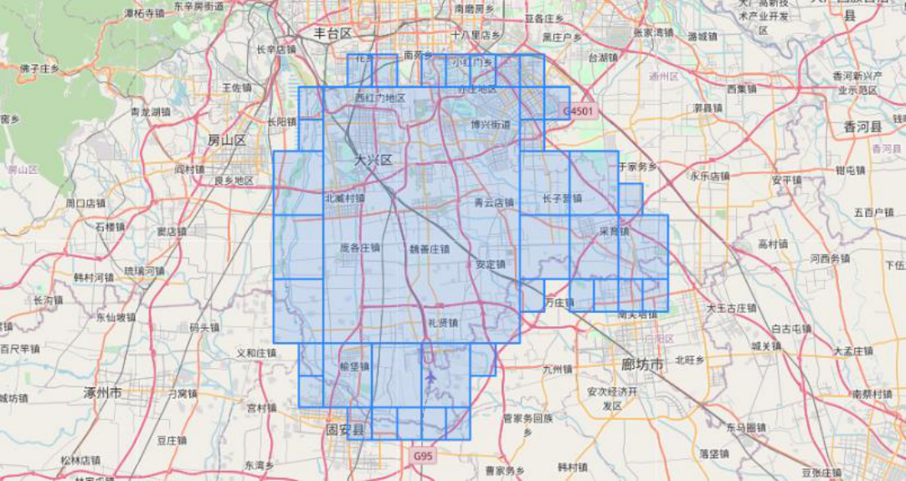

用北京六环区域的多边形构建一个查询Geomgrids对象

````sql
select ST_AsGrids(ST_GeomFromText('POLYGON((116.168188 40.158828,116.621415 40.13773
st_asgrids
------------------------------------------------
{"cells":["526555568786112512:13","526562715611693056:12","526560516588437504:12","
:13","532551480570281984:13","526546222937276416:12","526544023914020864:12","532557
526541824890765312:12","526536602210533376:13","532568248122605568:12","532554229349
527884234752:13"],"detailLevel":13,"is3d":false,"nCell":34}
````

北京六环Geomgrids的空间范围如下：

<!-- source_page: 438 -->

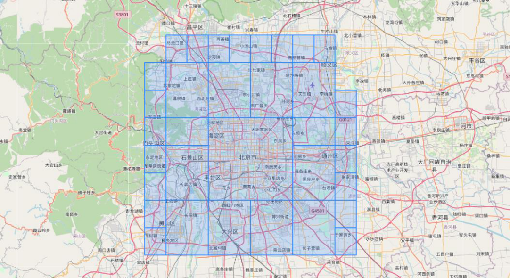

通过St_Intersection函数计算其交集

````sql
select ST_Intersection(ST_AsGrids(ST_GeomFromText('POLYGON((116.168188 40.158828,116
````

````text
st_intersection
---------------------------------------------
{"cells":["526538457636405248:14","526554606713438208:14","526548765557915648:14","
:14","526548696838438912:14","526555019030298624:14","526554675432914944:14","526554
````

交集结果空间范围如下：

<!-- source_page: 439 -->

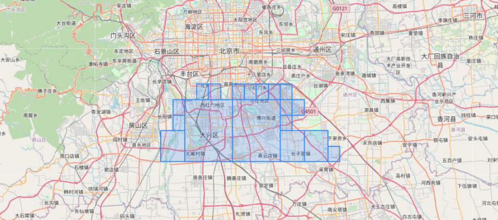

#### 示例二：

北京六环区域多边形构建的GeomGrids对象与北京六环内一个小区构建的GeomGrids对象做Intersection运算。

````sql
select ST_Intersection(ST_AsGrids(ST_GeomFromText('POLYGON((116.168188 40.158828,116
st_intersection
------------------------------------------------------------------------------------
{"cells":["526563833376931840:17","526563832303190016:17"],"detailLevel":17,"is3d":
````

<!-- chunk_type: interface; category: GeomGrids叠置分析函数; source_page: 439 -->

### ST_Union(geomgrids,geomgrids)

获取两个geomgrids对象的并集。 支持2D/3D 不支持索引

#### 语法

````sql
geomgrids ST_Union(geomgrids left, geomgrids right);
````

#### 参数

ley一个grids对象

right另一个grids对象

<!-- source_page: 440 -->

ley和right必须同为2D或同为3D网格，不支持2D 3D网格混合。

#### 返回值

如果ley和right有一个为空，返回NULL；

如果ley和right不为空，但没有相交网格，返回空的Geomgrids对象。

#### 示例

北京六环区域与大兴区网格并集

````sql
sql
ST_Union ST_AsGrids ST_GeomFromText
select
(
(
('POLYGON((116.168188 40.158828,116.621415
st_union
----------------------------------------------------------------
{
:
"cells" ["526552957445996544:14","526552201531752448:14","526552132812275712:14","
:12","532557527884234752:13","532570447145861120:13","526515161733791744:13","532568
526514818136408064:14","532555053983072256:12","526560516588437504:12","526553369762
543258501120:14","526553026165473280:14","526562715611693056:12","526555568786112512
320832:13","532558352517955584:13","532550930814468096:13","526537426844254208:12","
````

并集结果空间范围如下：

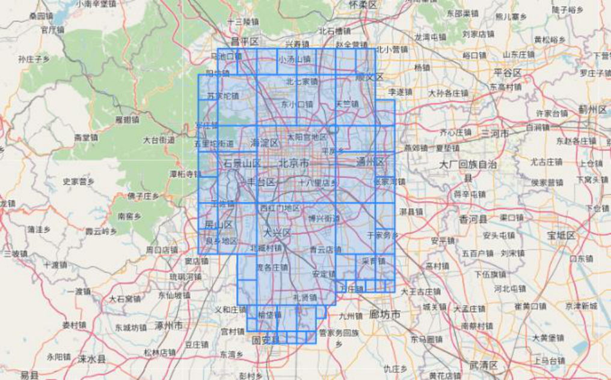

<!-- source_page: 441 -->

## GeomGrids操作符

<!-- chunk_type: interface; category: GeomGrids操作符; source_page: 441 -->

### =

判断两个geomgrids对象是否相等

支持2D/3D

支持GIN索引

#### 语法

````text
sql
geomgrids grids1 geomgrids grids2
boolean =(
,
);
````

#### 原理

同ST_Equals(geomgrids,geomgrids).

#### 示例

````sql
sql
st_gridcellfromText
st_gridcellfromText
select
('G00131032220212') =
('G00131032220212
?
?
column
----------
t
````

````sql
------------------------------------------------
ST_AsGrids ST_GeomFromText
select
(
('POLYGON((116.168188 40.158828,116.621415 40.13773
?
?
column
----------
f
````

````sql
-- 3D
ST_Intersects ST_AsGrids3D st_geomfromtext
select
(
(
('LINESTRING (114 35 100, 115 36 12
st_intersects
---------------
t
````

<!-- chunk_type: interface; category: GeomGrids操作符; source_page: 441 -->

### &&

<!-- source_page: 442 -->

判断两个geomgrids对象是否相交

支持2D/3D

支持GIN索引

#### 语法

````text
boolean &&(geomgrids grids1, geomgrids grids2);--支持索引
````

#### 原理

同ST_Intersects(geomgrids ,geomgrids)

<!-- chunk_type: interface; category: GeomGrids操作符; source_page: 442 -->

### @>

判断一个gridCell的空间范围是否完全覆盖一个gridCell的空间范围。

支持2D/3D

支持GIN索引

#### 语法

````text
boolean @>(geomgrids grids1, geomgrids grids2);--支持索引
````

#### 原理

同ST_Contains(geomgrids ,geomgrids ).

<!-- chunk_type: interface; category: GeomGrids操作符; source_page: 442 -->

### <@

判断一个gridCell的空间范围是否被完全另一个gridCell的空间范围覆盖。

支持2D/3D

支持GIN索引

#### 语法

<!-- source_page: 443 -->

````text
boolean <@(geomgrids grids1, geomgrids grids2);
````

#### 原理

同ST_WithIn(geomgrids,geomgrids).

## 空间索引

### gridcell索引

gridcell 数据格式支持BTree索引。目前仅支持2D,如果gridcell是3D网格，会忽略zcode信息。

#### 索引原理

gridcell 2D网格码 code是一个64位无符号整型，以code为排序顺序，构建Btree索引。code较小的网格排在前边，code较大的网格排在后边。支持网格间的大小比较。支持范围查询（父网格查子网格场景，主要用于网格聚合）

#### 索引使用

在gridcell字段上创建BTree索引，需要制定操作符类：btree_gridcell_ops

#### 示例

````sql
--为cell字段创建索引。其中cell为gridcell类型。
create index t_text_cell_btree on t_test using btree(cell btree_gridcell_ops);
````

#### 操作符/函数支持情况

支持以下操作符：

- <(gridcell,gridcell)
- <=(gridcell,gridcell)
- =(gridcell,gridcell)

**=(gridcell,gridcell)**

<!-- source_page: 444 -->

(gridcell,gridcell) 支持以下函数：

- ST_Equals(gridcell,gridcell)
- ST_Intersects(gridcell,gridcell)
- ST_Contains(gridcell,gridcell)
- ST_WithIn(gridcell,gridcell)

### geomgrids索引

geomgrids 数据格式支持GIN索引。

#### 索引使用

在Grids字段上创建GIN索引，需要制定操作符类：gin_grids_ops

#### 示例

````sql
--为grids字段创建索引。其中grid为grids类型。
create index idx_grid_town_bound on town_bound using gin (grids gin_grids_ops);
````

#### 索引原理

GIN是一种倒排索引，倒排索引最常用的场景是全文检索。全文检索原理是将一篇文章根据规则分解出多个分

词，通过每个分词可所引到文章。这样当查询个别分词的时候，可以实现文章的快速定位。

#### 查找树构建原理

一个Geomgrids对象，有多个GridCell叶节点构成的，将各个叶节点及其6级以下的祖先节点(GridCell对象)作为分词（ItemKey），构建查找树。（图后补）

#### 查找原理

查询输入为一个Geomgrids对象，按照与构建查找树一样的规则进行生成查找分词（QueryKey），在不同的查找策略（= && @> <@）场景下，对比QueryKey与ItemKey的关系，进而完成初筛。

#### 以&&为例介绍原理

待完善

<!-- source_page: 445 -->

#### 空间操作符/函数支持情况

支持以下空间操作符：

=(geomgrids,geomgrids)

&&(geomgrids,geomgrids)

@>(geomgrids,geomgrids)

<@(geomgrids,geomgrids)

支持以下函数：

- ST_Equals(geomgrids,geomgrid)
- ST_Intersects(geomgrids,geomgrid)
- ST_Contains(geomgrids,geomgrid)
- ST_WithIn(geomgrids,geomgrid)

## 北斗位置编码(BGC)

<!-- chunk_type: interface; category: 北斗位置编码(BGC); source_page: 445 -->

### ST_asBGC

经纬度坐标生成BGC-2D编码。

#### 语法

````sql
text ST_asBGC(double lng, double lat, int level)
````

#### 参数

| 参数名称 | 描述 |
| --- | --- |
| lng | 坐标经度，有效范围[-180,180] |
| lat | 坐标纬度，有效范围[-88,88] |
| level | BGC层级，取值范围[1,10] |

#### 返回值

BGC编码

<!-- source_page: 446 -->

#### 示例

````sql
select ST_asBGC(116.31260277777778,39.993161111111114,8);
st_asbgc
------------------
N50J47539B825534
````

<!-- chunk_type: interface; category: 北斗位置编码(BGC); source_page: 446 -->

### ST_asBGC3D

经纬度坐标生成BGC-3D编码。

#### 语法

````sql
text ST_asBGC3D(double lng, double lat,double height, int level)
````

#### 参数

| 参数名称 | 描述 |
| --- | --- |
| lng | 坐标经度，有效范围[-180,180] |
| lat | 坐标纬度，有效范围[-88,88] |
| height | 坐标大地高(单位m)，取值范围[-6302106.7222,528680167.3367] |
| level | BGC层级，取值范围[1,10] |

#### 返回值

BGC编码

#### 示例

````sql
select ST_asBGC3D(116.31260277777778,39.993161111111114,25125,8);
st_asbgc3d
----------------------------
N050J004705039DB8920557347
````

<!-- source_page: 447 -->

<!-- chunk_type: interface; category: 北斗位置编码(BGC); source_page: 447 -->

### ST_BGC2Box

通过BGC编码获取网格的box

#### 语法

box ST_BGC2Box(text bgcode)

#### 参数

| 参数名称 | 描述 |
| --- | --- |
| bgcode | BGC编码 |

#### 示例

````sql
select ST_bdCode2Box('N50J47539B825534');
st_bdcode2box
------------------------------------------------------------------------------
(116.31260416666666,39.99316840277778),(116.3125954861111,39.99315972222223)
````

<!-- chunk_type: interface; category: 北斗位置编码(BGC); source_page: 447 -->

### ST_BGC3D2Box

通过BGC编码获取网格的box

#### 语法

box ST_BGC3D2Box(text bgcode)

#### 参数

| 参数名称 | 描述 |
| --- | --- |
| bgcode | BGC编码 |

#### 示例

<!-- source_page: 448 -->

````sql
select ST_BGC3D2Box('N050J004705039DB8920557347');
st_bgc3d2box
------------------------------------------------------------------------------------
BOX3D(116.3125954861111 39.99315972222223 25124.460173016414,116.31260416666666 39.
````

## 实景三维中国-基础地理实体位置码(RSLC)

<!-- chunk_type: interface; category: 实景三维中国-基础地理实体位置码(RSLC); source_page: 448 -->

### ST_asRSLC

经纬度坐标生成实景三维中国-基础地理实体位置码2D编码。

#### 语法

````text
sql
ST_asRSLC
lng
lat
text
(double
, double
, int level);
````

#### 参数

| 参数名称 | 描述 |
| --- | --- |
| lng | 坐标经度，有效范围[-180,180] |
| lat | 坐标纬度，有效范围[-88,88] |
| level | 层级，取值范围[1,16] |

#### 返回值

实景三维中国-基础地理实体位置码2D编码

#### 示例

````sql
sql
ST_asRSLC
SELECT
(116.31260277777778,39.993161111111114,16);
st_asrslc
----------------------------
NE104J25253343282311346152
````

<!-- source_page: 449 -->

<!-- chunk_type: interface; category: 实景三维中国-基础地理实体位置码(RSLC); source_page: 449 -->

### ST_asRSLC3D

经纬度坐标和坐标大地高生成实景三维中国-基础地理实体位置码3D编码。

#### 语法

````text
sql
ST_asRSLC3D
lng
lat
height
text
(double
, double
,double
, int level)
````

#### 参数

| 参数名称 | 描述 |
| --- | --- |
| lng | 坐标经度，有效范围[-180,180] |
| lat | 坐标纬度，有效范围[-88,88] |
| height | 坐标大地高(单位m)，取值范围[-6302106.7222,528680167.3367] |
| level | 层级，取值范围[1,16] |

#### 返回值

实景三维中国-基础地理实体位置码3D编码

#### 示例

````sql
sql
ST_asRSLC3D
SELECT
(16.31260277777778,69.993161111111114,25125,16);
st_asrslc3d
----------------------------------------------
NE02002G001040205130343323802031113347614523
````

<!-- chunk_type: interface; category: 实景三维中国-基础地理实体位置码(RSLC); source_page: 449 -->

### ST_RSLC2Box

通过RSLC编码获取网格的box,RSLC为实景三维中国-基础地理实体位置码2D编码。

#### 语法

````text
sql
box ST_RSLC2Box
RSLC2D
(text
)
````

<!-- source_page: 450 -->

#### 参数

| 参数名称 | 描述 |
| --- | --- |
| RSLC2D | 实景三维中国-基础地理实体位置码2D编码 |

#### 返回值

网格box,box为2D。

#### 示例

````sql
sql
ST_RSLC2Box
SELECT
('NE104J25253343282311346152');
st_rslc2box
------------------------
(116.31260281032988,39.99316121419272),(116.3126026746962,39.993161078559034)
````

<!-- chunk_type: interface; category: 实景三维中国-基础地理实体位置码(RSLC); source_page: 450 -->

### ST_RSLC3D2Box

通过RSLC编码获取网格的box，RSLC为实景三维中国-基础地理实体位置码3D编码。

#### 语法

````text
sql
box3d ST_RSLC3D2Box
RSLC3D
(text
)
````

#### 参数

| 参数名称 | 描述 |
| --- | --- |
| RSLC3D | 实景三维中国-基础地理实体位置码3D编码 |

#### 返回值

网格box,box为3D。

<!-- source_page: 451 -->

#### 示例

````sql
sql
ST_RSLC3D2Box
SELECT
('NE02002G001040205130343323802031113347614523');
st_rslc3d2box
------------------------------------------------------------------------------------
BOX3D
(16.312602674696187 69.99316107855901 25124.986131570302,16.312602810329867 69
````

## 应用函数

<!-- chunk_type: interface; category: 应用函数; source_page: 451 -->

### ST_FindGridsPath(gridcell, gridcell, text, text, bool)

基于A-Star算法的无路网规划，返回最优路径的gridcell集合

该算法适用于2D和3D场景，如果输入的起始点和终止点都是3D,则按照3D进行无路网规划，否则按照2D进行无路网规划。

#### 语法

````text
sql
gridcell
ST_FindGridsPath gridcell startCell gridcell endCell
tableName
[]
(
,
, text
, te
````

#### 参数

| 参数名称 | 描述 |
| --- | --- |
| startCell | 起始点的网格码单元 |
| endCell | 终止点的网格码单元 |
| tableName | 保存障碍区域的表名 |
| gridsfiled | 指定障碍区域表中geomgrids字段 |
| hasBelow | 指定是否需要海平面以下的网格,默认是false |

#### 返回值

返回最优路径的网格码序列，即为gridcell[]

#### 原理与应用

<!-- source_page: 452 -->

函数ST_FindGridsPath 是基于A-Star算法和GeoSOT网格剖分所实现，主要应用于无路网路径规划相关的应用。

在已知起始点和终止点的情况下，通过设置障碍区域（即路径规划中不可通行的区域，比如：飞机禁飞区

等）,规划出一条能够躲避障碍区域并且路径最短的线路。

由于障碍区域可能包含多组数据，因此需要设置表来存储所有的障碍区域，其中filed 为geomgrids字段，用来保存障碍区域经GeoSOT打码之后的格式。

同时，为了加速判断与障碍区域的关系，需要使用geomgrid字段构建GIN索引，详情参见示例。

#### 示例（2D）

````text
sql
````

-- 创建扩展

````sql
EXTENSION
best_geomgrid
CREATE
IF NOT EXISTS
CASCADE;
````

````sql
-- 创建障碍表，其中grids为geomgrids类型
test
id ST_asGrids ST_asGridCell
grids
CREATE
TABLE
AS
SELECT 1 AS
,
(
(10,10)) AS
;
````

-- 创建索引

````sql
test_grids_gin_idx
test
gin grids gin_grids_ops
CREATE INDEX
ON
USING
(
);
````

-- 查找最优路径

````sql
ST_FindGridsPath ST_asGridCell
ST_asGridCell
SELECT
(
(9,10),
(11,10),'test','grids');
st_findgridspath
-----------------------------------------------------------------------------
{
:
:
:
:
14144117579710464 12,14145217091338240 12,14148515626221568 12,14149615137849344 12
(1 row)
````

可以通过ST_AsGeometry和ST_asGrids函数将集合进行打码显示出来，SQL语句如下

````sql
SELECT ST_asGeometry(ST_asGrids(ST_FindGridsPath(ST_asGridCell(9,10),ST_asGridCell(1
````

规划之后的路径如下图所示：

<!-- source_page: 453 -->

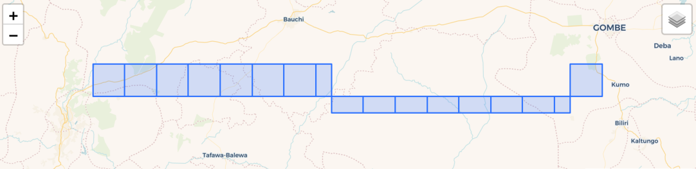

````text
其中，障碍物区域为POINT(10,10) ,在规划的路径中未通过点POINT(10,10) .
````

#### 示例（3D）

````text
sql
````

-- 创建扩展

````sql
EXTENSION
best_geomgrid
CREATE
IF NOT EXISTS
CASCADE;
````

````sql
-- 创建障碍表，其中grids为geomgrids类型
test_3d
id ST_asGrids ST_asGridCell3d
CREATE TABLE
AS
SELECT 1 AS
,
(
(10,10,10000)) A
````

-- 创建索引

````sql
test_3d_grids_gin_idx
test
gin grids gin_grids_ops
CREATE INDEX
ON
USING
(
);
````

-- 查找最优路径

````sql
ST_FindGridsPath ST_asGridCell3d
ST_asGridCell3d
SELECT
(
(9,10,0),
(11,10,10000),'test_3
st_findgridspath
-----------------------------------------------------------------------------
{
"14144117579710464,0:12","14145217091338240,0:12","14148515626221568,0:12","1414961
243456,2147483648:12","14356323323871232,0:12","14359621858754560,0:12","14360721370
}
0,0:12"
(1 row)
````

<!-- chunk_type: interface; category: 应用函数; source_page: 453 -->

### ST_RouteFromGridsPath(gridcell[])

返回gridcell集合数组对应的Geometry对象。如果只有一个gridcell则返回POINT ,否则返回LINESTRING (2D)或

````text
者LINESTRING Z (3D).
````

#### 语法

````text
sql
ST_RouteFromGridsPath gridcell
cells
geometry
(
[]
);
````

<!-- source_page: 454 -->

#### 参数

| 参数名称 | 描述 |
| --- | --- |
| cells | gridcell对象集合 |

根据gridcell对象集合中的每一个gridcell来判断输出LINESTRING 或者LINESTRING Z ,如果gridcell全部为3D,

````text
则输出LINESTRING Z ,否则输出LINESTRING 。
````

#### 示例(2D)

````sql
sql
EXTENSION
best_geomgrid
CREATE
IF NOT EXISTS
CASCADE;
````

````sql
test
id ST_asGrids ST_asGridCell
grids
CREATE
TABLE
AS
SELECT 1 AS
,
(
(10,10)) AS
;
````

````sql
ST_asText ST_RouteFromGridsPath ST_FindGridsPath ST_asGridCell
ST_asGri
SELECT
(
(
(
(9,10),
st_astext
--------------------------------------------------------------------------
LINESTRING(9.0666666666665 10.0666666666665,9.9666666666665 10.0666666666665,10.0666
(1 row)
````

其中，ST_FindGridsPath 返回gridcell数组，具体参见ST_FindGridsPath

规划之后的路径如下图所示：

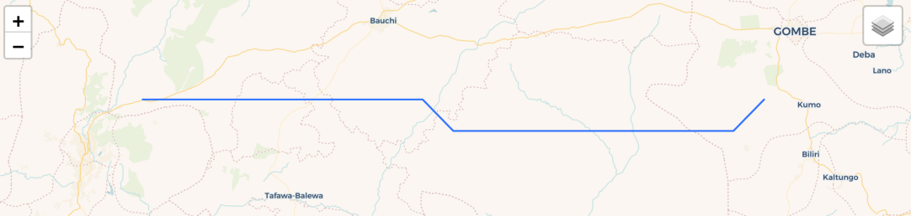

````text
其中，障碍物区域为POINT(10,10) ,在规划的路径中未通过点POINT(10,10) .
````

#### 示例(3D)

<!-- source_page: 455 -->

````sql
sql
EXTENSION
best_geomgrid
CREATE
IF NOT EXISTS
CASCADE;
````

````sql
test_3d
id ST_asGrids ST_asGridCell3d
CREATE TABLE
AS
SELECT 1 AS
,
(
(10,10,10000)) A
````

````sql
ST_asText ST_RouteFromGridsPath ST_FindGridsPath ST_asGridCell3D
ST_a
SELECT
(
(
(
(9,10,0),
st_astext
---------------------------------------------------------------------------
Z
LINESTRING
(9.0666666666665 10.0666666666665 6904.914564930937,9.9666666666665 10
666666666665 10.0666666666665 6904.914564930937)
````

<!-- chunk_type: interface; category: 应用函数; source_page: 455 -->

### ST_RouteFromGridsPath(geometry,geometry,gridcell[])

返回gridcell集合数组对应的Geometry对象（起始点和结束点根据制定点来匹配），如果只有一个gridcell则返

````text
回POINT ,否则返回LINESTRING (2D)或者LINESTRING Z (3D).
````

#### 语法

````text
sql
ST_RouteFromGridsPath startPoint
endPoint
gridcells gri
geometry
(
geometry,
geometry,
````

#### 参数

| 参数名称 | 描述 |
| --- | --- |
| startPoint | 起始点 |
| endPoint | 终止点 |
| gridcells | gridcell对象集合 |

根据gridcell对象集合中的每一个gridcell来判断输出LINESTRING 或者LINESTRING Z ,如果gridcell全部为3D,

````text
则输出LINESTRING Z ,否则输出LINESTRING 。
````

#### 示例(2D)

````sql
sql
EXTENSION
best_geomgrid
CREATE
IF NOT EXISTS
CASCADE;
````

````sql
test
id ST_asGrids ST_asGridCell
grids
CREATE
TABLE
AS
SELECT 1 AS
,
(
(10,10)) AS
;
````

<!-- source_page: 456 -->

````sql
ST_asText ST_RouteFromGridsPath ST_GeomFromText
ST_GeomFromTe
SELECT
(
(
('POINT(9 10)'),
T_asGridCell
(11,10),'test','grids')));
st_astext
-----------------------------------------------------------------------
LINESTRING(9 10,9.0666666666665 10.0666666666665,9.9666666666665 10.0666666666665,1
,11.0666666666665 10.0666666666665,11 10)
````

<!-- chunk_type: interface; category: 应用函数; source_page: 456 -->

### ST_FindAllGridsPath(gridcell, gridcell, text, text, bool)

基于A-Star算法的无路网规划，返回查找最优路径过程中遍历的所有gridcell的集合.

#### 语法

````text
sql
gridcell
ST_FindAllGridsPath gridcell startCell gridcell endCell
tableName
[]
(
,
, text
,
````

#### 参数

| 参数名称 | 描述 |
| --- | --- |
| startCell | 起始点的网格码单元 |
| endCell | 终止点的网格码单元 |
| tableName | 保存障碍区域的表名 |
| gridsfiled | 指定障碍区域表中geomgrids字段 |
| hasBelow | 指定是否需要海平面以下的网格,默认是false |

#### 返回值

返回查找最优路径过程中遍历的所有gridcell的集合，即为gridcell[]

#### 示例

````text
sql
````

-- 创建扩展

````sql
EXTENSION
best_geomgrid
CREATE
IF NOT EXISTS
CASCADE;
````

````text
-- 创建障碍表，其中grids为geomgrids类型
````

<!-- source_page: 457 -->

````sql
test
id ST_asGrids ST_asGridCell
grids
CREATE
TABLE
AS
SELECT 1 AS
,
(
(10,10)) AS
;
````

-- 查找所有遍历的路径节点

````sql
ST_FindAllGridsPath ST_asGridCell
ST_asGridCell
SELECT
(
(9,11),
(11,10),'test','grids');
st_findallgridspath
---------------------------------------------------------------------------
{
:
:
:
:
14378313556426752 12,14372815998287872 12,14360721370382336 12,14373915509915648
:
:
:
:
2,14196894137843712 12,14169406347149312 12,14174903905288192 12,14377214044798976 1
:
}
2,14173804393660416 12
(1 row)
````

<!-- chunk_type: interface; category: 应用函数; source_page: 457 -->

### ST_SmoothRouteFromGridsPath(gridcell[], text, text)

将无路网规划计算获得的gridcell集合,进行压缩平滑整合成轨迹路径

#### 语法

````text
sql
ST_SmoothRouteFromGridsPath cells gridcell
tableName
geomfiled
geometry
(
[],
text,
tex
````

#### 参数

| 参数名称 | 描述 |
| --- | --- |
| cells | gridcell集合 |
| tableName | 保存障碍区域的表名 |
| geomfiled | 指定障碍区域表中geom字段 |

#### 返回值

返回查找最优路径过程中遍历的所有gridcell的集合，即为gridcell[]

#### 示例

````text
sql
````

-- 创建扩展

````sql
EXTENSION
best_geomgrid
CREATE
IF NOT EXISTS
CASCADE;
````

````text
-- 创建障碍表，其中grids为geomgrids类型,geom为geometry类型
````

<!-- source_page: 458 -->

````sql
test id
grids geomgrids geom
CREATE TABLE
(
serial,
,
geometry);
````

````sql
test grids geom
st_asgrids st_geomfromtext
INSERT INTO
(
,
) VALUES(
(
('POLYGON((116.4786386
````

-- 查找所有遍历的路径节点

````sql
ST_asText ST_SmoothRouteFromGridsPath ST_FindGridsPath st_asgridcell
SELECT
(
(
(
(116.444
st_astext
---------------------------------------------------------------------------
LINESTRING(116.44611111111101 36.296111111111,116.4711111111115 36.5044444444445,11
````

## 辅助函数

<!-- chunk_type: interface; category: 辅助函数; source_page: 458 -->

### ST_ExturdeGeometry(geometry, float, float)

将二维geometry数据拉伸成三维多面体数据

#### 语法

````text
sql
ST_ExturdeGeometry
geom
h
z
geometry
(geometry
, float
,float
)
````

#### 参数

| 参数名称 | 描述 |
| --- | --- |
| geom | 二维geometry对象 |
| h | 对象底面大地高,单位为米 |
| z | 拉伸高度,单位为米 |

例如，某地建筑物海拔高度为10米，建筑物高度为100米，则函数定义为

````sql
ST_ExturdeGeometry(geom,10,100)
````

#### 返回值

返回拉伸之后的三维体数据对象。

#### 示例

<!-- source_page: 459 -->

北京六环区域进行拉伸500米

````sql
select ST_astext(ST_ExturdeGeometry(ST_GeomFromText('POLYGON((116.168188 40.158828,1
st_astext
---------------------------------------------------------------------------
POLYHEDRALSURFACE Z (((116.168188 40.158828 100,116.621415 40.137732 100,116.707932
168188 40.158828 600,116.094505 39.968297 600,116.099998 39.700442 600,116.696946 39
188 40.158828 600,116.621415 40.137732 600,116.621415 40.137732 100,116.168188 40.15
5 40.137732 100)),((116.707932 39.988486 100,116.707932 39.988486 600,116.696946 39.
39.700442 600,116.099998 39.700442 100,116.696946 39.71807 100)),((116.099998 39.700
39.968297 100,116.094505 39.968297 600,116.168188 40.158828 600,116.168188 40.15882
````

使用建模脚本显示图形如下:

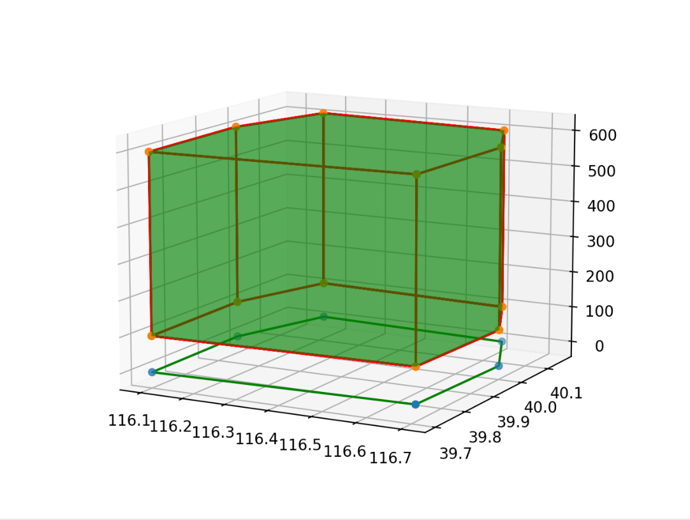

<!-- chunk_type: interface; category: 辅助函数; source_page: 459 -->

### ST_Grids23dtiles

GeomGrids导出为3DTiles模型。

<!-- source_page: 460 -->

#### 语法

````text
sql
ST_Grids23dtiles geomGrids grids
savePath
text
(
, text
)
````

#### 参数

| 参数名称 | 描述 |
| --- | --- |
| grids | 待导出的geomgrids对象，仅支持3D |
| savePath | 3dtiles保存的文件目录（数据库所在服务器文件目录） |

#### 返回值

保存成功，会返回路径。

#### 示例

北京六环区域3D打码，生成3dtiles

````sql
sql
test000
=# select ST_Grids23dtiles(st_force3d(ST_AsGrids(ST_GeomFromText('POLYGON((11
st_grids23dtiles
-----------------------------------------------------
succeed
path:
,save
'/home/postgres/tmp/tileset.json'
````

<!-- source_page: 461 -->

3dtiles在cesium中加载效果如下：

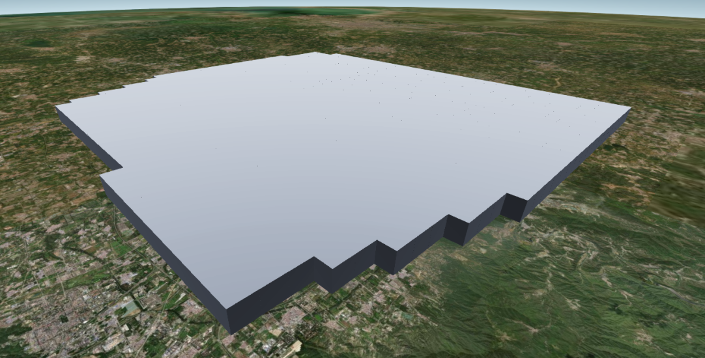

#### 说明

目前3dtiles只有一个根节点，会在savePath目录下生成tileset.json和grids.b3dm，前者为3dtiles的根文件。

<!-- chunk_type: interface; category: 辅助函数; source_page: 461 -->

### ST_CreateTableFromGeom

根据输入的geometry类型,对输入的空间数据进行网格构建,将生成的网格集合存储到相应的表中，并将每一个网格对应的GGER , BGC , RSLC 的编码以及对应的geometry数据存储到表中。

#### 语法

````text
sql
ST_CreateTableFromGeom tableName
geom
gger
Integer
(
text,
geometry,level integer,
boo
````

#### 参数

tableName生成的表名

geom输入的geometry数据

level网格码层级

gger是否生成GGER 码，默认为true

<!-- source_page: 462 -->

| 参数名称 | 描述 |
| --- | --- |
| bgc | 是否生成 BGC 码，默认为false |
| rslc | 是否生成 RSLC 码，默认为false |

#### 返回值

返回表中记录数，其中表中的字段如下:

| 字段名称 | 描述 |
| --- | --- |
| id | 自增类型 |
| cell | gridcell类型 |
| geom | cell对应的geometry类型 |
| gger | GGER 码，设定参数gger为true时，该字段存在，默认为true |
| bgc | BGC 码，设置参数bgc为true时且level合法，该字段存在，默认为false |
| rslc | RSLC 码，设置参数rslc为true时且level合法，该字段存在，默认为false |

#### 示例

````sql
sql
ST_CreateTableFromGeom
ST_geomfromtext
SELECT
('test002',
('LINESTRING(0 0 ,10 10)',432
st_createtablefromgeom
------------------------
````

````sql
\d test002
+
Table "public.test002"
Collation Nullable
St
Column |
Type
|
|
|
Default
|
--------+----------+-----------+----------+-------------------------------------+---
id
nextval
::regclass pl
| integer
|
| not null |
('test002_id_seq'
) |
cell gridcell pl
|
|
|
|
|
gger
| text
|
|
|
| ex
bgc
| text
|
|
|
| ex
rslc
| text
|
|
|
| ex
geom
ma
| geometry |
|
|
|
````

<!-- chunk_type: interface; category: 辅助函数; source_page: 462 -->

### ST_Geom2Shpfile

根据输入的geometry类型,对输入的空间数据进行网格构建,将生成的网格集合存储到相应的表中，并将每一个网格对应的GGER , BGC , RSLC 的编码以及对应的geometry数据存储到表中。再将表中数据导出到Shpfile文

<!-- source_page: 463 -->

件中。

#### 语法

````text
sql
ST_Geom2Shpfile tableName
shpfile_url
geom
Integer
(
text,
text,
geometry,level intege
````

#### 参数

| 参数名称 | 描述 |
| --- | --- |
| tableName | 生成的表名 |
| shpfile url<br>_ | 导出shpfile文件的绝对路径，比如： /tmp/shpfile.shp 或者 /tmp/shpfile |
| geom | 输入的geometry数据 |
| level | 网格码层级 |
| gger | 是否生成 GGER 码，默认为true |
| bgc | 是否生成 BGC 码，默认为false |
| rslc | 是否生成 RSLC 码，默认为false |

#### 返回值

返回导出到shpfile的记录数

#### 示例

````sql
sql
ST_Geom2Shpfile
ST_geomfromtext
SELECT
('test003','/tmp/003',
('LINESTRING(0 0 ,10 10)'
-----------------
````

````text
cpg
003.
dbf
003.
prj
003.
shp
003.
shx
003.
````

<!-- source_page: 464 -->

## Questions and Answers

### 1.GridCell与GeomGrids的适用场景分别是什么？

#### GridCell

GridCell是单元网格数据模型，主要用于Point数据类型的打码和空间索引。

优点：打码速度快、索引性能高、索引数据量小；

缺点：仅支持Point，空间运算函数/空间操作符/空间索引只支持2D。

#### GeomGrids

GeomGrids是网格集合数据模型，用于任意Geometry对象的打码和空间索引。

优点：适用于任意Geometry打码，空间运算函数/空间操作符/空间索引支持2D/3D

缺点：相较于GridCell,打码速度慢，索引数据量大。

#### 选择建议

数据只有Point，且不需要3D索引，优先使用GridCell； 如果数据有NonPoint(LineString/Polygon/MultiPoint)、或需要3D索引，使用GeomGrids。

### 2.怎么实现快速打码？

函数St_asGrids(geometry)实现了geometry打码成GeomGrids对象的功能，是一个CPU消耗较高的运算。 BEST-DB不支持并行update，但create table as select支持并行。 我们可以通过该方式实现快速打码。

pg环境设置

-- 设置表的并行度

````sql
alter table town_bound set (parallel_workers =4);
````

````text
-- 设置总的可开启的WORKER
set max_worker_processes=16;
````

-- 所有会话同时执行并行计算的并行度足够大

````text
set max_parallel_workers=16;
-- 单个QUERY中并行计算NODE开启的WORKER
set max_parallel_workers_per_gather =8;
````

-- 所有表和索引扫描允许并行

````text
set min_parallel_table_scan_size =0;
````

<!-- source_page: 465 -->

````text
set min_parallel_index_scan_size =0;
````

-- 并行计算优化器成本设置为0

````sql
set parallel_tuple_cost =0;
set parallel_setup_cost =0;
alter table town_bound set (parallel_workers =8);
````

创建新表并打码

````sql
create table town_bound2 as select gid,name,geom,st_asGrids(geom) from town_bound;
````

### 3.GeoSOT、GGER、BGC之间的关系

#### GeoSOT、GGER、BGC、RSLC之间的关系

GeoSOT是一种剖分理论。实现了从全球到厘米级的多尺度剖分，层级范围从0到32级。GGER是基于GeoSOT剖分理论实现的地球空间编码规则，其剖分算法和层级划分与GeoSOT完全一致，在此基础上，定义了编码规范。BGC是一种相对独立的剖分方案，其在部分层级兼容了国家地形图分幅规则，在一些层级与GeoSOT空间划分一致。BGC层级范围是1到10级，BGC层级与GeoSOT层级的关系没有公式可以计算，只能通过查表。RSLC是在BGC的基础智商，进行适应性调整，扩展二/三维空间的网格层级，在BGC的基础上又扩展了6级。RSLC层级范围是1到16层级，RSLC层级与GeoSOT层级的对应关系只能通过查表来计算。

#### GridCell与GeoSOT、GGER、BGC、RSLC的关系

GridCell是本数据库定义的数据模型，其剖分算法和网格编码规则均基于GeoSot。由于GGER与GeoSOT完全兼容，所以在GGER输入输出时只需要实现GGER编码与二进制编码的转换即可。BGC与GeoSOT整体差异比较大，由于其在部分层级上与GeoSOT网格一一对应，我们只能支持4-10级BGC编码构建GridCell对象，支持部分gridcell层级(15、19、20、23、26、29、32)输出为BGC编码。由于BGC规则复杂，很难用单一的数据模型表达，故没有实现BGC对应的数据模型，如果需要存储，只能借助于GridCell。RSLC与BGC类似，其在部分层级上与GeoSOT网格一一对应，目前只能支持4、8、10-16级RSLC编码构建GridCell对象，支持部分gridcell层级(9、15、19、20、21、23、26、29、32)输出为RSLC编码。RSLC与BGC类似，很难用单一的数据模型表达，故没有实现RSLC对应的数据模型，如果需要存储，只能借助于GridCell。总结一下：GridCell与GeoSOT一一对应，GridCell与GGER一一对应，GridCell与BGC、RSLC部分对应。

#### GGER与BGC/RSLC使用的选择

优先使用GGER,因为层级比较完整，GGER可充分利用GridCell所有功能。BGC/RSLC层级跨度大，部分层级与GeoSOT对应，空间索引、空间聚合都有问题。

<!-- source_page: 466 -->

在有BGC/RSLC输入输出等场景，不得不用BGC/RSLC时，才使用。

## 时间网格模型SQL接口说明

### timegrid

### 一、数据类型

#### 1.1 timecell

时间网格模块扩展的一个数据类型，用于表示公元前65536到65535之间的一个时间单元网格。时间网格用code（unsigned long）存储。

##### 时间意义

一个timecell代表一段时间范围。

##### 示例

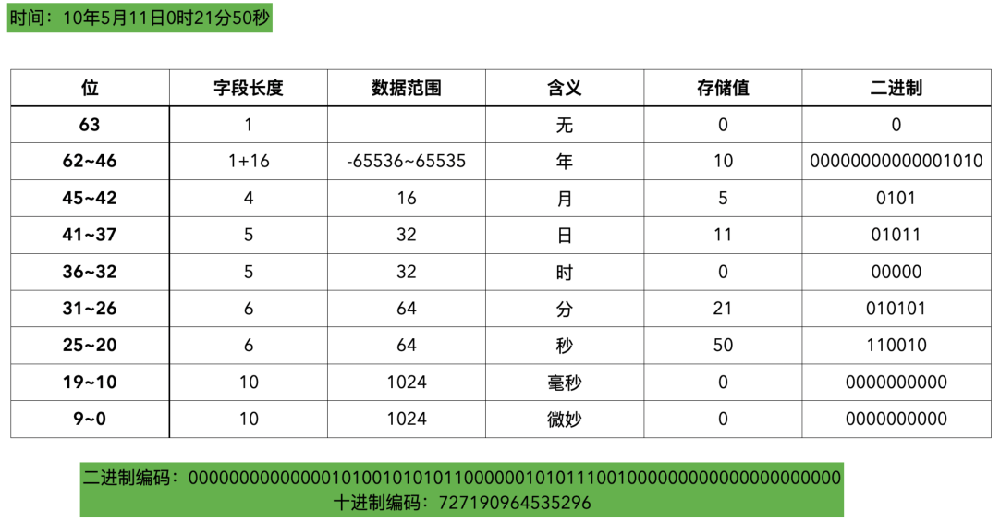

##### 原始格式输出

<!-- source_page: 467 -->

**140671517657661440:21**

##### 支持以下数据类型转到timegridcell

text：年-月-日 时:分:秒.毫秒（ISO 8601）

后续postgresql自带的timestamp类型适配

##### 支持从timeCell到以下类型的转换

- text:code
- text:年-月-日 时:分:秒.毫秒（ISO 8601）
- 后续postgresql自带的timestamp类型适配

##### 1.2 timegrids

由层级相同或不同的timecell集合组成，表示时间剖分特定的时间网格范围。

##### 时间意义

一个timegrids对象代表多个timecell对象时间范围集合。

##### 示例

````sql
testtimegrid=# select ST_AsTimeGrids(ST_GetDescendant(st_timecellFromISO('1999-2'),2
````

````text
------------------------------------------------------------------------------------
---------------------------------------------------------------------------
{"cells":["140675915704172544:24","140676465459986432:24","140677015215800320:24","
40679214239055872:24","140679763994869760:24"],"detailLevel":24,"nCell":8}+
````

````text
(1 row)
````

### 二、TimeCell输入输出函数

<!-- source_page: 468 -->

<!-- chunk_type: interface; category: 时间网格 / 二、TimeCell输入输出函数; source_page: 468 -->

#### 3.1 ST_timecellFromISO

##### 描述

通过给定的时间信息（ISO）构建timeCell对象

##### 语法

timeCell ST_timecellFromISO(text time)

##### 参数

| 参数名称 | 描述 |
| --- | --- |
| time | ISO时间 |

##### 示例

````sql
testtimegrid=# select ST_timecellFromISO('1999-01-08');
st_timecellfromiso
-----------------------
140672617169289216:26
(1 row)
````

<!-- chunk_type: interface; category: 时间网格 / 二、TimeCell输入输出函数; source_page: 468 -->

#### 3.2 st_asText(timeCell,text)

##### 描述

将一个时间网格对象转换为指定规范的文本编码。 (todo:等国标后修改)

##### 语法

text ST_asText(timeCell cell,text default 'ISO')

##### 参数

cell需要输出的时间单元网格对象

<!-- source_page: 469 -->

standard网格标准，支持RAW（原始格式），ISO（默认）

##### 示例

<!-- chunk_type: interface; category: 时间网格 / 二、TimeCell输入输出函数; source_page: 469 -->

#### 3.3 st_asText(timeCell[],text)

##### 描述

将时间网格数组对象转换为指定规范的文本编码。 (todo:等国标后修改)

##### 语法

text ST_asText(timeCell[] cell,text default 'ISO')

##### 参数

| 参数名称 | 描述 |
| --- | --- |
| cell | 需要输出的时间单元网格数组对象 |
| standard | 网格标准，支持RAW（原始格式），ISO（默认） |

##### 示例

````sql
testtimegrid=# select unnest(st_astext(st_GetDescendant(st_timecellFromISO('1999'),2
unnest
-------------------------
1999-12-16 ~ 1999-12-31
1999-12-1 ~ 1999-12-15
1999-5-16 ~ 1999-5-31
1999-5-1 ~ 1999-5-15
1999-4-16 ~ 1999-4-30
1999-4-1 ~ 1999-4-15
1999-3-16 ~ 1999-3-31
1999-3-1 ~ 1999-3-15
1999-2-16 ~ 1999-2-28
1999-2-1 ~ 1999-2-15
1999-1-16 ~ 1999-1-31
1999-1-1 ~ 1999-1-15
1999-6-1 ~ 1999-6-15
1999-6-16 ~ 1999-6-30
````

<!-- source_page: 470 -->

````text
1999-7-1 ~ 1999-7-15
1999-7-16 ~ 1999-7-31
1999-8-1 ~ 1999-8-15
1999-8-16 ~ 1999-8-31
1999-9-1 ~ 1999-9-15
1999-9-16 ~ 1999-9-30
1999-10-1 ~ 1999-10-15
1999-10-16 ~ 1999-10-31
1999-11-1 ~ 1999-11-15
1999-11-16 ~ 1999-11-30
(24 rows)
````

### 三、TimeCell属性与计算函数

<!-- chunk_type: interface; category: 时间网格 / 三、TimeCell属性与计算函数; source_page: 470 -->

#### 4.1 ST_Level(timecell)

##### 描述

获取给定时间网格的层级

##### 语法

integer ST_Level(timecell cell)

##### 参数

| 参数名称 | 描述 |
| --- | --- |
| cell | 给定的时间网格 |

##### 返回值

返回单元网格的层级

##### 示例

````sql
testtimegrid=# select ST_Level(ST_timecellFromISO('1999-01-08'));
st_level
----------
````

<!-- source_page: 471 -->

````text
(1 row)
````

<!-- chunk_type: interface; category: 时间网格 / 三、TimeCell属性与计算函数; source_page: 471 -->

#### 4.2 ST_GetParent(timecell)

##### 描述

获取给定单元网格的父网格

##### 语法

timecell ST_GetParent(timecell cell)

##### 参数

| 参数名称 | 描述 |
| --- | --- |
| cell | 给定的时间网格 |

##### 返回值

返回父网格对象，若输入cell的level为0，则返回空。

##### 示例

````sql
testtimegrid=# select ST_GetParent(ST_timecellFromISO('1999-01-08'));
st_getparent
-----------------------
140672617169289216:25
(1 row)
````

<!-- chunk_type: interface; category: 时间网格 / 三、TimeCell属性与计算函数; source_page: 471 -->

#### 4.3 ST_GetAncestor(timecell, integer)

##### 描述

获取给定单元网格的特定层级的祖先网格

##### 语法

<!-- source_page: 472 -->

timecell ST_GetAncestor(timecell cell,integer level)

##### 参数

| 参数名称 | 描述 |
| --- | --- |
| cell | 给定的时间网格 |
| level | 祖先网格的层级，要求不能大于cell的level |

##### 返回值

返回祖先网格对象，若输入的level大于cell的level，则返回空。

##### 示例

````sql
testtimegrid=# select ST_GetAncestor(ST_timecellFromISO('1999-01-08'),22);
st_getancestor
-----------------------
140671517657661440:22
(1 row)
````

<!-- chunk_type: interface; category: 时间网格 / 三、TimeCell属性与计算函数; source_page: 472 -->

#### 4.4 ST_AncestorOf(timecell, timecell)

##### 描述

判断一个timecell是否是另一个timecell的祖先

##### 语法

bool ST_AncestorOf(timecell ley,timecell right)

##### 参数

| 参数名称 | 描述 |
| --- | --- |
| ley | 假设为祖先的timecell对象 |
| right | 假设为后代的timecell对象 |

##### 示例

<!-- source_page: 473 -->

````sql
testtimegrid=# select ST_AncestorOf(ST_GetAncestor(ST_timecellFromISO('1999-01-08'),
st_ancestorof
---------------
t
(1 row)
````

<!-- chunk_type: interface; category: 时间网格 / 三、TimeCell属性与计算函数; source_page: 473 -->

#### 4.5 ST_GetDescendant(timecell,integer)

##### 描述

获取给定单元网格的后代网格

##### 语法

gridcell[] ST_GetDescendant(timecell cell,integer level))

##### 参数

| 参数<br>名称 | 描述 |
| --- | --- |
| cell | 给定的的单元网格 |
| level | 后代网格层级,为了避免数据量过大，支持5代以内合法区间：[cell.level+1,min(63,cell.level+5)]，<br>超过合法区间会返回NULL |

##### 返回值

返回后代网格数组对象。

##### 示例

````sql
testtimegrid=# select unnest(st_astext(ST_GetDescendant(ST_timecellFromISO('1999-1'
unnest
-----------------------
1999-1-30 ~ 1999-1-31
1999-1-28 ~ 1999-1-29
1999-1-26 ~ 1999-1-27
1999-1-24 ~ 1999-1-25
````

<!-- source_page: 474 -->

````text
1999-1-22 ~ 1999-1-23
1999-1-20 ~ 1999-1-21
1999-1-1 ~ 1999-1-1
1999-1-2 ~ 1999-1-3
1999-1-4 ~ 1999-1-5
1999-1-6 ~ 1999-1-7
1999-1-8 ~ 1999-1-9
1999-1-10 ~ 1999-1-11
1999-1-12 ~ 1999-1-13
1999-1-14 ~ 1999-1-15
1999-1-16 ~ 1999-1-17
1999-1-18 ~ 1999-1-19
(16 rows)
````

<!-- chunk_type: interface; category: 时间网格 / 三、TimeCell属性与计算函数; source_page: 474 -->

#### 4.6 ST_DescendantOf(timecell, timecell)

##### 描述

判断一个timecell是否是另一个timecell的后代

##### 语法

bool ST_DescendantOf(timecell ley,timecell right)

##### 参数

| 参数名称 | 描述 |
| --- | --- |
| ley | 假设为后代的timecell对象 |
| right | 假设为祖先的timecell对象 |

##### 示例

<!-- chunk_type: interface; category: 时间网格 / 三、TimeCell属性与计算函数; source_page: 474 -->

#### 4.7 ST_GetNextBrother(timecell)

##### 描述

获取给定timecell同层级的下一个网格

##### 原理

<!-- source_page: 475 -->

##### 语法

timecell ST_GetNextBrother(timecell cell)

##### 示例

````sql
testtimegrid=# select st_astext(ST_GetNextBrother(ST_timecellFromISO('1999-2-28 23:5
st_astext
---------------------------------
1999-3-1 0:0:0 ~ 1999-3-1 0:0:0
(1 row)
````

<!-- chunk_type: interface; category: 时间网格 / 三、TimeCell属性与计算函数; source_page: 475 -->

#### 4.8 ST_GetpreBrother(timecell)

##### 描述

获取给定timecell同层级的上一个网格

##### 原理

##### 语法

timecell ST_GetpreBrother(timecell cell)

##### 示例

````sql
testtimegrid=# select st_astext(ST_GetpreBrother(ST_timecellFromISO('1999-3-1 0:0:0.
st_astext
-------------------------------------------------
1999-2-28 23:59:59.999 ~ 1999-2-28 23:59:59.999
(1 row)
````

<!-- chunk_type: interface; category: 时间网格 / 三、TimeCell属性与计算函数; source_page: 475 -->

#### 4.9 ST_FamilyOf(timecell, timecell)

##### 描述

判断一个timecell是否是另一个timecell是否存在亲属关系

<!-- source_page: 476 -->

##### 语法

bool ST_FamilyOf(timecell ley,timecell right)

##### 原理

如果ley与right相等，或ley是right的祖先网格，或ley是right的后代网格，则返回true.

##### 示例

````sql
testtimegrid=# select ST_FamilyOf(ST_timecellFromISO('1999-2-26'),ST_timecellFromISO
st_familyof
-------------
t
(1 row)
````

### 四、TimeCell时间关系函数

<!-- chunk_type: interface; category: 时间网格 / 四、TimeCell时间关系函数; source_page: 476 -->

#### 5.1 ST_Equals(timecell,timecell)

比较两个timecell对象是否相等.

##### 语法

bool ST_Equals(timecell leycell, timecell rightcell)

##### 参数

| 参数名称 | 描述 |
| --- | --- |
| leycell | 第一个timecell对象 |
| rightcell | 第二个timecell对象 |

##### 示例

````sql
testtimegrid=# select st_equals(st_timecellFromISO('1999-1'),st_timecellFromISO('199
st_equals
````

<!-- source_page: 477 -->

````text
-----------
t
(1 row)
````

<!-- chunk_type: interface; category: 时间网格 / 四、TimeCell时间关系函数; source_page: 477 -->

#### 5.2 ST_Intersects(timecell,timecell)

判断一个timecell的时间范围是与另一个timecell的时间范围是否有交集。

##### 语法

bool ST_Intersects(timecell leycell, timecell rightcell)

##### 参数

| 参数名称 | 描述 |
| --- | --- |
| leycell | 第一个gridCell对象 |
| rightcell | 第二个gridCell对象 |

##### 原理

如果两个网格是亲属关系，则他们肯定相交。

##### 示例

````sql
testtimegrid=# select ST_Intersects(st_timecellFromISO('1999-2'),st_timecellFromISO
st_intersects
---------------
t
(1 row)
````

<!-- chunk_type: interface; category: 时间网格 / 四、TimeCell时间关系函数; source_page: 477 -->

#### 5.3 ST_WithIn(timecell,timecell)

判断一个timecell的时间范围是否被另一个timecell的时间范围完全包含。

##### 语法

bool ST_WithIn(timecell leycell, timecell rightcell)

<!-- source_page: 478 -->

##### 参数

| 参数名称 | 描述 |
| --- | --- |
| leycell | 第一个gridCell对象 |
| rightcell | 第二个gridCell对象 |

##### 原理

如果leycell与rightcell相等，或leycell是rightcell的后代网格，则返回true.

##### 示例

````sql
testtimegrid=# select ST_WithIn(st_timecellFromISO('1999-2'),st_getparent(st_timece
st_within
-----------
t
(1 row)
````

<!-- chunk_type: interface; category: 时间网格 / 四、TimeCell时间关系函数; source_page: 478 -->

#### 5.4 ST_Contains(timecell,timecell)

判断一个timecell的时间范围是否完全包含另一个timecell的时间范围。

##### 语法

bool ST_Contains(timecell leycell, timecell rightcell)

##### 参数

| 参数名称 | 描述 |
| --- | --- |
| leycell | 第一个gridCell对象 |
| rightcell | 第二个gridCell对象 |

##### 原理

如果leycell与rightcell相等，或leycell是rightcell的祖先网格，则返回true.

##### 示例

<!-- source_page: 479 -->

````sql
testtimegrid=# select ST_Contains(st_getparent(st_timecellFromISO('1999-2')),st_tim
st_contains
-------------
t
(1 row)
````

### 五、TimeCell操作符

<!-- chunk_type: interface; category: 时间网格 / 五、TimeCell操作符; source_page: 479 -->

#### 6.1 =

两个timecell是否相等

##### 语法

boolean =(timecell cell1, timecell cell2);

##### 原理

若两个timecell的code和level都相等，则返回true。

##### 示例

````text
testtimegrid=# select '140675915704172544:21'::timecell = '140675915704172544:21'::t
?column?
----------
t
(1 row)
````

<!-- chunk_type: interface; category: 时间网格 / 五、TimeCell操作符; source_page: 479 -->

#### 6.2 &&

判断一个timecell的时间范围是否与另一个timecell的时间范围是否有交集。

##### 语法

boolean &&(timecell cell1, timecell cell2);

<!-- source_page: 480 -->

##### 原理

同ST_Intersects(timecell,timecell)，如果两个网格是亲属关系，则他们肯定相交。

##### 示例

````text
testtimegrid=# select '140675915704172544:21'::timecell && '140675915704172544:21'::
?column?
----------
t
(1 row)
````

<!-- chunk_type: interface; category: 时间网格 / 五、TimeCell操作符; source_page: 480 -->

#### 6.3 @>

判断一个timecell的时间范围是否完全覆盖一个timecell的时间范围。

##### 语法

boolean @>(timecell cell1, timecell cell2);

##### 原理

同ST_Contains(timecell,timecell)

##### 示例

````sql
testtimegrid=# select st_getparent('140675915704172544:21'::timecell) @> '1406759157
?column?
----------
t
(1 row)
````

<!-- chunk_type: interface; category: 时间网格 / 五、TimeCell操作符; source_page: 480 -->

#### 6.4 <@

判断一个timecell的空间范围是否被完全另一个timecell的空间范围覆盖。

##### 语法

<!-- source_page: 481 -->

boolean <@(timecell cell1, timecell cell2);

##### 原理

同ST_WithIn(timecell,timecell)

##### 示例

````sql
testtimegrid=# select '140675915704172544:21'::timecell <@ st_getparent('14067591570
?column?
----------
t
(1 row)
````

<!-- chunk_type: interface; category: 时间网格 / 五、TimeCell操作符; source_page: 481 -->

#### 6.5 <

判断一个timecell是否小于另一个timecell

##### 语法

boolean <(timecell cell1, timecell cell2);

##### 原理

如果"cell1.code<cell2.code" 或 "cell1.code==cell2.code && cell1.level<cell2.level",返回true。

##### 示例

````text
testtimegrid=# select '140675915704172544:21'::timecell < '140675915704172544:22'::t
?column?
----------
t
(1 row)
````

<!-- chunk_type: interface; category: 时间网格 / 五、TimeCell操作符; source_page: 481 -->

#### 6.6 <=

判断一个timecell是否小于等于另一个timecell

<!-- source_page: 482 -->

##### 语法

boolean <=(timecell cell1, timecell cell2);

##### 原理

如果"cell1.code<=cell2.code" 或 "cell1.code==cell2.code && cell1.level<=cell2.level",返回true。

##### 示例

````text
testtimegrid=# select '140675915704172544:21'::timecell <= '140675915704172544:22'::
?column?
----------
t
(1 row)
````

<!-- chunk_type: interface; category: 时间网格 / 五、TimeCell操作符; source_page: 482 -->

#### 6.7 >

判断一个timecell是否大于另一个timecell

##### 语法

boolean >(timecell cell1, timecell cell2);

##### 原理

如果"cell1.code>cell2.code" 或 "cell1.code==cell2.code && cell1.level>cell2.level",返回true。

##### 示例

````text
testtimegrid=# select '140675915704172544:22'::timecell >'140675915704172544:21'::ti
?column?
----------
t
(1 row)
````

<!-- chunk_type: interface; category: 时间网格 / 五、TimeCell操作符; source_page: 482 -->

#### 6.8 >=

<!-- source_page: 483 -->

判断一个timecell是否大于等于另一个timecell

##### 语法

boolean >=(timecell cell1, timecell cell2);

##### 原理

如果"cell1.code>=cell2.code" 或 "cell1.code==cell2.code && cell1.level>=cell2.level",返回true。

##### 示例

````text
testtimegrid=# select '140675915704172544:22'::timecell >'140675915704172544:21'::ti
?column?
----------
t
(1 row)
````

### 六、timeGrids输入输出转换函数

<!-- chunk_type: interface; category: 时间网格 / 六、timeGrids输入输出转换函数; source_page: 483 -->

#### 7.1 ST_AsTimeGrids(timecell)

通过单个timecell对象构建TimeGrids对象

##### 语法

timegrids ST_AsTimeGrids(timecell)

##### 参数

| 参数名称 | 描述 |
| --- | --- |
| cell | timecell对象 |

##### 示例

<!-- source_page: 484 -->

````sql
testtimegrid=# select ST_AsTimeGrids(st_timecellFromISO('1999-2-12 1'));
st_astimegrids
----------------------------------------------------------------
{"cells":["140677569266581504:31"],"detailLevel":31,"nCell":1}+
````

````text
(1 row)
````

<!-- chunk_type: interface; category: 时间网格 / 六、timeGrids输入输出转换函数; source_page: 484 -->

#### 7.2 ST_AsTimeGrids(timecell[])

通过timecell数组构建TimeGrids对象。

##### 语法

timegrids ST_AsGrids(timecell[] cells)

##### 参数

| 参数名称 | 描述 |
| --- | --- |
| cells | timecell数组 |

##### 示例

````sql
testtimegrid=# select ST_AsTimeGrids(ST_GetDescendant(st_timecellFromISO('1999-2'),2
````

````text
------------------------------------------------------------------------------------
---------------------------------------------------------------------------
{"cells":["140675915704172544:24","140676465459986432:24","140677015215800320:24","
40679214239055872:24","140679763994869760:24"],"detailLevel":24,"nCell":8}+
````

````text
(1 row)
````

<!-- chunk_type: interface; category: 时间网格 / 六、timeGrids输入输出转换函数; source_page: 484 -->

#### 7.3 ST_AsTimeCellArray

TimeGrids对象转换为TimeCell数组

<!-- source_page: 485 -->

##### 语法

gridcell[] ST_AsTimeCellArray(TimeGrids grids);

##### 参数

| 参数名称 | 描述 |
| --- | --- |
| grids | 需要转换的timeGrids对象。 |

##### 示例

````sql
testtimegrid=# select ST_AsTimeCellArray(ST_AsTimeGrids(ST_GetDescendant(st_timecell
st_a
````

````text
------------------------------------------------------------------------------------
----------------------
{140679763994869760:24,140679214239055872:24,140678664483241984:24,1406781147274280
40675915704172544:24}
(1 row)
````

<!-- chunk_type: interface; category: 时间网格 / 六、timeGrids输入输出转换函数; source_page: 485 -->

#### 7.4 ST_AsText(TimeGrids,text)

将一个Grids对象转换为指定规范的文本编码

##### 语法

text ST_AsText(TimeGrids grids,text standard)

##### 参数

| 参数名称 | 描述 |
| --- | --- |
| grids | 需要输出的网格集合对象。 |
| standard | 支持ISO |

##### 描述

按照规范标准，将一个网格对象输出。

<!-- source_page: 486 -->

##### 示例

````sql
testtimegrid=# select st_astext(ST_AsTimeGrids(ST_GetDescendant(st_timecellFromISO('
````

````text
st_astext
````

````text
------------------------------------------------------------------------------------
------------------------------------------------------------------------------------
-----------------------------------------------------------------------------
{"cells":["1999-2-8 ~ 1999-2-9","1999-2-20 ~ 1999-2-21","1999-2-1 ~ 1999-2-1","1999
16 ~ 1999-2-17","1999-2-14 ~ 1999-2-15","1999-2-12 ~ 1999-2-13","1999-2-10 ~ 1999-2-
,"1999-2-4 ~ 1999-2-5","1999-2-24 ~ 1999-2-25"],"detailLevel":25,"nCell":15}+
````

````text
(1 row)
````

<!-- chunk_type: interface; category: 时间网格 / 六、timeGrids输入输出转换函数; source_page: 486 -->

#### 7.5 ST_AsTimeGrids(startTimeISO text,endTimeISO text,detailLevel integer default-1,isagg boolean default true)

时间段打码函数

##### 语法

timegrids ST_AsTimeGrids(startTimeISO text,endTimeISO text,detailLevel integer default -1,isagg boolean default true)

##### 参数

| 参数名称 | 描述 |
| --- | --- |
| startTimeISO | 起始时间ISO格式text。 |
| endTimeISO | 截止时间ISO格式text。 |
| detailLevel | 打码层级（默认-1，获取起始终止时间的最大层级） |
| isAgg | 是否聚合 |

##### 描述

时间段打码

<!-- source_page: 487 -->

##### 示例

·

### 七、timeGrids属性函数

<!-- chunk_type: interface; category: 时间网格 / 七、timeGrids属性函数; source_page: 487 -->

#### 8.1 ST_DetailLevel(timegrids)

获取一个timegrids对象的最大层级

##### 语法

integer ST_DetailLevel(timegrids grids);

##### 参数

| 参数名称 | 描述 |
| --- | --- |
| grids | timeGrids对象 |

##### 示例

````sql
testtimegrid=# select ST_DetailLevel(ST_AsTimeGrids(ST_GetDescendant(st_timecellFrom
st_detaillevel
----------------
````

````text
(1 row)
````

<!-- chunk_type: interface; category: 时间网格 / 七、timeGrids属性函数; source_page: 487 -->

#### 8.2 ST_nCells(timegrids)

获取一个timegrids对象中单元网格数量

##### 语法

integer ST_nCells(timegrids grids);

##### 参数

<!-- source_page: 488 -->

grids timeGrids对象

##### 示例

````sql
testtimegrid=# select ST_nCells(ST_AsTimeGrids(ST_GetDescendant(st_timecellFromISO('
st_ncells
-----------
````

````text
(1 row)
````

### 八、timeGrids时间关系判断函数

<!-- chunk_type: interface; category: 时间网格 / 八、timeGrids时间关系判断函数; source_page: 488 -->

#### 9.1 ST_Intersects(timeGrids,timeGrids)

查询两个Grids对象是否相交

##### 语法

boolean ST_Intersects(timeGrids ley, timeGrids right);

##### 参数

| 参数名称 | 描述 |
| --- | --- |
| ley | 一个grids对象 |
| right | 另一个grids对象 |

##### 描述

##### 原理

ley和right为待判断的两个timeGrids对象。cellL、cellR 分别为ley和right中的网格单元。如果存在cellL与cellR 相等或cellL与cellR 互为亲属关系，则判断ley与right相交。

##### 示例

<!-- source_page: 489 -->

````sql
testtimegrid=# select ST_Intersects(ST_AsTimeGrids(ST_GetDescendant(st_timecellFromI
st_intersects
---------------
t
(1 row)
````

<!-- chunk_type: interface; category: 时间网格 / 八、timeGrids时间关系判断函数; source_page: 489 -->

#### 9.2 ST_Intersects（timecell ,timeGrids） ST_Intersects（timeGrids,timecell）

timecell与timeGrids对象间的相交判断

##### 语法

boolean ST_Intersects(timecell cell, timeGrids grids); boolean ST_Intersects(timeGrids grids, timecell cell);

##### 参数

| 参数名称 | 描述 |
| --- | --- |
| cell | gridcell对象 |
| grids | geomgrids对象 |

##### 示例

````sql
testtimegrid=# select ST_Intersects(ST_AsTimeGrids(ST_GetDescendant(st_timecellFromI
st_intersects
---------------
t
(1 row)
````

````sql
testtimegrid=# select ST_Intersects(st_timecellFromISO('1999-2'),ST_AsTimeGrids(ST_G
st_intersects
---------------
t
(1 row)
````

<!-- chunk_type: interface; category: 时间网格 / 八、timeGrids时间关系判断函数; source_page: 489 -->

#### 9.3 ST_Equals（timeGrids,timeGrids）

<!-- source_page: 490 -->

查询两个timeGrids 对象是否相等。

##### 语法

boolean ST_Equals(timeGrids ley, timeGrids right);

##### 参数

| 参数名称 | 描述 |
| --- | --- |
| ley | 一个timeGrids对象 |
| right | 另一个timeGrids对象 |

##### 原理

ley和right为待判断的两个timeGrids对象。nCellL、nCellR分别为其单元格数量。如果nCellL==nCellR且对于ley中的任意cell均在right中存在，则判断ley与right相等。

##### 示例

````sql
testtimegrid=# select ST_AsTimeGrids(ST_GetDescendant(st_timecellFromISO('1999-2'),2
?column?
----------
t
(1 row)
````

<!-- chunk_type: interface; category: 时间网格 / 八、timeGrids时间关系判断函数; source_page: 490 -->

#### 9.4 ST_WithIn（timeGrids ,timeGrids）

查询一个timeGrids被另一个timeGrids对象包含

##### 语法

boolean ST_WithIn(timeGrids ley, timeGrids right);

##### 参数

ley被包含timeGrids对象

<!-- source_page: 491 -->

right另一个timeGrids对象

##### 原理

ley和right为待判断的两个timeGrids对象。cellL、cellR 分别为ley和right中的网格单元。如果ley中的每一个cellL都可在right中找到与其相等或为cellL的祖先网格cellR，则ley被right包含。

##### 示例

````sql
testtimegrid=# select ST_WithIn(ST_AsTimeGrids(ST_GetDescendant(st_timecellFromISO('
st_within
-----------
t
(1 row)
````

<!-- chunk_type: interface; category: 时间网格 / 八、timeGrids时间关系判断函数; source_page: 491 -->

#### 9.5 ST_WithIn（timecell ,timeGrids）

查询一个timecell对象是否被一个timeGrids对象包含。

##### 语法

boolean ST_WithIn(timecell cell, timeGrids grids);

##### 参数

| 参数名称 | 描述 |
| --- | --- |
| cell | timecell对象 |
| grids | timeGrids对象 |

##### 示例

````sql
testtimegrid=# select ST_WithIn('140679214239055872:24'::timecell,ST_AsTimeGrids(ST_
st_within
-----------
t
(1 row)
````

<!-- source_page: 492 -->

<!-- chunk_type: interface; category: 时间网格 / 八、timeGrids时间关系判断函数; source_page: 492 -->

#### 9.6 ST_Contains（timeGrids,timeGrids）

查询一个timeGrids对象是否完全包含另一个timeGrids对象

##### 语法

boolean ST_Contains(timeGrids ley, timeGrids right);

##### 参数

| 参数名称 | 描述 |
| --- | --- |
| ley | timeGrids对象 |
| right | 被包含timeGrids对象 |

##### 原理

见ST_WithIn

##### 示例

````sql
testtimegrid=# select ST_Contains(ST_AsTimeGrids(st_timecellFromISO('1999-2')),ST_As
st_contains
-------------
t
(1 row)
````

<!-- chunk_type: interface; category: 时间网格 / 八、timeGrids时间关系判断函数; source_page: 492 -->

#### 9.7 ST_Contains（timeGrids,timecell）

判断一个timeGrids对象是否包含timecell对象。

boolean ST_Contains(timeGrids grids, timecell cell);

##### 参数

grids timeGrids对象

<!-- source_page: 493 -->

cell timecell对象

##### 示例

````sql
testtimegrid=# select ST_Contains(ST_AsTimeGrids(ST_GetDescendant(st_timecellFromISO
st_contains
-------------
t
(1 row)
````

### 九、timeGrids叠置分析函数

<!-- chunk_type: interface; category: 时间网格 / 九、timeGrids叠置分析函数; source_page: 493 -->

#### 10.1 ST_Intersection(timeGrids,timeGrids)

获取两个geomgrids对象的交集

##### 语法

geomgrids ST_Intersection(timeGrids ley, timeGrids right);

##### 参数

| 参数名称 | 描述 |
| --- | --- |
| ley | 一个timeGrids对象 |
| right | 另一个timeGrids对象 |

##### 返回值

如果ley和right有一个为空，返回NULL；

如果ley和right不为空，但没有相交网格，返回空的timeGrids对象。

##### 示例

````sql
testtimegrid=# select ST_Intersection(ST_AsTimeGrids(st_timecellFromISO('1999-2')),S
````

<!-- source_page: 494 -->

````text
------------------------------------------------------------------------------------
---------------------------------------------------------------------------
{"cells":["140675915704172544:24","140676465459986432:24","140677015215800320:24","
40679214239055872:24","140679763994869760:24"],"detailLevel":24,"nCell":8}+
````

````text
(1 row)
````

<!-- chunk_type: interface; category: 时间网格 / 九、timeGrids叠置分析函数; source_page: 494 -->

#### 10.2 ST_Union(timeGrids,timeGrids)

获取两个timeGrids对象的并集

##### 语法

timeGrids ST_Union(timeGrids ley, timeGrids right);

##### 参数

| 参数名称 | 描述 |
| --- | --- |
| ley | 一个timeGrids对象 |
| right | 另一个timeGrids对象 |

##### 返回值

如果ley和right有一个为空，返回NULL；

如果ley和right不为空，但没有相交网格，返回空的timeGrids对象。

##### 示例

````sql
testtimegrid=# select ST_Union(ST_AsTimeGrids(st_timecellFromISO('1999-2')),ST_AsTim
st_union
----------------------------------------------------------------
{"cells":["140675915704172544:21"],"detailLevel":21,"nCell":1}+
````

````text
(1 row)
````

<!-- source_page: 495 -->

### 十、timeGrids操作符

<!-- chunk_type: interface; category: 时间网格 / 十、timeGrids操作符; source_page: 495 -->

#### 11.1 =

判断两个timeGrids对象是否相等

##### 语法

boolean =(timeGrids grids1, timeGrids grids2);

##### 原理

同ST_Equals(timeGrids,timeGrids).

##### 示例

````sql
testtimegrid=# select ST_AsTimeGrids(st_timecellFromISO('1999-1')) = ST_AsTimeGrids(
?column?
----------
t
(1 row)
````

<!-- chunk_type: interface; category: 时间网格 / 十、timeGrids操作符; source_page: 495 -->

#### 11.2 &&

判断两个timeGrids对象是否相交

##### 语法

boolean &&(timeGrids grids1, timeGrids grids2); boolean &&(timecell grids1, timeGrids grids2); boolean &&(timeGrids grids1, timecell grids2);

##### 原理

同ST_Intersects(timeGrids ,timeGrids) 同ST_Intersects(timecell ,timeGrids) 同ST_Intersects(timeGrids ,timecell)

##### 示例

<!-- source_page: 496 -->

````sql
testtimegrid=# select ST_AsTimeGrids(st_timecellFromISO('1999-1')) && ST_AsTimeGrids
?column?
----------
t
(1 row)
````

````sql
testtimegrid=# select st_timecellFromISO('1999-1') && ST_AsTimeGrids(st_timecellFrom
?column?
----------
t
(1 row)
````

````sql
testtimegrid=# select ST_AsTimeGrids(st_timecellFromISO('1999-1')) && st_timecellFro
?column?
----------
t
(1 row)
````

<!-- chunk_type: interface; category: 时间网格 / 十、timeGrids操作符; source_page: 496 -->

#### 11.3 @>

判断一个timeGrids的空间范围是否完全覆盖一个timeGrids的空间范围。

##### 语法

boolean @>(timeGrids grids1, timeGrids grids2); boolean @>(timeGrids grids, timecell cell);

##### 原理

同ST_Contains(timeGrids ,timeGrids ). 同ST_Contains(timeGrids ,timecell ).

##### 示例

````sql
testtimegrid=# select ST_AsTimeGrids(st_timecellFromISO('1999-1')) @> ST_AsTimeGrids
?column?
----------
t
(1 row)
````

<!-- source_page: 497 -->

````sql
testtimegrid=# select ST_AsTimeGrids(st_timecellFromISO('1999-1')) @> st_timecellFro
?column?
----------
t
(1 row)
````

<!-- chunk_type: interface; category: 时间网格 / 十、timeGrids操作符; source_page: 497 -->

#### 11.4 <@

判断一个timeGrids的空间范围是否被完全另一个timeGrids的空间范围覆盖。

##### 语法

boolean <@(timeGrids grids1, timeGrids grids2); boolean <@(timecell cell, timeGrids grids);

##### 原理

同ST_WithIn(timeGrids,timeGrids). 同ST_WithIn(timecell,timeGrids).

##### 示例

````sql
testtimegrid=# select ST_AsTimeGrids(st_timecellFromISO('1999-1')) <@ ST_AsTimeGrids
?column?
----------
t
(1 row)
````

````sql
testtimegrid=# select st_timecellFromISO('1999-1') <@ ST_AsTimeGrids(st_timecellFrom
?column?
----------
t
(1 row)
````

### 十一、索引

#### 12.1 timecell

timecell数据类型支持BTree索引。

<!-- source_page: 498 -->

##### 索引原理

timecell网格码code是一个64位无符号整形，以code为排序顺序，构建btree索引。code小的网格在前边，code大的在后边。

##### 索引使用

在timecell字段上创建BTree索引 ，需要指定操作符类：btree_timecell_ops

##### 示例

````sql
testtimegrid=# create index on t2 using btree (t btree_timecell_ops);
CREATE INDEX
````

````text
testtimegrid=# \d+ t2
Table "public.t2"
Column | Type | Collation | Nullable | Default | Storage | Stats target | Descr
--------+----------+-----------+----------+---------+---------+--------------+------
t | timecell | | | | plain | |
Indexes:
"t2_t_idx" btree (t)
Access method: heap
````

##### 操作符/函数支持情况

支持以下操作符：

- <(timecell,timecell)
- <=(timecell,timecell)
- =(timecell,timecell)
- =(timecell,timecell)

(timecell,timecell) 支持以下函数：

- ST_Equals(timecell,timecell)
- ST_Intersects(timecell,timecell)
- ST_Contains(timecell,timecell)
- ST_WithIn(timecell,timecell)
