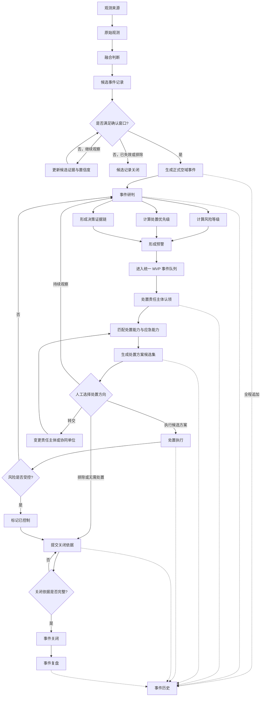
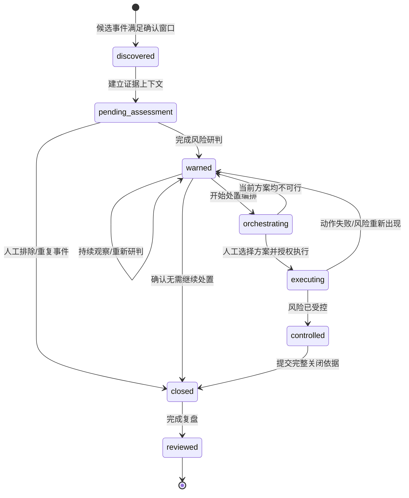
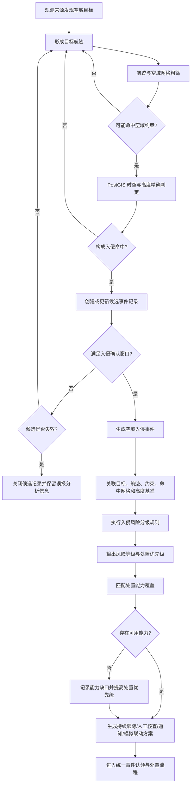
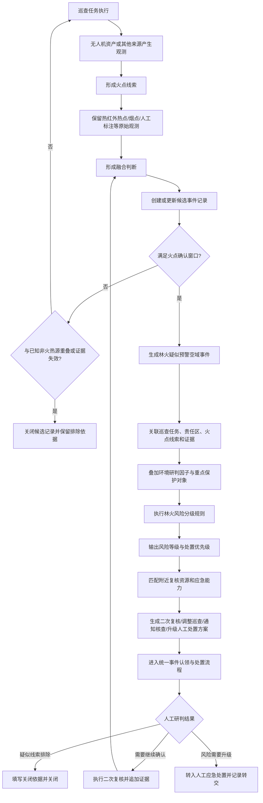
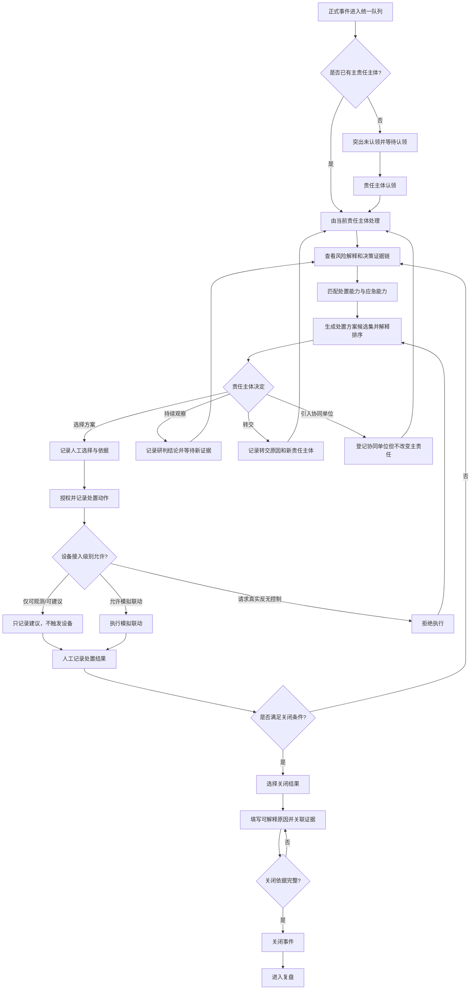
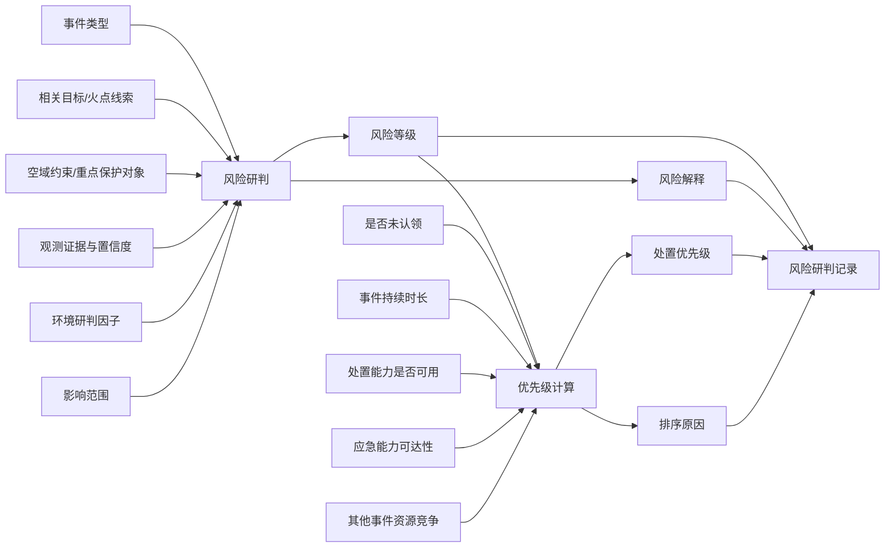
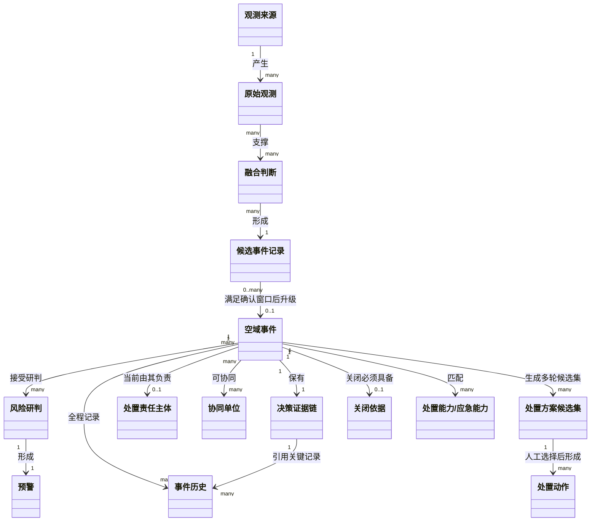

# 低空空域事件预警处置业务流程图

> 状态：概念模型提案  
> 范围：业务对象、业务判断、状态流转和人工决策  
> 不包含：前端 UI、接口、数据库表和技术实现

## 1. 统一事件处置闭环

### 核心业务约束

1. 原始观测不是空域事件，候选事件也不是正式空域事件。
2. 只有满足对应确认窗口后，候选事件才能升级为正式空域事件。
3. 风险等级与处置优先级分别计算，不能互相替代。
4. 系统输出多个可解释的处置方案候选，不自动执行唯一方案。
5. 关键研判、认领、方案选择、执行和关闭必须进入事件历史。
6. 事件关闭必须有关闭依据，不能因目标暂时消失而自动关闭。

## 2. 正式事件生命周期

### 状态与业务结果的区别

- `closed` 是生命周期状态。
- `controlled`、`excluded`、`false_positive`、`duplicate`、`handed_off` 是关闭结果或处置结果。
- “持续观察”是处置决定，不是新的生命周期状态。
- 已关闭事件不可重新认领或追加处置动作，只能进入复盘。

## 3. 禁飞/管控区入侵事件流程

### 入侵判定必须同时考虑

- 空域目标身份与目标航迹连续性。
- 空域约束的水平几何范围。
- 约束生效时间。
- 目标与约束的垂直范围。
- AMSL/AGL 高度基准转换是否成立。
- 连续观测数量、持续时间和观测置信度。

网格命中只用于粗筛，不能直接等同于入侵判定。

## 4. 无人机林火巡查预警流程

### 林火场景边界

- 输出的是“林火疑似预警”，不是已确认火灾。
- 工作台可建议二次复核、通知和升级，不负责自动消防调度。
- 单一热点通常只形成候选记录；多源证据、持续性证据或人工高置信标注才可升级。
- 与已知非火热源重叠时，应降低置信度或保持待复核，不能直接删除原始观测。

## 5. 认领、处置和关闭子流程

## 6. 风险研判与处置优先级流程

风险等级回答“事件有多危险”；处置优先级回答“平台应多早投入注意力和能力”。能力缺口通常改变优先级，不直接改变事件本身的风险等级。

## 7. 概念关系总览

## 8. 概念模型验收条件

不依赖前端 UI，使用数据库脚本、测试夹具或命令行即可验证：

1. 原始观测能够形成融合判断和候选事件记录。
2. 未满足确认窗口时不能产生正式事件。
3. 满足确认窗口后能够生成对应类型的正式空域事件。
4. 正式事件能够完成风险等级和处置优先级计算，并保留解释。
5. 两类事件进入同一事件队列语义和同一生命周期。
6. 事件能够被认领、转交和添加协同单位，且主责任唯一。
7. 系统能够生成多个处置方案候选，并记录人工选择。
8. 处置动作能够记录成功、失败、取消或仅建议，禁止真实反无设备直控。
9. 没有关闭依据时事件不能关闭。
10. 全部关键决定能够通过事件历史和决策证据链复原。
